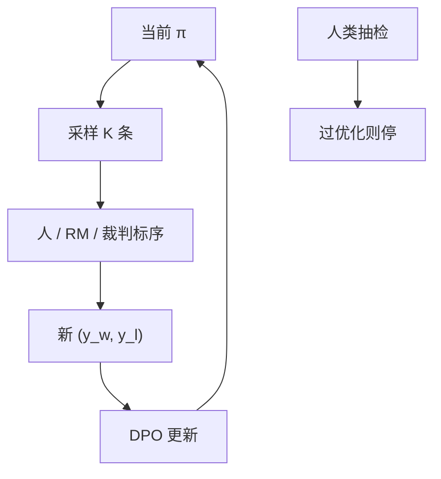

# 迭代与在线 DPO

离线偏好对来自旧策略；策略一走远，成对数据过期。迭代生成再标注，等于把 DPO 接回 on-policy 环。

<footer>—— Rafailov 等 DPO 的离线设定；迭代 DPO / 在线偏好（Snorkel、Intel、后续 on-policy DPO 变体）把教师换成当前 π</footer>

[上一课](/llm/train-infer-mismatch)收束 PPO/GRPO 的系统偏差。本单元问：没有更多人类比较时，监督从哪来。[DPO](/llm/dpo) 默认吃固定 $(y_w,y_l)$。缺口是：**最优策略一旦离开造对分布，离线 DPO 在过期对上拟合，等于 off-policy 偏好学习。** 本课写迭代与在线 DPO，不重导 BT 回代。

## 问题

DPO 假设比较由当前关心的 $r$ 在 $\pi_{\mathrm{ref}}$ 邻域产生。公开偏好集来自 ChatGPT 或其他教师，$\pi_{\mathrm{ref}}$ 对两条 $y$ 概率都极低，梯度噪。即使对来自自己的 SFT，一轮 DPO 之后 $\pi_\theta$ 已变，继续在旧对上多 epoch，就是对过期行为分布做极大似然。迭代：用当前策略采样候选，再请人、RM 或 LLM 裁判标序，换成新对，更新 $\pi_{\mathrm{ref}}$ 或保持冻结。在线：每步或每批都重新造对，更接近 [PPO](/llm/ppo-llm) 的数据流，只是损失仍是 DPO。

Dong 等 RSO、迭代 DPO 的工业复现，都在补这条分布缺口。它不自动解决 [过优化](/llm/rm-overoptimization)：裁判若是旧 RM，迭代只是更快榨干 RM。每轮提示集也应刷新或重加权，否则只是对同一批 $x$ 反复打磨，看起来在线、实际题面离线。

### 参考策略跟不跟

每轮把 $\pi_{\mathrm{ref}}$ 改成上一轮 $\pi$，邻域跟着走，KL 意义变成「相对昨天」，能力可以走远，也更容易崩。冻结最初 SFT 当 ref，更像 InstructGPT 的锚。必须声明。在线 DPO 文献里两种都有。

用 RM 打分造对，再 DPO，不是「无奖励模型」；只是 RM 不进 PPO。过优化曲线仍然适用。

## 方法

一轮：$\pi$ 对每个 $x$ 采 $K$ 条 → 裁判或 RM 排序 → 取最好/最差或所有胜负对 → DPO 若干步 → （可选）更新 ref。金标抽检每轮都做，防止代理分涨、人降。在线小 batch 时，学习率低于离线，因为对的噪声大。与 RLHF 第三阶段对照：PPO 用标量 $r$；这里用序。两者都要新样本。

## 机制

迭代把 DPO 从「一次监督」变成偏好版 on-policy。梯度始终在当前会说的话上比较，避免对数比噪声。走得远的能力来自采样覆盖，不是来自损失形式。若 $K$ 小、温度低，候选几乎相同，对没有信息，退化成空转——与 GRPO 全对组同一病。

自奖励（下一课）是把 JUD 换成模型自己；本课仍假设外部序。

## 边界与工程取舍

人类每轮标，贵，很快碰到可扩展监督问题。RM 或 LLM 裁判迭代，便宜，Goodhart 更快。混合：多数对由 AI 标，少数由人校准 RM。无 KL 的 PPO 与在线 DPO 在可验证域上常不如直接 GRPO；本课主场是开放偏好。下一课去掉外部裁判。

每轮都要外部金标抽检；提示集也要刷新，否则名为在线、题面仍离线。π_ref 冻结还是跟随必须声明。

## 小结

- 离线 DPO 对过期；迭代/在线用当前 π 造对，接回 on-policy。
- 造对的裁判若是 RM，过优化仍在。
- $\pi_{\mathrm{ref}}$ 冻结或跟随必须声明。
- 候选无分叉则对无信息，需温度与 $K$。
- 出处：Rafailov 等 DPO；迭代 DPO 工业配方；Dong 等 RSO；对照 Ouyang PPO 的在线样本。
