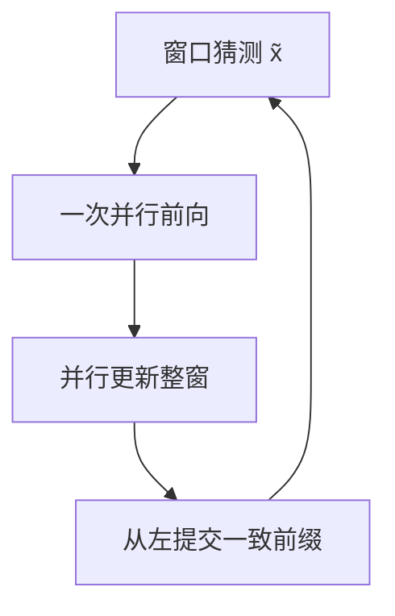
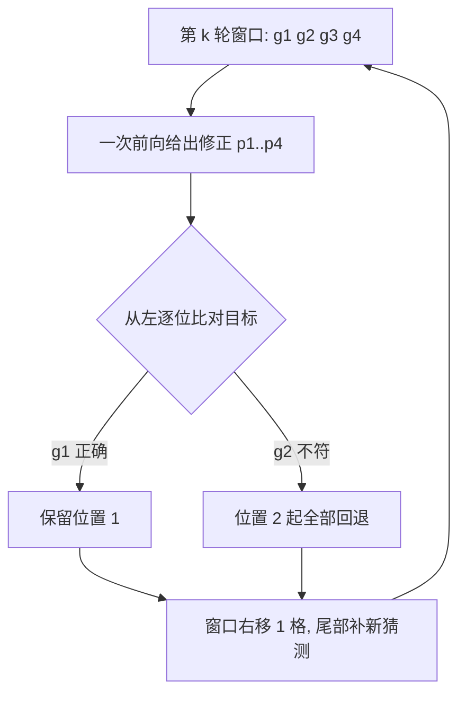

# Jacobi 并行解码

把未来 token 看成非线性方程组的未知数，用上一轮猜测并行更新所有位置；对得上的前缀留下，对不上的退回逐步。

<footer>—— Santilli et al., Accelerating Transformer Inference for Translation via Parallel Decoding, ACL 2023；Lookahead 见 Fu et al., 2024</footer>

[上一课](/llm/self-speculative-decoding)仍保留串行草稿：浅层逐步猜，$\gamma$ 步之后才校验。本课把「猜」也并行化。Santilli 等人把翻译解码写成 Jacobi / Gauss–Seidel 迭代：一次前向同时更新多个未来位置，用上一轮的填法当条件。它不保证每轮都前进很多；精确性来自 *验证与回退*，不是来自一次 Jacobi 扫就把方程解完。主干已有 [Lookahead Decoding](/llm/lookahead-decoding) 把 n-gram 池加上去；本课只补方程视角与朴素 Jacobi 为什么常常不加速，以免后课把 Lookahead 当成唯一的并行解码。

## 问题

自回归 $x_{t+1}=f(x_{\le t})$ 是三角依赖。GPU 能一次算很多位置，因果却强迫逐步。投机用外源填未来位置；自投机用浅层填。有没有第三种填法：用 *同一完整模型、上一轮的猜测* 填？这就是定点迭代。缺口是期望前进：若初始猜测远离真解，一轮并行更新之后，只有最左边一个位置可能对，其余全废，还多付了宽查询的注意力。翻译上，Santilli 等人观察到在某些设置可减少前向次数；开放生成上，无辅助结构的 Jacobi 经常亏。Lookahead 要解决的正是「猜出来的碎片如何缓存再验」，本课先把不加池的 Jacobi 写清楚。

Jacobi 解码可以做成与贪心路径一致：每轮只提交从左起连续猜对的前缀。采样版本需要对每个位置定义接受规则，否则分布漂到迭代器上。不要宣传「并行所以无损」而不写提交规则。

## 方法

初始化未来窗口 $\tilde x_{t+1:t+W}$（随机、复制上一 token、或抄提示 n-gram）。每轮用完整模型对窗口做一次前向（因果掩码仍以 *已提交前缀 + 当前猜测* 为条件），得到各位置新的 argmax 或样本，写回窗口。从左扫描：与校验分布一致的最长前缀提交，窗口右移。Gauss–Seidel 变体在同一前向里用刚刚更新的左侧位置条件右侧，依赖核能否提供这种掩码；标准因果核通常做的是 Jacobi（整窗看上一轮）。

窗口 $W$ 越大，一次 [FlashAttention](/llm/flashattention) 的查询越长，算术强度上升，这是相对逐步 decode 的真正硬件理由。但未提交的位置是错条件，算力打在可能被丢的查询上。Lookahead 把窗口轨迹切成 n-gram 进池，验证枝单独掩码，才把「打在错条件上的计算」变成可回收的提案。

数字实例：取 $W=8$。一轮前向要为 8 个猜测位置各付一份查询计算；若从左扫描只有第 1 个位置与目标 argmax 一致，这轮就只提交 1 个 token，其余 7 份算力随窗口右移作废——这就是「期望提交 $\approx 1$」最直观的代价账。

## 机制

定点 $x=f(x)$ 的收敛速度取决于 $f$ 对右侧扰动有多敏感。语言模型里，一个早期 token 错误会让后续条件全部错位，收缩系数不小于 1，故朴素 Jacobi 的提交长度期望接近 1。翻译有较强的局部对应，偶尔能多提交几个。开放生成依赖池与验证枝，不是依赖多扫几次窗口。墙钟上，只有「期望提交 $\gt 1$ 且宽查询仍在带宽墙内」才加速；prefill 已经算力密集时，再加宽窗口会撞计算屋顶。

术语翻译：定点迭代就是「把猜测代回同一个函数、拿输出当新一轮猜测」反复做，直到输入和输出对得上为止。Jacobi 解码把未来几个 token 当未知数，每轮整窗一起代回；而语言模型对早期 token 的错误极其敏感，这个「对得上」往往迟迟不来。

与[投机](/llm/speculative-decoding)的差别：投机的草稿分布 $q$ 明确进入似然比；Jacobi 的 $q$ 是上一轮点估计，没有逐步 $q(\tilde x_i)$ 就不好做 Leviathan residual。实践中贪心 Jacobi 用「是否等于目标 argmax」当接受，采样要另写规则。

常见误区：初学者容易以为「在同一个前向里用刚更新完的左侧位置去条件右侧」还是 Jacobi，实际上那叫 Gauss–Seidel。两者的分界在于整窗看的是上一轮的旧值（Jacobi）还是混入了本轮的新值（Gauss–Seidel）；标准因果注意力核没有为后者准备掩码，写代码前要先确认。

## 边界

不要在生产聊天默认开朴素 Jacobi。有 Lookahead / Medusa / EAGLE 时，Jacobi 只是其中 Lookahead 的生成枝。与分页 KV 的接口：窗口位置的查询仍对应已提交长度之后的逻辑下标，页表要为未提交位置准备临时槽，提交失败则丢槽。投机与 Jacobi 不要无文档地叠两层窗口。

出处：Santilli et al., ACL 2023；Fu et al., Lookahead Decoding, 2024。

## 小结

- 朴素 Jacobi 用上一轮猜测并行更新未来位置，提交从左连续猜对的前缀。
- 开放生成上期望前进常接近 1，加速靠宽查询的强度，不靠魔法收敛。
- Lookahead 在 Jacobi 之上加 n-gram 池与验证枝，才成为可用算法。
- 无损必须写提交规则；没有逐步 $q$ 就不能直接套 Leviathan residual。
- 宽窗口抬算术强度，也抬可能被丢的 FLOPs。
- 后课离开搜索算法，处理流式字符串边界。
- 出处：Santilli et al., ACL 2023；Fu et al., 2024。
