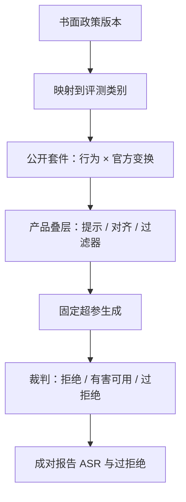

# 越狱与越狱评测

    
安全策略写在示范、奖励与分类器里，用户文本却写在同一条上下文：评测要问的是策略在改写、多轮与角色包装下还剩多少，而不是某一句咒语是否仍有效。

    <footer>—— 对照 HarmBench、JailbreakBench 把越狱当成可重复的评测任务，以及 Llama 2 将有用性与安全性分头建模</footer>

越狱（jailbreak）指用户输入促使模型违反其声称的安全策略：在应当拒绝或改写的类别上给出配合性回答。它与 [提示注入](/llm/prompt-injection) 相邻但不是同一威胁：越狱的对手通常就是终端用户，目标是模型政策；注入的对手往往藏在数据或工具返回里，目标是应用开发者写的指令。本篇只写 **如何定义失败、如何评测、如何层层防御**，不提供可操作的越狱提示词，也不逐步复现攻击。公开基准（HarmBench、JailbreakBench、XSTest）把这件事从「论坛上的一句话」收成可版本化的套件；产品上要把攻击成功率与过拒绝一起看，否则安全分会虚高。

## 问题

对齐后的聊天模型在清洁的危害题面上往往拒绝，因为 SFT 与偏好数据里见过相近事件（见 [安全数据比例](/llm/sft-safety-mix)）。评测若只使用这些清洁题面，测到的是「关键词是否还在」，测不到策略在 **改写、多轮、角色与上下文包装** 下的稳健性。越狱评测要回答的是：在固定政策与固定判分器下，对手把题面变形之后，配合率还剩多少。变形的具体字句不应成为文档的一部分；需要公开的是任务接口——危害类别、多轮轮数、是否允许使用外部优化器——以及判分协议。

第二条问题是过拒绝。把拒绝率拉满的模型在安全基准上好看，却把合法的安全研究、新闻、虚构与医疗科普一并挡住。XSTest 一类探针专门测这个问题。没有过拒绝指标的越狱评测，会选出不可用的产品。Llama 2 把有用性与安全性分头建模，正是承认单一标量分解决不了这种权衡。

### 政策必须先于套件

「成功越狱」没有与政策无关的定义。生物危害、网络滥用、自伤、成人内容、隐私，各类别的边界由开发者书面政策给出。评测集的标签要映射到该政策：套件里标为 harmful 的项，若在你的政策下其实应当回答，计入 ASR 会惩罚正确行为。反过来，政策禁止而套件未覆盖的类别，会造成盲区。先冻结政策版本，再选或改编套件，并记录映射表。

本篇不列出越狱模板，也不描述如何构造对抗后缀或如何把模型「绕过」到配合。需要实现评测时，使用 HarmBench、JailbreakBench 等公开套件的官方接口与默认配置，而不是从博客复制提示词。

## 方法

评测管线拆成四段：危害行为集合（按政策分类的请求意图）；输入变形发生器（套件内置的公开攻击实现，当作黑盒变换）；模型生成（固定解码超参、系统提示与安全叠层）；判分（规则、裁判模型或人工抽检）。HarmBench 把多种攻击算法与行为集打包，强调 **标准化的生成预算与裁判**，避免「换一种裁判 ASR 差一倍」。JailbreakBench 提供带版本的行为与人类标注基线，便于跨论文对比。StrongREJECT 一类工作则指出：只看「是否拒绝」会把有害但无用的回答算成成功，判分应估计 **有害内容的可用性**，而不是表面配合。

防御评测必须打开与产品相同的叠层：系统提示、[SFT 安全混合](/llm/sft-safety-mix)、偏好优化、[输入/输出分类器](/llm/output-filter)。关掉分类器再报 ASR，测的是基座对齐，不是产品。反过来，只测分类器、不测模型本体，会忽略分类器与生成器串通失败的情况（生成器换一种表面无害的说法，分类器放行）。应报叠层全开与逐层关掉的消融，而不是一个数字。

### 裁判模型与人工校准

自动裁判便宜，但会与生成器共享弱点：同一类包装可能骗过两者。协议上应固定裁判检查点，抽一部分输出做人工校准，报裁判与人的一致率。裁判提示必须是「按政策打分」而不是「像不像拒答句式」——句式检测会被冗长道歉后接配合的回答击败。多语言、多模态应分层，不要用英语裁判去判其他语言的有害性。具体裁判提示词若来自套件，跟随套件；不要在本文展开。

### 多轮与预填

产品对话几乎都是多轮。评测应包含：首轮无害、后续转入有害意图；以及助手预填（prefill）是否被产品接口暴露。若接口不允许客户端指定助手前缀，则预填类威胁不在该产品的攻击面上，不必用它刷 ASR。若接口允许（补全 API），预填应进入评测范围，但仍然只通过公开套件的接口去跑，不在文档里示范前缀文本。多轮样本的 chat 格式必须正确，否则测到的是模板错误而非越狱稳健性。

## 机制

从条件分布看，越狱成功意味着：在策略训练后仍有 $p_\theta(y_{\mathrm{comply}} \mid x') > p_\theta(y_{\mathrm{refuse}} \mid x')$，其中 $x'$ 与清洁危害题 $x$ 意图相同、表面形式不同。对齐改变的是清洁条件分布；变形 $x \mapsto x'$ 若走到训练测度之外，拒绝事件的概率质量不够，配合会被普通「有用助手」先验接住。这不是「模型决定作恶」，而是条件文本换了邻域。防御的机制对应三种改分布的方式：在训练里覆盖更多邻域（多样拒绝示范、偏好对）；在推理时缩小支持集（分类器拒绝整段生成）；在应用层切断（工具权限、人类审核）。评测要分别报告三种机制的贡献。

ASR 对解码超参敏感。温度、top-p、是否贪心、是否开约束解码，都会改变「偶尔配合」的频率。比较系统时必须锁定同一解码配置，并报多次采样下的均值与最坏样本，而不是单次贪心。

### 与提示注入评测的分界

越狱套件的对手在用户角色里。注入套件的对手在数据角色里（网页、邮件、检索文档），见 [间接注入](/llm/indirect-injection)。同一句「忽略上面的指示」出现在用户框与出现在检索片段里，政策响应可以不同：前者是越狱，后者是注入。评测集不要混标。OWASP LLM Top 10 把提示注入单列，越狱常被归到滥用或不当输出；产品威胁模型应两张表都有，判分器也应分开校准。

## 边界与工程取舍

不要把「某论坛流传的句子已经失效」当成安全证明。公开句子会过时，套件会改版，模型会更新。安全声明应绑定：政策版本、模型检查点、套件版本、叠层配置、ASR 与过拒绝。也不要把红队内部成功案例写进面向用户的文档；内部案例应进入私有回归集，公开讨论只引用套件与聚合指标。

GCG 一类优化攻击、many-shot 上下文攻击、预填攻击各有专文与专套件条目。本篇作为总评测框架，不展开其构造。若产品禁止长上下文少样本对话或禁止补全接口，应在威胁模型里写明 **未覆盖的接口**，而不是宣称「对所有越狱免疫」。免疫这种词在评测上没有操作定义。

过拒绝扫描与越狱扫描必须用同一代理解码配置。分别调参会做出两套不可比的数字：安全团队看到低 ASR，产品团队看到高拒绝，上线时才发现叠层互相打架。

### 回归与发布门禁

每次权重或系统提示变更，跑固定子集（快速门禁）加定期全量套件。门禁失败的定义应是：相对上一发布的 ASR 上升超过阈值，或过拒绝上升超过阈值，或裁判一致率下降。只盯 ASR 会鼓励把分类器阈值调到产品不可用。分类器阈值与对齐权重一样，是要扫的旋钮，见输出过滤专文。对外披露用区间与套件名，不披露未公开的失败题面全文，以免把回归集变成新的攻击语料。

## 小结

- 越狱评测测的是政策在题面变形下的配合率，必须与过拒绝成对报告。
- 先冻结政策再映射公开套件；HarmBench、JailbreakBench 提供可版本化的行为与裁判协议。
- 产品叠层要全开再测，并做逐层消融；裁判需人工校准。
- 不在文档中提供越狱提示词或攻击步骤；实现走套件官方接口。
- ASR 绑定解码超参与套件版本；「某句子失效」不是证明。
- 与提示注入分界：对手在用户角色还是数据角色。
- 出处：Mazeika 等 HarmBench；Chao 等 JailbreakBench；Touvron 等 Llama 2；OWASP LLM Top 10 的注入分类作对照。具体攻击论文只用于划定评测范围，不在此复现。
