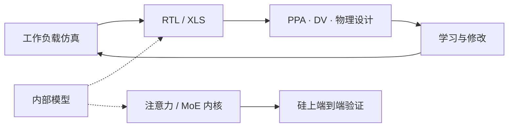

# 用自家模型加速 ASIC 设计闭环

规格在设计闭环里收敛，而不是一开始就完全知道；测量、验证、学习、修改、再来一轮，把工作负载仿真、RTL、质量结果与物理设计之间的反馈缩短。

<footer>—— OpenAI，Hot Chips 2026 关于 Jalapeño 执行方式的说明</footer>

Jalapeño 从架构概念到 tapeout 被写成大约九个月量级的路径：2024 年末概念，2025 年 RTL 冻结，2025 年末 tapeout，随后工程硅在实验室按生产目标频率与功耗跑模型。OpenAI 把加速因素之一写成**自家模型**，并在演讲里点名用内部 AI 与 XLS 硬件描述语言推动流程。这不是「用聊天机器人写 Verilog」的段子，而是把设计闭环改成可搜索：人给出功能正确的内核与约束，模型在 PPA 与映射上做迭代。公开的量化结果包括：相对人工基线，BF16 乘法上约 56% 的 PPA 收益，矩阵单元面积约小 10%；从功能正确的内核出发，内部系统把注意力与 MoE 核做到比既有专家手写实现快 1.5×–1.8×，并在芯片上端到端验证。本篇只写这些已披露的闭环形状，不编造使用了哪一个对外产品名去综合哪一个未公开模块。

## 问题

先进工艺上的推理 ASIC 传统上要多年：微架构、RTL、验证、物理设计、DFT、封装协同，每一段都有长反馈。规格若一开始就锁死，工作负载却在九个月里从「通用矩阵乘」漂到「带草稿模型的投机 decode 与突发 MoE」，硅会刚下线就错代。OpenAI 的问题是双重的：既要把 [推理专用](/llm/jalapeno-inference-only) 的空白设计做出来，又要让规格跟着模型路线图收敛。人工迭代的墙钟太慢，跟不上产品。

第二条问题是空间架构的映射。核切片、本地 HBM、集合网络一旦钉进硬件，内核放置就是组合爆炸。人擅长写功能正确的注意力，不擅长在物理核上搜流水与布局。若编程模型不为搜索器设计，AI 辅助只会生成无法闭合时序的 RTL。

### 闭环的对象是 PPA 与内核，不是替代签核

AI 可以提议微结构改动、重写数据通路、调整流水。签核仍要时序、功耗、DRC、形式验证与仿真。OpenAI 强调改动可以晚到 RTL 冻结当天，这提高了对回归验证的要求：模型给出的补丁必须进同一套 DV，而不是绕过。九个月能成立，前提是验证与物理设计也被拉进同一反馈，而不是前端加速、后端仍按年排期。

GPT-5.3-Codex-Spark 出现在公开材料里，是工程样品上跑的**工作负载**之一，不是「用 Spark 设计了 Jalapeño」的证据。设计侧只写了 internal AI model 与 XLS。不要把产品名在设计与运行之间串台。

## 方法

公开方法是连续收敛。工作负载仿真（prefill / 草稿 / 校验 decode、MoE 突发）产出瓶颈；RTL 与 XLS 描述被修改；QoR 与 DV、物理设计的结果回流。内部模型参与两段：一段在硅上——例如对 BF16 乘法与矩阵单元面积的 PPA 搜索；一段在内核上——从功能正确实现搜到 1.5×–1.8× 的注意力与 MoE。空间 ISA 被故意设计成「人好懂、前沿模型好编程」：暴露本地张量、快速本地路径、显式通信，让搜索去处理映射、放置、调度、流水。Gluon 把每个物理核当线程块，布局成为张量上的显式字段。

与 Broadcom 的硅实施、Celestica 的整机并行，而不是串成「先芯片再系统」。物理设计与封装约束必须尽早进仿真，否则九个月只优化了逻辑门，700 W 与 HBM4 中介层在后端爆炸。AI 辅助不能取消 [代工与实施伙伴](/llm/jalapeno-openai-broadcom-tsmc)，它取消的是部分前端试错的墙钟。

### 编程模型为搜索器而简

若硬件暴露的是隐式缓存与统一内存，搜索器难以把「慢」归因到放置。Jalapeño 的 [切片化本地视图](/llm/jalapeno-sliced-hbm) 把成本函数写清楚：本地命中、集合网、通用 NoC 三档。模型优化内核时，目标是少走后两档、喂饱矩阵单元。1.5×–1.8× 的公开加速来自这类搜索，而不是来自未披露的新算法注意力。人仍要提供功能正确的起点与测试；AI 把实现推到高性能。这一分工与「完全自动芯片」不同。

## 机制

反馈缩短的机制是：同一套度量（延迟、能耗、面积、时序余量）在仿真与硅前工具里反复打分，模型在离散的 RTL 改动空间里提议。XLS 一类 HDL 比随意的 Verilog 方言更适合做等价重写与流水变换，因为它把计算图提得更高。56% 的 BF16 乘法 PPA 与 10% 的矩阵面积，是这一搜索在**已公开的两个模块**上的得分，不是全芯片平均。把它外推成「整颗 Jalapeño 比人工设计小一半」没有依据。

内核侧的机制是：功能正确保证数值；搜索改 tiling、流水、与集合网的重叠。端到端上芯片验证，避免仿真器与硅的 ISA 偏差。OpenAI 还把同一套 AI 用于把规格收敛到测量——哪一段该加大矩阵、哪一段该加大 HBM 切片——而不是在项目启动时写死一份再也不改的 ISA。这解释了为何能对未共同设计的 GPT-OSS、DeepSeek R1、Kimi K2.5 在 A0 回硅后较快跑通：硬件保持了足够通用的空间原语，内核搜索补上模型差异。

九个月是 RTL 到 tapeout 的公开量级，不是「从零招人到量产机柜」。架构概念在 2024 年末，系统与 [Celestica](/llm/jalapeno-celestica) 的机柜路径更长。不要把前端墙钟写成全栈交付周期。

### 与传统 EDA 自动布局布线的关系

EDA 的 P&R、综合、形式验证已经自动化数十年。Jalapeño 故事里的新意是：生成式模型进入**微结构与内核**，而不只是在给定网表上布线。传统工具仍做签核。宣称「AI 取代物理设计」与公开材料不符。Broadcom 的实施职责包含时序签核与 DFT，这一层没有被「九个月」取消。

## 边界与工程取舍

不要把 56% 与 1.5×–1.8× 写进与 GPU 的产品对比——那是相对人工基线或专家手写核的内部对照，InferenceX 才是系统级对照。不要点名未公开的内部模型版本。不要假设开源社区用同一套 XLS 流程能复现 Jalapeño：工具链、工艺 PDK、验证农场都未开放。

风险是过拟合：模型把 RTL 拟合到仿真器喜欢的形状，硅上出现相关失效。公开材料强调 DV 与物理设计在闭环内，正是为了这条风险。另一风险是规格漂得太晚：冻结日当天的大改需要验证覆盖，否则九个月换来的是一次 respin。多代路线图（Gen 2 能效、Gen 3 经济的低延迟服务）依赖把这一闭环变成可重复的组织能力，而不是一次奇迹。

出处：Hot Chips 2026 执行、AI 辅助与内核页；OpenAI 联合稿中「部分由自家模型加速」及工程样品工作负载。不编造未公开的模块级 PPA 全表与模型权重来源。

## 小结

- Jalapeño 的规格在测量—验证—学习闭环里收敛；自家模型参与 RTL/XLS 与内核搜索。
- 已披露对照：BF16 乘法约 56% PPA、矩阵单元面积约小 10%；注意力/MoE 核 1.5×–1.8× 并在硅上验证。
- 空间编程模型把本地张量与显式通信暴露给搜索器，使映射可优化。
- 九个月量级指 RTL 到 tapeout；签核、代工、整机仍由伙伴与传统 EDA 承担。
- 内部 PPA 数字不可直接当产品对 GPU 的倍数。
- 出处：Hot Chips 2026；OpenAI / Broadcom 公开说明。
