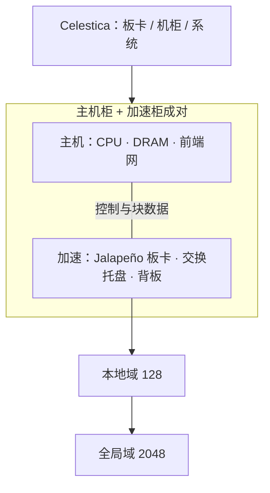

# Celestica 板卡与机柜系统化

Jalapeño 是多代计算平台的第一步：OpenAI 设计加速器，Broadcom 做硅实施与网络，Celestica 贡献板卡、机柜与系统专长。

<footer>—— OpenAI 与 Broadcom 联合公布的平台分工</footer>

芯片能算，不等于机房能装。Jalapeño 封装是 700 W 级 HBM4 近存器件，还要配主机、铜缆背板、Tomahawk 交换、液冷与供电，才能变成可复制的 128 芯片本地域。OpenAI 把这条工业化路径明确写成与 **Celestica** 合作：板卡、机柜、系统集成、可规模生产的整机。Hot Chips 2026 把产品说成硅加「主机与加速器机柜对」，并向 Broadcom 与 Celestica 致谢。本篇写系统化要回答的工程问题——托盘怎么切、主机怎么绑、故障域怎么划——不编造 Celestica 未公布的料号、线缆芯数或机柜 SKU 功耗上限。

## 问题

自研 ASIC 项目常见的断裂发生在 GDS 之后：实验室插座上跑通的工程样品，到不了能上架、能维护、能过安全认证的机柜。板卡要处理 HBM4 封装的电源完整性与 700 W 热密度；机柜要把 128 颗装置、交换、背板收成一个本地域；主机侧要提供 PCIe / CXL 一类的控制与数据入口，又不能成为集合通信的瓶颈。这些不是算法组的内核问题，却决定 [切片化](/llm/jalapeno-sliced-hbm) 与 [Tomahawk 域](/llm/jalapeno-tomahawk) 在墙上钟里是否存在。

OpenAI 选择把「从芯片到可部署系统」交给有规模制造与整机经验的合作方，而不是把第一代平台做成仅内部实验室可复制的架子。Celestica 在公开表述里的角色是 **board, rack, and system**：把 Broadcom 实施的硅、Tomahawk 交换、以及 OpenAI 的加速器架构收成工厂能重复的单元。没有这一层，九个月的 RTL 到 tapeout 只产生晶圆，不产生 InferenceX 曲线上的机柜。

### 主机柜与加速柜成对，而不是一张万能主板

Hot Chips 把形态写成主机与加速器机柜成对。含义是：CPU、DRAM、前端网、本地盘在主机侧；Jalapeño、HBM4、加速器域交换在加速侧。成对设计让两种热密度、两种布线（前端以太 vs 背板 Clos）分开，也让升级可以换加速柜而不必同步换完所有通用服务器。具体托盘如何命名、每托盘几颗 ASIC，官方演讲没有写成可引用的装配图；128 颗本地域是系统级事实，装配切分以厂商后续硬件手册为准。

第三方机柜拆解常会给出托盘绰号与每槽芯片数。那是分析，不是 OpenAI 数据手册。规划本地域容量时用 128 颗与 700 W 封装、216 GiB/颗这些已公布数字，用机柜功率=128×700 W 量级做**下限量级**时仍要加上交换、主机、泵与转换损耗，不能把 89.6 kW 当成整柜铭牌。

## 方法

系统化按三个可替换单元来做。**板卡**：加速器模组承载封装、VRM、水冷冷板、到背板的高速连接器；主机板卡承载 CPU 与前端 I/O。**托盘**：把若干板卡收成可维护的 1U/2U 级现场可替换单元，液冷歧管与电源连接按托盘盲插。**机柜**：计算托盘加交换托盘加冷量分配，背板把 128 颗收成本地域，柜间光纤/铜缆把最多 16 柜收成 2048 全局域。Celestica 的工作是让这三层的机械、热、电、制造公差同时收敛，并且能在代工线上重复，而不是只做一台展厅样机。

运维接口应暴露「本柜 128 域」与「全局 2048 域」为拓扑标签，调度器按域绑 TP / EP，见 [scale-up vs scale-out](/llm/scale-up-vs-scale-out)。现场更换的粒度是托盘或机柜，不是焊在中介层上的 HBM 立方体。固件、CPLD、水冷泄漏检测属于系统包，必须与 CAN 总线或等效机柜管理成套交付，否则芯片团队会在机房里重新发明 BMC。

### 制造与认证是架构的一部分

可规模生产意味着：连接器插拔寿命、线缆长度档位、冷板与封装的机械耦合、泄漏与冷凝、安规与电磁兼容。这些项目失败时，表现是「偶发 NCCL 超时」或「某条 Clos 链路 CRC」，看起来像网络栈，根因在系统。把 Celestica 写进平台声明，是承认第一代 Jalapeño 的交付物是**机柜**，不是芯片样品。OpenAI 说工程样品已在实验室按生产目标频率与功耗跑工作负载（含 GPT-5.3-Codex-Spark），那是硅与板卡的联合里程碑；初始部署目标写在 2026 年底，那是整机与机房的里程碑。

## 机制

700 W 封装的热必须在板卡级被冷板接走，再在机柜级被 CDU 接走。近存 HBM4 立方体对温度敏感，系统化若只给逻辑裸片做好冷却、内存侧热点，会先丢带宽再丢数据。电源从母线到封装要经过多级转换，效率点决定机柜进线功率；「芯片 700 W」与「机柜每槽 1 kW+」之间的空隙由系统吃掉。

电学上，背板是本地域的物理实现：短距铜把 ASIC 连到 Tomahawk 托盘。系统厂商的价值是控制插入损耗与 skew，使 SerDes 工作在以太 Scale-Up 需要的误码率上。这与 Broadcom 宣称 Tomahawk 6 对无源铜缆有较长可达距离是同一条供应链故事：交换硅提供 SerDes，整机提供通道。

OpenAI 用 Pareto 前沿比较的是**系统**在封装 TDP 归一化下的吞吐与延迟，Jalapeño 按 700 W、对照 GPU 按 1.2–1.4 kW。没有 Celestica 这一层把封装 TDP 变成可上架功耗，这些点无法落在同一张图上。

### 故障、备件与爆炸半径

本地域 128 颗共享背板与交换托盘，故障半径是机柜，不是单卡。备件策略应按托盘与整柜，液冷快接头与电源架是柜级 SKU。全局域 2048 把爆炸半径再放大到 16 柜：Clos 脊或柜间光模块故障会切掉 EP 组。系统手册必须写清：哪些链路冗余、哪些只能降域运行。不要用通用 x86 机柜的热插 GPU 流程套到焊死在 2.5D 封装上的加速器。

## 边界与工程取舍

不要把 Celestica 写成芯片设计者。架构与 RTL 在 OpenAI，硅实施与 Tomahawk 在 Broadcom，整机在 Celestica。不要填写未公开的机柜 U 数、托盘配比、CPU 型号与 PCIe 分叉。不要假设第一代平台对外销售给任意云——公开材料把它定位为 OpenAI 自用推理平台的多代中的第一代，部署与 Microsoft 等伙伴的机房规划绑定。

成本账里，系统化占比很高：冷量、交换、铜缆、认证往往不比晶圆便宜。评测「每美元 token」若只算 ASIC 晶圆，会系统性低估。反过来，把某一代机柜的代工报价当成长期定律也会过期。

出处：OpenAI–Broadcom 联合稿中的 Celestica 分工（board, rack, system）；Hot Chips 2026 的主机/加速柜对与致谢。不引用未公开装配图与料号。

## 小结

- Celestica 承担 Jalapeño 从封装到可复制机柜的板卡、机柜与系统集成。
- 公开形态是主机柜与加速柜成对；本地域 128 颗是系统级单元。
- 700 W HBM4 封装的热、电、机械必须在托盘级收敛，否则实验室频率到不了机房。
- 故障域按托盘/机柜/2048 域划分，不能按单卡热插假设。
- 评测与调度都应对着机柜域，而不是对着裸芯片。
- 出处：OpenAI / Broadcom 公开平台说明；Hot Chips 2026。
