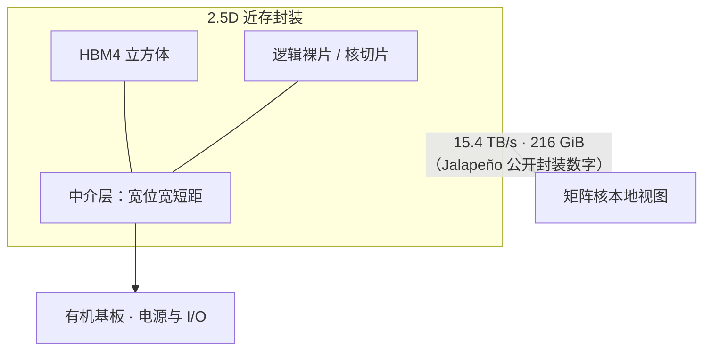

# HBM4 与 2.5D 中介层近存封装

HBM4 把接口加宽到 2048 bit，单栈带宽进入 TB/s 量级；这么宽的 I/O 走不了普通基板，必须靠中介层把计算裸片和内存立方体贴到同一近存封装里。

<footer>—— JEDEC JESD270-4 HBM4；对照 2.5D 硅中介层近存封装的公开工程约束</footer>

Jalapeño 公开规格把封装写成 HBM4：15.4 TB/s 带宽、216 GiB 容量、700 W 封装功耗。这不是「换一代颗粒名字」，而是一次近存封装选择——计算核要吃满 [切片化本地视图](/llm/jalapeno-sliced-hbm)，必须把 DRAM 立方体放到与逻辑裸片同一块中介层上，互连短、位宽极宽、功耗按 picojoule/bit 而不是按板级 DDR 计。JEDEC 于 2025 年 4 月发布 JESD270-4：HBM4 在 2048 bit 接口上可达 8 Gb/s，单栈带宽最高约 2 TB/s，支持 4/8/12/16 高堆叠与 24 Gb 或 32 Gb 颗粒，单立方体容量最高 64 GB。本篇用这些**已公布**的标准与 Jalapeño 封装级数字讨论近存，不反推未公开的栈数、供应商绑定或中介层工艺节点。

## 问题

LLM 推理在 decode 段是带宽墙：每步把权重与 KV 从封装内存扫进矩阵核。HBM3E 一类上一代栈已经把单栈带宽推到约 1 TB/s 量级，再往上靠拉高单 pin 速率会撞信号完整性与功耗。HBM4 的公开策略是**加宽接口**：位宽从此前世代的 1024 bit 量级翻到 2048 bit，通道数增加到 32（64 伪通道），用宽度换带宽，而不是只卷单 pin Gb/s。JEDEC 新闻稿把 8 Gb/s × 2048 bit 写成最高约 2 TB/s/栈。

板级走线做不到这种位宽。HBM 从第一代起就依赖 2.5D：硅中介层提供微凸点间距的海量连线，把逻辑裸片与 HBM 立方体摆在同一平面上，再把中介层贴到有机基板。这叫近存（near-memory）——内存仍是 DRAM，不是 SRAM，但物理距离按毫米计，不按 PCB 英寸计。没有中介层，Jalapeño 印在幻灯片上的 15.4 TB/s 没有物理载体。

### 容量、带宽与功耗必须在同一封装里同时成立

只追带宽会得到矮栈、少容量；只追容量会得到 16 高堆叠、热和良率变差。Jalapeño 给出的是三者同时：216 GiB、15.4 TB/s、700 W。216 GiB 不能被整除成「公开标准里某一种栈数 × 某一种颗粒」的唯一解——颗粒密度、是否全用满、ECC 开销都未在公开材料里拆开。正确读法是：这是封装交付的**可用**容量与带宽，不是 BOM 表。

JEDEC 写明 HBM4 控制器可向后兼容 HBM3 控制接口的演进关系，但封装上的 PHY、中介层布线与电源完整性仍按 HBM4 的 2048 bit 来设计。不要把「协议兼容」理解成「同一块中介层可以混插 HBM3E 与 HBM4」。

## 方法

近存封装的方法分三层。第一层是 DRAM 立方体：TSV 把多层颗粒叠起来，HBM4 允许 4 到 16 高，颗粒 24 Gb 或 32 Gb。第二层是中介层：硅中介层或桥接（如 EMIB 一类嵌入桥）提供精细布线，把立方体的海量 DQ/DQS 接到 SoC PHY。第三层是有机基板与电源：700 W 级封装要液冷与机柜级供电配合，见 [Celestica 系统化](/llm/jalapeno-celestica)，那已经超出中介层，但仍由同一近存选择决定热密度。

Jalapeño 把 HBM4 切给各核切片做本地视图。封装带宽 15.4 TB/s 是所有栈、所有通道的聚合；切片化决定聚合如何被核看见。2.5D 的物理邻近是切片化的前提：若内存在另一块 PCB 上，不存在「每核本地 HBM」。OpenAI 把架构原则写成尽量吃满 HBM 带宽；选 HBM4 而不是停留在 HBM3E，与这一原则一致。供应商是哪一家、pin 是否跑到标准上限以上，公开演讲没有写成可引用的采购条款，本文不填。

### 从标准带宽到封装屋顶线

单栈最高约 2 TB/s 是 JEDEC 口径下的上限，取决于 pin 速率与是否用满 2048 bit。Jalapeño 的 15.4 TB/s 是整封装测量口径的公开数字，用来和同期 GPU 的 HBM3E/HBM4 封装对比，不是把「2 TB/s × 栈数」在博客里自行乘出来。通道变多（32 通道）给控制器更多并行度，也给中介层布线更多串扰预算——这是封装工程，不是模型超参。

2.5D 相对 3D 堆叠逻辑：HBM 立方体已经是 3D DRAM；逻辑与 DRAM 并排在中介层上是 2.5D。Broadcom 另有公开的 3.5D 面对面堆叠平台，用于自家先进封装产品线。Jalapeño 演讲没有把封装商标绑定到某一 CoWoS 或 XDSiP 型号，规划时只锁定「HBM4 + 中介层近存」，不把友商白皮书的堆叠层数抄过来。

## 机制

近存降低的是**位能**与**延迟**。中介层上的走线比 PCB 短一到两个数量级，寄生电容小，同样带宽下 PHY 功耗更低。对 700 W 封装，内存 I/O 若按板级 GDDR 的 pJ/bit 计，功耗会先于算力顶满。宽接口让单 pin 不必顶到信号完整性崩溃的速率；JEDEC 把标准速率写到 8 Gb/s，产业界另有把 HBM4 往更高 pin 速率做的工程讨论，那些属于供应商与代工厂的演示，不是 Jalapeño 的已公布 PHY 表。

容量机制是堆叠：16 高 × 32 Gb 颗粒给出标准里的 64 GB/栈上限。Jalapeño 的 216 GiB 落在「多栈、中等堆高」的合理区间，但合理不等于已披露。热是堆高的隐变量：立方体顶部颗粒更热，刷新与保留时间变差，近存封装必须与液冷一起设计。

GiB 与 GB 在公开幻灯片里混用过。Jalapeño 写 216 GiB、2048 芯片系统 432 TiB，是按二进制前缀的容量口径。和 JEDEC 用十进制 GB 描述颗粒密度不是同一套单位，换算时不要把 216 当成 216×10⁹ 字节去反推栈数。

### 对推理屋顶线的含义

Prefill 吃算力，decode 吃带宽。HBM4 近存把 decode 的字节屋顶线上移；若内核仍在统一交叉开关上争用，屋顶线只存在于数据手册。切片化与近存是配套：中介层提供物理带宽，切片提供逻辑隔离。MXFP4 把每个元素打到约 4.25 bit，同样 15.4 TB/s 能扫更多元素，见 [MXFP4](/llm/jalapeno-mxfp4)——那是数值格式对近存的乘数，不是替代封装。

## 边界与工程取舍

不要用 Jalapeño 的 15.4 TB/s 去除 JEDEC 的 2 TB/s 得出「一定是 N 栈」并写进容量规划。不要把未公开的中介层层数、微凸点间距、良率曲线当成事实。不要假设所有 HBM4 产品都跑同一 pin 速率：标准给上限，产品选工作点。

近存封装提高了故障域：坏一个立方体可能整封装降级或报废，不能当单条 DIMM 热插。机柜必须按封装 TDP 与液冷设计，风冷 8 卡箱的经验不适用。HBM 分配在产业里是约束：OpenAI 与 Broadcom 的合作公开了平台方向，具体晶圆与颗粒合同不属于这篇架构笔记。

出处：JEDEC JESD270-4 新闻稿与标准要点；OpenAI Hot Chips 2026 封装级 HBM4 数字（15.4 TB/s、216 GiB、700 W）；2.5D 中介层是 HBM 类产品的公开封装形态。不引用未公开的栈图与供应商配额。

## 小结

- HBM4 用 2048 bit 宽接口把单栈带宽推到约 2 TB/s 量级（JEDEC，最高 8 Gb/s）。
- 如此宽的 I/O 依赖 2.5D 中介层近存，不能走普通 PCB。
- Jalapeño 公开封装：HBM4、15.4 TB/s、216 GiB、700 W；栈数与供应商未作为可引用规格给出。
- 近存提供物理带宽，切片化决定核如何看见它；两者缺一则屋顶线用不满。
- 规划用封装级公开数字，不要用标准上限反推 BOM。
- 出处：JESD270-4；Hot Chips 2026 Jalapeño 规格页。
