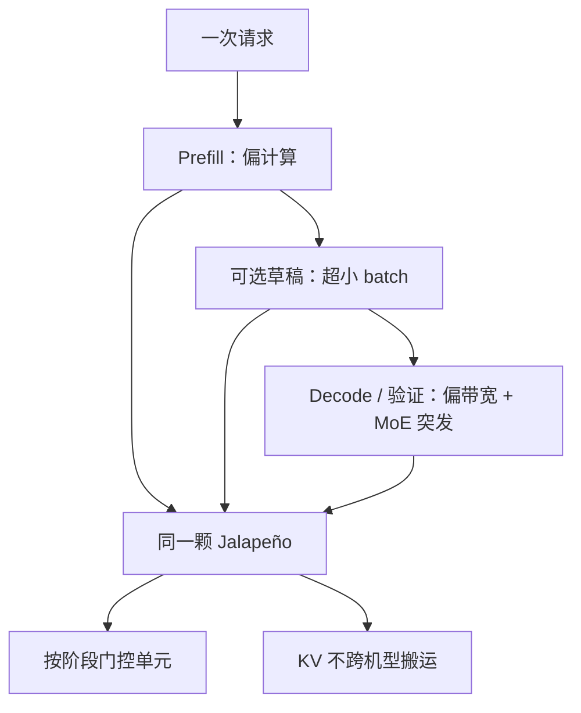

# 专为 LLM 推理的空白设计（非通用 GPU）

从空白开始只做 LLM 推理：不为训练、不为图形、不为通用 CUDA 生态付税，把晶体管花在逐步生成的延迟与每焦耳 token 上。

<footer>—— OpenAI 在 Hot Chips 2026 对 Jalapeño 的公开框架：inference platform，metrics 是 time to last token 与 tokens per joule</footer>

OpenAI 在 Hot Chips 2026 公开了自研推理 ASIC **Jalapeño**（现场报道用 Jalapeno / Jalapeño 两种拼写）。讲者把它说成推理平台而不是一块「通用加速卡」：硅、主机与加速机柜一起设计，目标是多芯片工作负载上、低延迟下的性能每瓦。公开时间线大致是 2024 年底架构概念、2025 年 RTL 冻结、2025 年底 tapeout，之后实验室跑通 Codex，再跑 ChatGPT。本篇只写「为什么从空白做推理芯片、而不是做一张小 GPU」；工艺与合作见 [Broadcom / TSMC](/llm/jalapeno-openai-broadcom-tsmc)，数据搬运见 [下一篇](/llm/jalapeno-data-movement)，矩阵核见 [脉动阵列](/llm/jalapeno-systolic)。未在公开演讲与可靠报道中出现的隐藏宽、SM 数、未发布的指令集，一律不写。

## 问题

通用 GPU 要同时擅长：稠密训练、反向、各种序列长度、图形与 HPC、以及几十年累积的编程模型。推理服务的热路径窄得多：一次请求穿过 compute-bound 的 prefill、可选的小草稿模型、以及 memory-bound、带突发 MoE 通信的 decode / 验证。每一段的瓶颈不同，但用户看见的是端到端的 last token 时间，电费看见的是每焦耳多少 token。为训练准备的缓存层次、动态调度、额外精度与双工互连，在纯 decode 工厂里是税：面积、功耗、验证复杂度。

OpenAI 的公开论点是：异构机群（一张卡专门 prefill、一张专门 decode）会在负载配比变化时留下闲置加速器，而闲置仍要付封装、HBM、I/O 与网络的底噪。Jalapeño 选择**单颗均衡芯片**：某一阶段用不到的单元断电门控，KV 留在本地，而不是在阶段边界把 KV 搬到另一类机器上。这与 NVIDIA 把 [PD 分离](/llm/pd-disaggregation) 做成产品、再与 [LPX](/llm/groq-3-lpx) 做 AFD 是不同的系统答案。空白设计的问题是：放弃通用性之后，还能不能在没共设计过的开源模型上跑起来——Hot Chips 用 GPT-OSS、DeepSeek R1、Kimi K2.5 回答「能在硅回到实验室之后尽快跑通」，并强调这三款都不是为 Jalapeño 共设计的。

### 指标从 FLOPS 换成 last token 与焦耳

公开幻灯把两个指标放在前面：time to last token（体验）与 tokens per joule（效率）。比较沿延迟–能量的 Pareto 前沿，而不是比芯片数量、单芯片吞吐或只比 TTFT。评测套件是 SemiAnalysis InferenceX：跨开源模型、覆盖 prefill 到 decode、按封装 TDP 做功率归一化。现场报道给出对照封装功耗：Jalapeño 700 W，GB200 1.2 kW，GB300 与 MI355X 1.4 kW。这些是评测设定，不是本博客测的。OpenAI 还指出对照路径上 GPU 侧常用多 token 预测 / 投机，而 Jalapeño 演示多用单 token 预测——比的时候要看清是不是同一套解码算法。

Hot Chips 数字来自 OpenAI 自己的测量与公开幻灯，SemiAnalysis 等媒体做了实验室核验叙述。本篇转述时保持「厂商在指定模型上的 Pareto 点」，不把 1.5×–1.9× 每千瓦写成对任意 Rubin 机柜的普遍定律。

## 方法

设计约束收成一句：只服务 LLM 推理的前向。没有公开把反向、优化器状态、训练集合通信写成一等公民。空间化执行、本地张量、显式通信，是为了让人和模型都能写核，而不是为了兼容任意 CUDA 图。系统选择上，KV 不在阶段之间跨专门化机群搬家，而是留在 Jalapeño 上，靠门控改变「此刻点亮的计算 / 内存 / 网络」比例。网络仍要 scale：公开拓扑是本地 128 颗 ASIC 的低延迟域，再经 Broadcom Tomahawk 6 的半扁平两级 Clos 扩到 2048 颗的全局域，张量并行走更高带宽、专家并行走较低带宽——这是推理并行，不是通用多租户 GPU 集群的随意拼车。

软件上，Gluon 把每个物理核当 thread block 来编，核上有张量、SIMD、标量引擎与本地内存视图。公开说内部模型把功能正确的核优化到高性能，注意力与 MoE 核相对已有专家手写实现快约 1.5×–1.8×，并在芯片上端到端验证。这是设计方法（用自家模型加速芯片与核），不是用户 API 保证。

### 「推理专用」不是「只跑自家闭源模型」

媒体容易把定制芯片写成「只为 GPT 加密指令」。Hot Chips 与随后的公开报道强调：用开源模型篮来证明通用性与Bring-up 速度；甚至有报道称实验室用 Codex 提示把 Doom 一类程序迁到芯片上——那是逸事，说明编程模型可被搜索，不是产品特性。对容量规划，应把它当成「前向 Transformer 家族（含 MoE）的推理 ASIC」，而不是「只会一种隐藏宽的固定功能块」。固定功能到什么程度，公开材料没有给出算子白名单；不确定的地方不要补全。

## 机制

空白设计省下的税，花在三处公开叙述过的地方。一是封装功耗预算：700 W 对照千瓦级训练 GPU，评测按 TDP 归一化后看每千瓦混合 tokens/s。二是阶段门控：闲置单元不付底噪，避免异构机群里「另一张卡在空转」。三是把架构收敛过程本身做成循环——公开说规格不是一开始就定死，而是测量、验证、学习、修改；RTL 冻结当天仍有重大变更。九个月量级的 RTL 到 tapeout，被讲者当作全栈（模型–编译器–硅）协同的证据，而不是中心化 GPU 路线图的一个 SKU。

Pareto 幻灯在 GPT-OSS 120B、DeepSeek R1 670B、Kimi K2.5（约万亿参数，报道用 K2.5 / K2 等名称，以幻灯为准）上把 Jalapeño 画在前沿。匹配工作点上的倍数（约 1.5×–1.9× 每千瓦吞吐、若干倍端到端延迟）都是**指定模型、指定对照配置**。OpenAI 还声称在经济吞吐下、前沿模型上可做到亚毫秒 token 间隔，并称若加上多 token 预测，在同等效率下延迟还有约 3×–5× 的改进空间——这是未在该次对比里兑现的预告，不要当成已测规格。

推理专用意味着生态税转给软件：没有 CUDA 十年的算子库。Bring-up 三个开源模型证明的是可行性，不是 Hugging Face 上每一个检查点都能当天出生产 SLA。

### 与 GPU、LPU 的位置

相对通用 GPU：少训练与图形，多针对逐步生成与能量。相对 Groq 类 SRAM LPU：Jalapeño 公开规格走 HBM4 大容量带宽（见数据搬运篇），不是「整模常驻 SRAM」；它仍是近存加速器，但记忆层次与 NVIDIA Groq 3 LPX 不同。不要把三张芯片画成同一条屋顶线。

## 边界与工程取舍

不要把 InferenceX 的每千瓦倍数直接换成「替代 N 柜 Rubin」。SemiAnalysis 等公开评论也指出：对照若停在 Blackwell、而 Rubin 已在出货，比较基准会过时；实验室工程样品与云上可售容量不是同一阶段。不要假设训练会在这颗芯片上发生。不要编造未公开的算子覆盖表、未发布的 Gen 2/Gen 3 规格——公开只说 Gen 2 瞄准更好的每瓦、Gen 3 瞄准经济的低延迟服务，没有给出数字。

单芯片均衡也有代价：它不会在纯 prefill 上比专门的巨型训练 GPU 更「像训练器」，也不会在纯 SRAM 确定性上比 LPU 更「像实时」。它赌的是**同一次请求内阶段比例会变**，买两支专用机群的底噪更亏。负载若长期极端偏斜，这个赌可能输。

出处：Hot Chips 2026 OpenAI Jalapeño 环节的现场报道（ServeTheHome 等）与 OpenAI 公开幻灯叙述；InferenceX 为 SemiAnalysis 的公开基准框架。不把付费通讯里未公开的内部规格当作官方数据手册。

## 小结

- Jalapeño 公开定位是从空白做起的 LLM 推理平台，不是通用 GPU。
- 关键指标是 last token 时间与每焦耳 token，用功率归一化的 Pareto 而不是裸 FLOPS。
- 系统选择是单芯片均衡 + KV 本地 + 阶段门控，而不是异构机群之间搬 KV。
- 开源模型篮用来证明并非只能跑共设计的闭源模型；生态仍远小于 CUDA。
- 对照倍数钉模型与是否投机解码；亚毫秒 TBT 与 MTP 增益是公开宣称，需与已测点分开。
- 出处：Hot Chips 2026 公开报道。
