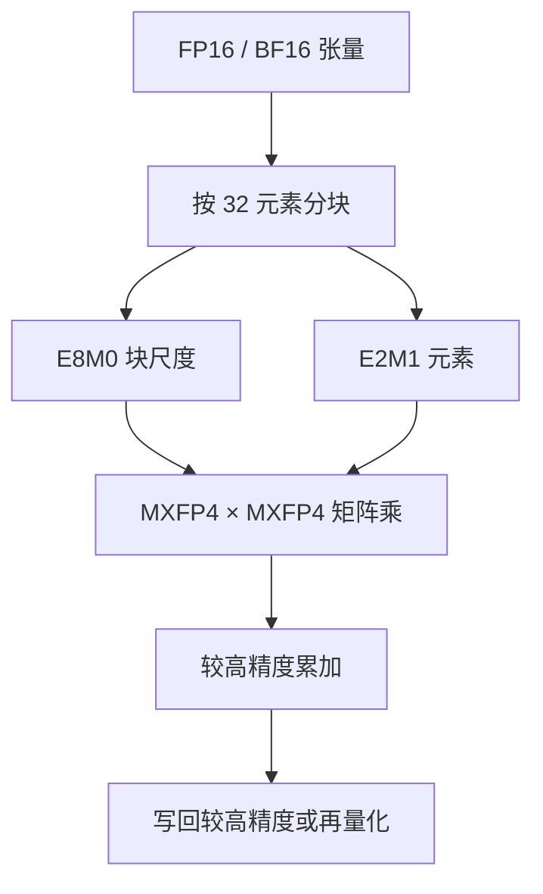

# MXFP4 / 低精度推理数值

MX 合规格式由元素类型、块内共享的尺度、以及块大小三者定义；MXFP4 把 32 个 FP4（E2M1）元素绑到一个 E8M0 尺度上。

<footer>—— OCP Microscaling Formats (MX) Specification v1.0</footer>

Jalapeño 把矩阵算力写成 **13.4 PFLOP/s 的 MXFP4×MXFP4**。这不是厂商私有的 4-bit 别名，而是 Open Compute Project 已发布的微缩放浮点：块大小 32，元素为 FP4 E2M1（1 符号、2 指数、1 尾数），块尺度为 E8M0（8 bit 纯指数、2 的幂）。存储上每块 8 + 32×4 = 136 bit，合 4.25 bit/元素。推理要在 [HBM 带宽墙](/llm/decode-memory-wall) 上多扫一些权重，4-bit 比 FP8 再省一倍量级的字节；没有块尺度，FP4 自身的动态范围只有大约 12 倍，装不下 Transformer 各层差几个数量级的张量。本篇写 OCP 数值与它对推理核的约束，不把 NVIDIA 的 NVFP4 或某家私有 INT4 方案写成「也叫 MXFP4」。

## 问题

逐张量 FP8（E4M3 / E5M2）已经把训练与部分推理推进到 8-bit。再往 4-bit 走，单个元素几乎没有尾数：E2M1 的正规值只有 ±1、±1.5、±2、±3、±4、±6 等有限档，加上亚正常与零。一层 MLP 的权重若跨过两个数量级，单一全局尺度会把小系数打成零、把大系数打饱和。逐元素 8-bit 尺度又太贵，抵消 4-bit 的密度。MX 的折中是**细粒度块尺度**：k 个相邻元素共享一个尺度，k 在硬件友好的 32 上钉死。

OCP MX v1.0 由 AMD、Arm、Intel、Meta、Microsoft、NVIDIA、Qualcomm 等共同发布，目标是可互换的亚 8-bit 格式，而不是各家再发明一套不可导入的 4-bit。Jalapeño 作为推理芯片直接把峰值矩阵算力标在 MXFP4 上，等于把这一互换格式当成一等数据类型，而不是事后软件模拟。

### FP4 没有 Inf / NaN 槽

规范要求 FP4 实现支持亚正常，且**不保留** Inf 与 NaN 编码。所有 16 种 4-bit 码都是数。转换到 FP4 必须支持 roundTiesToEven。这意味着溢出不能靠 IEEE 的 Inf 传播来「显眼地炸」；实现必须在量化前用块尺度把幅度收进 E2M1 可表示区间，否则饱和被静默吃掉。对调试不友好，对面积友好——4-bit 乘法器不必处理特殊值通路。

E8M0 尺度是无符号指数，OCP 把它写成 2 的幂。硬件上尺度乘法常退化成对指数的加减，不必为尺度再做一套尾数乘法。这是 MX 相对「每块一个 FP16 尺度」的面积理由，不是精度理由。

## 方法

量化按块。对向量块 $V\in\mathbb{R}^{32}$，参考算法用块内最大绝对值确定共享指数，使最大元素映射到 FP4 最大正规值附近，再就近偶数舍入到 E2M1。尺度存成 E8M0；元素存成 32 个 nibble。反量化是 $x_i \approx s\cdot \mathrm{decode}(e_i)$。矩阵乘时，两块 MXFP4 的点积可以先在整数或较高精度里累加元素乘积，再补上两个块尺度的指数和——规范第 6 节定义了 MX 向量点积与一般点积，硬件按此实现，而不是先全部展开成 FP32 再 GEMM。

Jalapeño 的 13.4 PFLOP/s 计的是这种矩阵乘的峰值，不是「芯片里每一个 ALU 都以 MXFP4 跑」。softmax、层归一化、路由仍需要更高精度；与 [KV 的 8-bit](/llm/kv-int8-fp8) 一样，低精度首先打在**带宽敏感、校准相对稳定**的权重与激活 GEMM 上。OpenAI 在 InferenceX 对比里用过 DeepSeek R1 与 Kimi K2.5 的 MXFP4 部署，说明格式已经进入跨模型的推理路径，而不是某一闭源权重的私有打包。

### 与 NVFP4、INT4、MXFP6/8 的差集

NVFP4 是 NVIDIA 在 Blackwell / Rubin 路径上的 4-bit 方案，块与尺度定义与 OCP MX 不必相同；不要在同一张精度表里把「MXFP4 的 32×E2M1+E8M0」和 NVFP4 当可互换存储。INT4 没有指数，动态范围全靠尺度，对异常值更脆。MXFP6 / MXFP8 是同一家族的 6-bit 与 8-bit 元素，块尺度同样是 E8M0、块大小 32；从 MXFP8 降到 MXFP4 是精度台阶，不是另一种量化哲学。Jalapeño 公开峰值只钉 MXFP4×MXFP4，未在同一页给出 MXFP8 峰值，本文不编造。

块大小 32 要求连续 32 个元素幅度相近。按输出通道分块通常比按随意展开的内存顺序更稳。若编译器把布局打乱，共享尺度会对着一堆不相干的数，误差陡增。这是数值格式对 [切片化布局](/llm/jalapeno-sliced-hbm) 的约束：物理放置与量化块边界应对齐。

## 机制

MXFP4 能工作，是因为 Transformer 权重在局部通道上往往近似同量级，块尺度吸掉层与通道之间的数量级差，E2M1 只编码局部相对值。误差表现为块内的量化噪声，进入 GEMM 后被累加平均；残差连接与 RMSNorm 仍在较高精度时，噪声被限制在线性层内部。若把注意力分数也打成 MXFP4，softmax 对误差敏感，这通常不是默认路径。

带宽机制更硬。相对 FP16，4.25 bit 约是 3.8× 的元素密度；相对 FP8，约 1.9×。Decode 扫权重的时间按密度下降，前提是 PHY 与核真的按打包的 nibble 读，而不是在 HBM 里存 MXFP4、进核前解成 FP16。Jalapeño 把峰值标成 MXFP4 矩阵算力，意味着数据通路按此建设。利用率仍取决于 [减少搬运](/llm/jalapeno-data-movement)：格式只减字节，切片化决定这些字节要走多远。

OCP 规范写的是互换与基本运算，不保证「任意模型、任意层 MXFP4 都无损」。上线应以该模型在目标任务上的校准与评测为准。Hot Chips 的 Pareto 曲线是系统级吞吐与延迟，不是逐层 SQNR 表。

### 溢出、下溢与校准

E2M1 最大幅度有限，块尺度若按 max-abs 设定，块内最大值可表示，其余元素向粗网格靠。全零块、几乎全零的稀疏专家，尺度下溢时元素全变零，等于关掉那一路——有时无害，有时会让偶发激活的专家「消失」。校准应覆盖长尾专家与长上下文，而不是只看短 prompt 的 perplexity。训练感知量化（QAT）可以把分布推进块尺度友好的形状；Jalapeño 作为推理芯片不规定训练配方，只规定推理时能吃 MXFP4 GEMM。

## 边界与工程取舍

不要把 MXFP4 写成「4-bit 即 4.00 bit」：尺度开销使有效比特是 4.25。不要与 GPTQ / AWQ 的分组 INT4 混报压缩比——后者分组大小、是否有零点、是否非对称都不同。不要假设 softmax、RoPE、RMSNorm 都在 MXFP4 里算。不要用芯片峰值 PFLOP/s 除以 13.4 去反推「核数 × 频率 × MAC」——那是未公开微架构。

词表投影、路由 logits、KV 是否 MXFP4，公开材料没有写成全芯片统一。KV 更常见的是 8-bit 档，见 INT8/FP8 实践。混合精度是默认，不是失败。

出处：OCP MX v1.0（MXFP4 = FP4 E2M1 + 块 32 + E8M0）；Jalapeño 峰值 13.4 PFLOP/s MXFP4×MXFP4 来自 Hot Chips 2026。不编造未公布的累加器位宽或逐层量化配置。

## 小结

- MXFP4 是 OCP 微缩放格式：32 个 E2M1 元素共享一个 E8M0 尺度，有效 4.25 bit/元素。
- FP4 无 Inf/NaN，靠块尺度把幅度收进可表示区间；转换需 roundTiesToEven。
- Jalapeño 把矩阵峰值标在 MXFP4×MXFP4，用于吃满 HBM 带宽下的推理 GEMM。
- 与 NVFP4、分组 INT4 不可互换；块边界应与内存布局对齐。
- 归一化与 softmax 默认留在较高精度；验收看任务指标，不看格式名字。
- 出处：OCP MX Specification v1.0；Hot Chips 2026 Jalapeño 规格。
