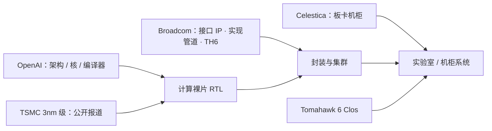

# OpenAI 架构 + Broadcom 实现 + TSMC 3nm

架构与工作负载定义在 OpenAI；把 RTL 变成可流片的封装、I/O 与以太网交换，要靠芯片公司与代工厂的现有管道。

<footer>—— Hot Chips 2026：OpenAI 点名 Broadcom 与 Celestica；公开报道将计算裸片联系到 TSMC 3nm / N3P</footer>

定制推理芯片很少是「一家公司从晶体管画到机柜」。Jalapeño 的公开故事是分工：OpenAI 定义推理架构、编程模型与指标，并强调计算裸片大部分是新写的 RTL；实现与接口 IP、以太网交换、板卡机柜则明确感谢 **Broadcom** 与 **Celestica**。工艺节点在 OpenAI 幻灯的现场稿里不如算力/带宽表格那么被逐字抄出，但随后的公开分析（SemiAnalysis 等）把计算裸片写成 TSMC **N3P**、并常把 I/O 小芯片联系到 N3E——**这是报道，不是本博客看到的数据手册**。本篇只整理已经公开的分工与节点叙述，不编造未披露的 mask 层数、未公开的 wafer 价格、未发布的第二代节点。

## 问题

从空白做 ASIC 有两套时钟。一套是架构：空间核、HBM 切片、集合网络，见 [推理专用](/llm/jalapeno-inference-only) 与 [数据搬运](/llm/jalapeno-data-movement)。另一套是工业：物理设计、接口 PHY、HBM 控制器、封装、以太网交换芯片、机柜供电与液冷。后者有现成 IP 与量产交换芯片时，九个月量级的 RTL 到 tapeout 才可理解；全部自研 SerDes 与交换，时间表会变成另一个项目。OpenAI 在问答里被问到「有多少是 Broadcom 现成 IP」：公开转述是计算裸片大部分从零写，接口 IP 与单独的 I/O 芯片用了现有块，其余是新的 RTL（报道提到 XLS 与 Verilog）。问题是：读者容易把「自研芯片」理解成「连交换芯片都是 OpenAI 的」——公开拓扑用的是 Broadcom **Tomahawk 6**。

代工节点决定能买到的密度、SRAM、HBM PHY 与能效。3nm 级是 2025–2026 年先进推理芯片的公开选项之一；具体是 N3P 还是别的 3nm 变体，应以 OpenAI / TSMC / Broadcom 的正式披露为准。在正式数据手册出现前，把「TSMC 3nm」写成**公开报道中的共识表述**，把 N3P/N3E 拆分写成**二次报道**。

### 三家名字对应三层

- **OpenAI**：工作负载、空间架构、编译器/Gluon、指标与实验室系统；用自家模型加速设计闭环（公开提过相对人工基线的 PPA 例子，如 BF16 乘法与矩阵单元面积）。
- **Broadcom**：被点名为关键伙伴；公开系统网络用 Tomahawk 6（约 102.4 Tb/s 级以太交换，高基数端口）。实现侧通常还包括 ASIC 服务（物理设计、接口）——具体合同范围未公开，不要写成「整颗计算核是 Broadcom 架构」。
- **TSMC**：公开报道中的晶圆厂与 3nm 级工艺；HBM4 堆叠的供应商在报道里有猜测（例如三星），**未在本篇当作事实**。
- **Celestica**：被点名为板卡与机柜系统化伙伴。

「OpenAI 架构 + Broadcom 实现」是分工的方便说法，不是法律上的 IP 归属表。问答已经把计算核描述为几乎全新 RTL。不要为了叙事把矩阵核写成 Broadcom TPU 风格的现成核——公开对比里脉动阵列是架构选择，见 [权重驻留](/llm/jalapeno-systolic)。

## 方法

读公开规格时按「计算封装」与「集群网络」两张表。Hot Chips 现场稿给出的计算封装数字：13.4 PFLOP/s 的 MXFP4×MXFP4 矩阵算力；15.4 TB/s HBM4、216 GiB；700 W 封装。2048 芯片系统：约 27 EFLOP/s、432 TiB。片间网络：本地 128 ASIC 域约 600 GB/s，全局 2048 域约 200 GB/s。二次报道补充过：计算裸片 reticule 级、两侧各三堆 HBM4（共六堆）、可能另有 N3E I/O 小芯片——**六堆与 I/O 节点未在本篇当作幻灯原文**，需要待原始幻灯或数据手册核对。

网络方法是直接采用已经量产的高基数以太交换，而不是再流一片 scale-up 专用交换。公开拓扑：半扁平两级 Clos，本地域服务张量并行的高带宽，全局域服务专家并行的较低带宽，任意两颗最多两跳。分析文章讨论过 Tomahawk 6 的延迟相对「超低延迟交换」并不最短——那是评论，不是 OpenAI 的选型白皮书。能确定的是：scale-up 与 scale-out 都走以太交换芯片，这与 NVLink 铜脊是不同的工业路线。

### 时间表里的「实现」是什么

公开项目时间从招人到 tapeout 大约十六个月、RTL 执行大约九个月（不同报道口径略有出入：有的把九个月说成 RTL 到 tapeout，有的说成 A0）。实现管道包括：用内部模型辅助 RTL、XLS 类硬件描述、与 DV/物理设计的短闭环。这解释了为什么需要有经验的 ASIC 伙伴：短闭环仍然要有库、有封装规则、有 HBM 与 SerDes 的签核。Gen 2 在公开口头上「已经在开发、数月内瞄准 tapeout」，没有给出节点是否仍为 3nm。不要把 Gen 2 的工艺写进本文。

## 机制

这种分工能缩短进度，是因为不可加速的部分（先进工艺排队、HBM 供给、交换芯片流片）被映射到已经存在的产品：N3P 类产能、HBM4、Tomahawk 6。可加速的部分（推理数据路径、门控策略、空间 ISA 与编译器）留在 OpenAI，并用自己的模型搜索 PPA。结果是一颗「看起来像定制核、接上却是工业以太与工业封装」的系统。700 W / 13.4 PFLOP/s MXFP4 的封装，是在这个工业约束里选的工作点，而不是在真空里最大化 FLOPS。

对 LLM 集群，这意味着通信语义更接近数据中心以太（RoCE/以太交换）而不是 NVLink 域。本地 128 卡域的 600 GB/s 是公开的片间口径，用来放 TP；跨 2048 的 200 GB/s 用来放 EP。能否在 decode 上扛住 All-to-All，取决于 MoE 的专家并行宽度与这档带宽，而不是取决于「TSMC 3nm」这个词。工艺影响的是同一面积里能放多少矩阵单元与 SRAM，带宽表是封装与交换给的。

13.4 PFLOP/s 是 MXFP4 矩阵算力，不是 FP32，也不是「等效 GPU」。与 Rubin 公开 NVFP4 峰值比大小时，必须钉数据类型与是否稠密；SemiAnalysis 等做过同节点对照，仍是二次分析。

### 不要把代工厂写成架构师

3nm 不决定权重驻留还是输出驻留，不决定 KV 是否切片。那些是 OpenAI 的微架构选择。同样，Tomahawk 6 不决定 Gluon 如何把核映射成 thread block。读新闻时把「谁家的 3nm」和「谁家的脉动阵列」分开，才能避免把每一颗 3nm AI 芯片写成同一个东西。

## 边界与工程取舍

不确定项（在正式数据手册前应保持开放）：I/O 小芯片的确切工艺与功能切分；HBM 颗粒供应商；Broadcom 在物理设计中的工作份额；封装是 CoWoS 还是别的 2.5D 名称（后续篇若写 2.5D，也只能引用已公开的封装叙述）。不要把 Celestica 写成芯片设计公司。不要把 Tomahawk 6 的 102.4 Tb/s 加进 Jalapeño 封装的 13.4 PFLOP/s 里当「芯片算力」。

供应链风险与 NVIDIA 垂直整合相反：交换与代工是外购。好处是时间；代价是路线图要跟 Broadcom 交换代数与 TSMC 节点窗口对齐。公开多代路线只说到 Gen 2/3 的目标口号，没有给出另一家代工厂。

出处：Hot Chips 2026 现场报道中的伙伴致谢、问答转述与封装规格表；Tomahawk 6 拓扑同场幻灯；TSMC N3P/N3E 来自 SemiAnalysis 等公开分析，文中已标明为报道。不编造未公开合同。

## 小结

- 公开叙事是 OpenAI 定义推理架构与计算核 RTL，Broadcom 与 Celestica 被点名为实现与系统伙伴。
- 集群 scale-up/out 走 Broadcom Tomahawk 6 的两级 Clos，不是 NVLink。
- 工艺在公开报道中为 TSMC 3nm 级，N3P 计算裸片 / N3E I/O 为二次报道，待官方数据手册确认。
- 封装级已公开数字以 Hot Chips 表格为准：MXFP4 算力、HBM4 带宽与容量、700 W、128/2048 域带宽。
- 「自研」指架构与数据路径，不指代工厂与以太交换芯片。
- 出处：Hot Chips 2026 报道 + 标明来源的工艺分析。
