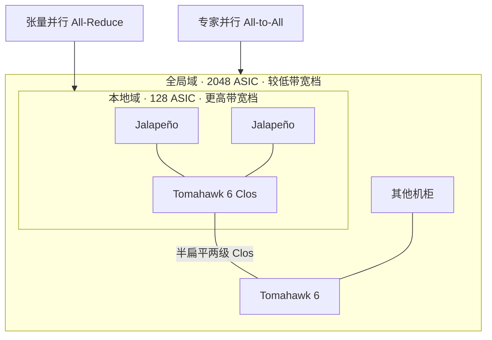

# Tomahawk 以太：scale-up 与 MoE scale-out

本地域 128 颗 ASIC，全局域 2048 颗；半扁平两级 Clos 建在 Broadcom Tomahawk 6 上，张量并行给更高带宽，专家并行给较低带宽。

<footer>—— OpenAI，Hot Chips 2026 Jalapeño 网络页</footer>

Jalapeño 的芯片互连没有走 NVLink 那一类专用加速器链路，而是把 Broadcom 的 **Tomahawk 以太交换**当成规模化生产路径。OpenAI 与 Broadcom 的联合说明里，Tomahawk 被点名为把平台拉到大规模部署的网络硅；Hot Chips 2026 进一步给出域的大小与职责：机柜内本地域 128 颗、跨柜全局域 2048 颗，拓扑是半扁平两级 Clos，**张量并行走更高带宽、专家并行走较低带宽**。公开封装级数字把本地域写成 600 GB/s、全局域写成 200 GB/s。本篇把这套以太域对到 [Scale-Up / Scale-Out](/llm/scale-up-vs-scale-out) 的编程含义上，并用 Broadcom 已公布的 Tomahawk 6（BCM78910 系列，102.4 Tb/s）说明交换芯片这一档能提供什么——不把分析师对托盘里几颗交换芯片的猜测写成 OpenAI 规格。

## 问题

单颗 Jalapeño 是 700 W、216 GiB、13.4 PFLOP/s MXFP4 的推理封装。前沿稠密与 MoE 模型仍然要跨芯片切：[张量并行](/llm/tensor-parallel) 要低延迟 All-Reduce，[专家并行](/llm/expert-parallelism) 要 All-to-All。GPU 超节点用 NVLink 域回答 Scale-Up；Jalapeño 选择以太交换回答同一问题，并额外把域做到 2048 颗。问题是：以太能否同时当 Scale-Up（短距、低延迟、高带宽）和 MoE 的 Scale-Out（多跳、拥塞、专家分发）？若把两种通信塞进同一尽力而为的数据中心网，decode 的同步税会打穿 TPOT。

OpenAI 的拆法是**两个域、两种带宽**，而不是「一张网通吃」。本地域覆盖一柜 128 颗，强调核到核低延迟；全局域用两级 Clos 拉到 16 柜量级的 2048 颗。TP 需要的字节与同步更狠，给高带宽档；EP 的 All-to-All 可以落在较低带宽档——这与 MoE 服务里「宽 EP、窄 TP」的经验同向，见 DeepSeek 一类部署约束，但数字以 Jalapeño 公开页为准。

### 以太 Scale-Up 不是把交换机当 NVSwitch 用

Tomahawk 6 的产品定位明确写了：同时服务 AI 的 scale-up 与 scale-out，单芯片 102.4 Tb/s，端口形态包括 512×200GbE、256×400GbE、128×800GbE、64×1.6TbE，并强调 RoCEv2、拥塞控制与高基数。它仍是以太网交换机：报文、队列、ECN、负载均衡，不是加速器私有的内存语义互连。Jalapeño 能把它当 Scale-Up 用，靠的是短距铜缆/背板、闭集拓扑、以及运行时把集合通信映射到这条确定的 Clos，而不是在共享数据中心叶子上碰运气。

600 GB/s 与 200 GB/s 是 Hot Chips 规格页上的域级数字，口径是每芯片注入该域的带宽量级，不要理解成 Tomahawk 6 的 102.4 Tb/s 芯片吞吐，也不要理解成任意一对核的点对点速率。一对一换算必须回到拓扑与过订阅，公开材料没有给出完整的轨对齐表。

## 方法

把通信维画在域上。TP 组优先放进 128 颗的本地域，使激活 All-Reduce 走柜内背板与本地交换，避免跨柜光学的跳数。MoE 的专家若铺开到 2048 颗全局域，All-to-All 走半扁平两级 Clos；带宽档低于 TP，换的是专家容量——更多芯片可以各持更少专家，decode 时本地 GEMM 更瘦、并行度更高。这与「机柜当一块加速器」同构，见 [rack-as-accelerator](/llm/rack-as-accelerator)，只是脊从 NVLink Switch 换成了 Tomahawk 6 以太。

主机侧仍有前端以太（管理、存储、对外 API），不要与加速器域混地址、混队列。Celestica 负责把交换托盘、计算托盘、铜缆与液冷收成可复制机柜，见 [板卡与机柜](/llm/jalapeno-celestica)。软件要把 NCCL 式集合通信的后端换成这条以太域上的实现，进程组禁止跨出 2048 的全局域去「再叠一层普通 Clos」当同一 TP 组。

### Broadcom 公开规格只说明交换硅这一档

Tomahawk 6（BCM78910 / BCM78914）是商用交换芯片：102.4 Tb/s，Peregrine 106.25G 或 Condor 212.5G PAM4 SerDes，Broadcom 声称可支撑最多 512 XPU 的单跳 scale-up 与更大的两层 scale-out。Jalapeño 的 128 / 2048 是 OpenAI 系统拓扑，不必等于 Broadcom 营销页上的 512 XPU 示例。引用时分开：芯片能提供的基数与比特率来自 Broadcom；域的大小与 600/200 GB/s 来自 Hot Chips。未公开的是每颗 Jalapeño 引出多少条 SerDes、过订阅比、以及全局域里光学与铜缆如何混用的完整 BOM。

## 机制

半扁平两级 Clos 的机制是：多数柜间流量只过有限跳数，避免经典三层数据中心把 AI 集合通信拉成高尾延迟。本地域更扁，核到核延迟按机柜背板计。TP 对延迟敏感，因为 decode 每层都同步；给它 600 GB/s 档，是为了让 All-Reduce 的传输时间仍能被本地 GEMM 掩盖或至少不超过步预算。EP 的消息更碎、更突发，200 GB/s 档加上拥塞控制（Tomahawk 产品特性里的负载均衡与智能拥塞管理）要解决的是 hol 阻塞与 ECMP 极化，而不是把每条专家消息都抬到 TP 的带宽。

以太 Scale-Up 相对 NVLink 的机制差异：报文开销、端到端拥塞、PFC/ECN 策略会进入关键路径。好处是供应链与端口生态（光模块、铜缆、交换机整机）按以太发货，适合与 Broadcom 硅实施、Celestica 整机一起上量。OpenAI 把这一点写成生产路径，而不是实验室专用互连。

Hot Chips 还强调请求跨越 prefill、草稿模型、带突发 MoE 通信的校验 decode 三阶段。网络必须在同一套域上同时伺候计算墙与带宽墙，而不是为 MoE 突发另建一张物理网。闲置加速器的基线功耗是他们反对异构机群的理由之一；域的设计要让同一颗芯片在不同阶段开不同比例的计算、内存与网络，而不是把 KV 在阶段边界搬到另一类机器。

### 与 NVLink 超节点的对照

NVL72 一类是 72 GPU 专用域；Jalapeño 全局域 2048 是以太网域，编程模型仍是多装置，不是单一 PCIe 功能。不要把 2048 写成「一块 GPU」。故障域也不同：交换芯片或 Clos 脊影响整域集合通信，运维应按域摘柜，而不是按单卡热插。跨 2048 之外的副本、存储、地域，仍走真正的 Scale-Out 前端网，不要让检查点抢加速器 Clos。

## 边界与工程取舍

不要用 Tomahawk 6 的 102.4 Tb/s 去除 128 得出每卡带宽并当作 Jalapeño 规格。不要把 SemiAnalysis 对 Chana 托盘里一颗还是两颗交换芯片的推断抄进容量表——那是第三方重建。不要假设 RoCE 参数（MTU、PFC、DCQCN）可以从普通存储网照搬；AI 集合通信的报文尺寸与突发和存储完全不同。

MoE 若专家数远小于 2048，不必为了用满全局域而把 EP 拉满；空半截 Clos 只会增加跳数。TP 若超出本地域，必须测量全局域 200 GB/s 档是否扛得住 decode，而不是从训练拓扑抄 $T$。

出处：Hot Chips 2026 网络与规格页（128 / 2048、600 / 200 GB/s、TP 高带宽 / EP 较低带宽、Tomahawk 6）；OpenAI–Broadcom 联合稿中的 Tomahawk 点名；Broadcom BCM78910 产品页的 102.4 Tb/s。不编造未公开的 SerDes 条数与过订阅比。

## 小结

- Jalapeño 用 Tomahawk 以太做加速器域：本地域 128、全局域 2048，半扁平两级 Clos。
- 公开带宽档：本地域 600 GB/s、全局域 200 GB/s；TP 走高档，EP 走低档。
- Tomahawk 6 是 102.4 Tb/s 商用交换硅，说明「以太能当 Scale-Up 交换」这一档，不等于系统拓扑的逐端口表。
- 以太 Scale-Up 仍是报文网络，靠闭集拓扑与集合映射逼近专用互连，不是 NVLink 的内存语义。
- 域外副本与存储走前端网；不要把分析师 BOM 当成官方规格。
- 出处：Hot Chips 2026；OpenAI / Broadcom 公开说明；Broadcom Tomahawk 6 产品页。
