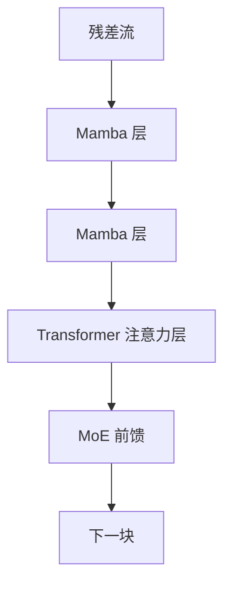

# Jamba 注意力-SSM 混合

少数 Transformer 层提供精确检索，多数 Mamba 层提供线性扫描；再在前馈里插 MoE。

<footer>Lieber 等，Jamba，AI21，2024</footer>

纯 Mamba 堆叠在长上下文上便宜，在精确检索和 in-context 格式上发虚；纯 Transformer 相反。Jamba 不发明第三种序列算子，只在深度上把已有的两种层按周期排好，再把部分前馈换成 MoE。它是可部署的交错图：注意力层数决定 KV 预算，Mamba 层数决定扫描占比，专家层数决定激活参数。

## 问题

Mamba 把序列层做成线性时间和常数状态，但纯 SSM 堆叠在 in-context 学习、精确拷贝和某些推理格式上，往往落后于同规模 Transformer。注意力的 KV 表太贵，却是目前最可靠的随机访问记忆。两边的短板对称：全注意力付不起长上下文的缓存；全 Mamba 付不起「从任意位置取回一个 token」的精度。

Jamba 的问题不是再发明一种序列算子，而是**在现有算子之间做层间交错**：哪些层必须是注意力，哪些层可以是 Mamba，前馈要不要做成 MoE。目标是一张能在长上下文下部署的稠密–稀疏混合图，而不是理论上更纯的模型。

AI21 的 Jamba 是工程混合，层比、MoE 周期、注意力间隔都是超参，不是从第一性原理推出来的唯一解。

### 单层替换解决不了检索

把 Transformer 的每一层注意力换成 Mamba，得到的是纯 SSM 语言模型。长程压缩在，精确检索弱。把每一层都留成注意力，KV 随长度线性涨，百万 token 上下文在推理侧先被缓存打死。需要的是在深度方向上**稀疏散布**注意力，让大多数深度走 SSM。

## 方法

Jamba 的骨架是重复的「混合块」。块内按固定周期排列：

- 多数层：Mamba 序列混合 + 稠密或稀疏 MLP；
- 每隔 $l$ 层：插入一层标准的因果 Transformer 注意力（带 KV），再接 MLP；
- 每隔 $e$ 层：把 MLP 换成 MoE，路由到专家子集。

注意力层是**全序列**的，不是 Griffin 那种滑动窗口。SSM 层用 Mamba 的选择性扫描。两者在残差流上交替，而不是在同一层里并联。MoE 不参与序列混合的选择，只放大前馈容量、压低每 token 激活参数。

### 交错的周期

设总层数为 $L$。若每 $l$ 层出现一次注意力，则注意力层数约为 $L/l$，KV 缓存按这个比例缩小。$l=1$ 退回 Transformer；$l \to L$ 退回几乎纯 Mamba。Jamba 的实验落在中间：足够密的注意力以维持 in-context 与检索，足够稀以让长上下文的缓存可部署。

MoE 周期 $e$ 独立于 $l$。序列层的线性时间与专家层的稀疏激活正交：前者管长度，后者管参数。把两者绑在同一层也可以，但论文把它们拆开，便于分别消融。

### 仍是因果语言模型

位置、词嵌入、输出头与常规 Decoder-only Transformer 同类。变的是中间的序列混合器。注意力层使用和普通 Transformer 相同的 QKV 与因果掩码；Mamba 层使用选择性 SSM。没有新的位置编码理论，也没有新的路由理论——Jamba 是**组装**，组装的对象已经在各自论文里成立。

## 机制

### 注意力层在混合里实际做什么

稀疏的全序列注意力提供全局的、可寻址的记忆。In-context 的示范、远处的约束、需要精确对齐的格式，由这些层完成匹配。因为层数少，KV 总量约为纯 Transformer 的 $1/l$。对长上下文推理，这是 Jamba 可落地的直接原因。

Mamba 层则在两次注意力之间做线性扫描，把局部模式和可压缩的长程统计写进 SSM 状态。下一层注意力看到的残差，已经过 SSM 的混合，不完全是原始 token 流。于是注意力不必在每一层重复同一份全局匹配。

KV 只在注意力层物化。Mamba 层的状态宽度与上下文长度无关，不进入 KV 预算。

### MoE 叠在混合骨架上

Jamba 的总参数可以很大（专家数 × 专家宽），激活参数保持在较小的一档。这与 Switch Transformer 一类的稀疏前馈相同，只是底座从纯 Transformer 换成了 Mamba–注意力交错。负载均衡、专家并行、路由抖动，全部是 MoE 自己的工程，不因下面是 SSM 而消失。混合架构若在路由上失败，表现会先像一个坏 MoE，而不是像一个坏 SSM。

## 边界与工程取舍

交错比是超参，对任务敏感。检索型、needle-in-haystack、严格的 in-context 拷贝，需要更密的注意力；纯长文档的流畅续写，可以更稀。没有一条对所有下游都最优的 $l$。把 Jamba 理解成「Mamba 已经足够、注意力只是遗留」会读反论文：注意力被留下，正是因为 SSM 单独不够。层比一旦在预训练里钉死，推理期很难再加密注意力而不重新训练，所以 $l$ 是产品决策，不是运行时开关。

实现上，两种层的 kernel 不同，编译、量化、投机解码都要走两套。训练时的流水线切分也更烦：注意力层通信 KV，Mamba 层通信状态。MoE 再引入专家并行，三套并行维度（数据、专家、序列核）必须一起排。这是部署成本，不是论文图表里的曲线。

Jamba 1.5 等后续版本改宽度、改对齐数据，不改变「注意力–Mamba–MoE」这张图。本篇只讨论这张图。

与 Griffin 的差别要写清：Griffin 的注意力是局部窗口、全局通道是线性 RNN，且可以没有 MoE；Jamba 的注意力是全局的、全局通道由注意力与 Mamba 共同承担，并用 MoE 堆参数。两者都是混合，混合的轴不一样。部署时若只报告总参数或只报告激活参数，会把 MoE 的稀疏与 SSM 的线性时间混成一个「效率」数字；正确的报表是三栏——注意力层 KV、$l$ 与 $e$、激活 FLOP。

## 小结

Jamba（Lieber 等，AI21，2024）把 Transformer 注意力层与 Mamba 层按周期交错，并在部分前馈上使用 MoE：用少数全序列注意力保住检索与 in-context，用多数选择性 SSM 压低长上下文的时间与 KV，用专家稀疏放大容量。它是层间混合的工程解，不是新的序列算子。读它时应盯住两个周期——注意力间隔 $l$ 与 MoE 间隔 $e$——以及由此而来的 KV 预算，而不是把它简化成「带 MoE 的 Mamba」。交错比在预训练里钉死之后，几乎不能当推理开关用。
