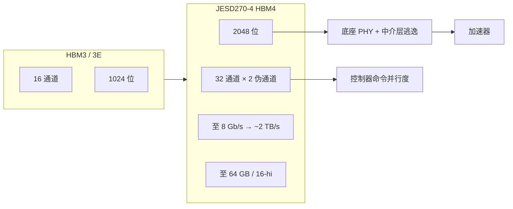

# JEDEC HBM4

HBM4 在 2048 位接口上把每针速率写到 8 Gb/s，使单栈带宽达到 2 TB/s 量级，并把每栈独立通道从 HBM3 的 16 条加倍到 32 条。

<footer>—— JEDEC，2025 年 4 月 16 日：发布 JESD270-4 HBM4 标准新闻稿</footer>

HBM3 / [HBM3E](/llm/hbm3e) 把 1024 位宽接口和堆叠 DRAM 推到了当前加速器的主位。模型参数、KV 与专家权重继续涨，单栈带宽与容量再次成为屋顶线的分母。JEDEC 在 2025 年 4 月 16 日公布 **JESD270-4**：HBM4。新闻稿给出的规范峰值是：最高 8 Gb/s 的传输速率、2048 位接口、合计最高约 **2 TB/s** 每栈；通道从 16 条加倍为 32 条，每条再分两个伪通道；栈高支持 4 / 8 / 12 / 16 层，芯粒密度 24 Gb 或 32 Gb，16 高 × 32 Gb 给出最高 **64 GB** 每立方。本篇写这条标准合同对封装、控制器和 LLM 屋顶线意味着什么。厂商后续可能把针速再往上推的产品档，以各家数据手册为准，不把新闻稿未写的 12+ Gb/s 写成 JESD270-4 的保证值。

## 问题

算术强度低的 decode、以及任何「每步扫一遍权重」的工作点，时间由从栈里搬出的字节决定，见 [HBM 屋顶线](/llm/hbm-roofline)。提高 $B$ 的两条路是加针和加每针速率。HBM3E 主要走后一条：接口仍是 1024 位，把 Gb/s 往 9.6 一档推。继续加速率，PHY、中介层逃逸和功耗先顶住；继续加栈高，热和 TSV 良率先顶住。HBM4 选择把**位宽翻倍**，用更多独立通道换并行度，而不是只把 1024 位再超频一档。

通道加倍不是装饰。HBM3 每个立方 16 个完全独立的 64 位通道；HBM4 写成 32 通道 × 2 伪通道，控制器可以有更多独立的命令流去打不同的 bank 组，减少大模型里「很多内核同时要内存」时的命令堵塞。代价是底座 PHY、凸点阵列和 [CoWoS](/llm/cowos-l-r) 逃逸必须放下约两倍的 DQ 与配套电源地。节距若仍停在上一代微凸点，面积和 SSN 会先爆。这是标准与封装必须一起读的原因。

### 2 TB/s 怎么来、不要反推错

粗算 $B = (2048/8)\times 8\,\mathrm{Gb/s} = 2048\,\mathrm{GB/s} \approx 2\,\mathrm{TB/s}$。这是规范写在新闻稿上的峰值乘积，假定全宽、满速率、不计 ECC 开销与实现降额。系统卡的 $B$ 还要乘栈数再乘利用率。一张放八栈 HBM4 的加速器，纸面可以接近 16 TB/s 量级，那是「八条满规格栈同时跑满」的上界，不是 decode 小 $M$ 时能吃到的有效带宽。JEDEC 还写了供应商可选的更低 VDDQ（0.7 / 0.75 / 0.8 / 0.9 V）与 VDDC（1.0 / 1.05 V），目标是降功耗；具体落在哪一档由器件，不由博客指定。

标准号是 JESD270-4。HBM3 族是 JESD238。引用时写 JESD270-4 与发布日期 2025-04-16。不要把第三方文章里误植的编号抄进容量规划。

## 方法

控制器与 PHY 按 2048 位、32 通道去设计。新闻稿写 HBM4 **接口定义向后兼容现有 HBM3 控制器**，使同一控制器在需要时可以驱动 HBM3 或 HBM4。这句话的工程含义是：命令/协议层面有兼容路径，降低迁移成本；它**不**意味着 1024 位的旧 PHY 凸点图可以直焊 2048 位的新立方，也不意味着中介层逃逸层数可以不改。封装侧仍是新的凸点阵列、新的电源垫密度、新的热包络。16 高栈把容量推到 64 GB，JEDEC 同时要在有限封装高度里放下更多芯粒，键合与减薄策略见 [混合键合](/litho/hbm-hybrid-bonding)，标准只规定电气与配置，不规定必须用微凸点还是混合键合。

Directed Refresh Management（DRFM）写进 HBM4，用于加强 row-hammer 缓解与 RAS。加速器固件与内存控制器必须按标准实现定向刷新命令，而不是只把数据速率开到 8 Gb/s。刷新占用的带宽要从屋顶线里扣：规范峰值是数据总线能提供的上限，不是持续用户带宽。测试接口（边界扫描、BIST、IEEE 1500 一类底座包装）随通道数变重；已知好立方与逻辑 die 的配对，在 16 高、64 GB 的报废成本下比 8 高更苛刻。

对 LLM 规划：容量墙与带宽墙仍然分开。64 GB × 栈数决定能驻留的权重 + KV；2 TB/s × 栈数决定 decode 扫参数的时间下界。精度从 FP16 到 FP8 / FP4 减的是字节，分子 $B$ 若按 HBM4 抬一档，拐点右移的程度要重新算，不能沿用 HBM3E 卡的经验倍数。HBM4 立方更宽，意味着 [CoWoS-L](/llm/cowos-l-r) 一类大中介层更可能成为默认载体：3.3× 硅中介层不一定围得下「更大的逻辑 + 更多更宽的立方」。

### 电压、兼容与多源

可选 VDDQ / VDDC 让各家在能效上分化，也让主板与中介层的电源平面必须按最严的一档做完整、按实际器件做配置。多源是 JEDEC 的价值：SK hynix、Samsung、Micron 以及控制器/IP 厂商都在新闻稿里表态支持。多源保证的是接口合同，不保证键合工艺、底座用 DRAM 工艺还是逻辑工艺、以及 12 高与 16 高的热阻可互换。换供应商等于换应力与刷新表征，见混合键合专文。新闻稿中的「单个控制器可同时面向 HBM3 与 HBM4」是为了系统公司做过渡 SKU；量产加速器通常仍会为 HBM4 单独签核一套 PHY 与封装。

## 机制

位宽翻倍时，电源与地针必须一起加，否则同步开关噪声把眼图吃掉。HBM4 的通道独立性使不同通道可以不同步，这有利于命令并行，也使跨通道的校准、ZQ 和温度读出变成更多独立状态机。底座从「DRAM 工艺上的宽 I/O」走向更像逻辑 PHY：均衡、端接、更低的 I/O 电压，都是 2048 位 × 8 Gb/s 的信号完整性在逼。标准把速率钉在 8 Gb/s 这一档作为发布时的规范峰值；产品若宣称更高针速，那是器件超规范或后续补充，引用时必须分开。

容量公式：$16 \times 32\,\mathrm{Gb} / 8 = 64\,\mathrm{GB}$。24 Gb 芯粒在同样 16 高下是 48 GB。栈高与芯粒密度是两个旋钮，热包络往往先限制栈高。16 高相对 12 高，上层 DRAM 离底座更远，刷新时间与温度传感器的布局必须按标准的 DRFM 与温度管理来，而不是只在数据手册上印 64 GB。系统侧若用不满带宽，立方仍在漏电和刷新，HBM 功耗是加速器 TDP 的显项——HBM4 的能效改进来自更低的 I/O 电压与更高的每瓦字节，不是来自「闲着就不耗电」。

Barry Wagner（NVIDIA，JEDEC HBM 子委员会主席）在新闻稿中把 HBM4 定位为 AI 与加速计算所需的带宽与容量台阶。这是标准化陈述，不是某一代 GPU 的产品表。具体卡用几栈、跑几 Gb/s，以该卡数据手册为准。

### 和 HBM3E、UCIe 内存提案的关系

HBM3E 是 1024 位接口上的速率延伸，控制器兼容 HBM3，封装凸点图可延续。HBM4 是位宽与通道架构的换代，即便协议向后兼容，物理与电源已经是新一代。有研究讨论用 [UCIe](/llm/ucie-d2d) 接 on-package 内存以改善岸线密度，那是另一条封装内存路径，不是 JESD270-4 的内容。规划 2026 年前后的加速器时，主路径仍是 JEDEC 立方体 + 2.5D；UCIe 内存是补充叙事。不要把 2 TB/s 单栈和 UCIe 岸线 GB/s/mm 加进同一条「内存带宽」里。

## 边界与工程取舍

不要用 8 Gb/s × 2048 位去标注尚未采用 HBM4 的 H200 / B200 类产品——那些卡的公开内存是 HBM3E。不要把 64 GB 写成每张 GPU 的容量；那是单立方上限，GPU 容量是栈数 × 每栈。不要忽略刷新与 ECC 对持续带宽的折扣。不要假设 HBM3 中介层版本稍改即可逃逸 2048 位。不要把新闻稿里的「向后兼容控制器」理解成「旧板子插新立方」。

热与高度：16 高是否进某一产品，取决于盖内净空和键合工艺，标准允许不等于该年能量产。Row-hammer 与 RAS 是标准强制能力，固件若关掉 DRFM 去换几个百分点的带宽，可靠性合同已经破了。

出处：JEDEC 新闻稿 *JEDEC and Industry Leaders Collaborate to Release JESD270-4 HBM4 Standard*（2025-04-16）：8 Gb/s、2048 位、2 TB/s、32 通道、电压档、DRFM、4–16 高、24/32 Gb、64 GB、HBM3 控制器兼容表述。器件超规范速率以各厂手册为准。

## 小结

- JESD270-4 把 HBM4 定为 2048 位、至 8 Gb/s、约 2 TB/s 每栈，通道 32×2 伪通道。
- 容量上限 64 GB（32 Gb × 16 高）；电压与 DRFM 是能效和 RAS 合同的一部分。
- 位宽翻倍把压力转到 PHY、凸点与中介层逃逸；标准兼容控制器不等于兼容封装。
- LLM 屋顶线按栈数 × 规范 $B$ × 利用率重算，不沿用 HBM3E 的经验倍数。
- 产品针速与栈数以数据手册为准，不以新闻稿峰值代替整卡规格。
- 出处：JEDEC JESD270-4 发布说明。
