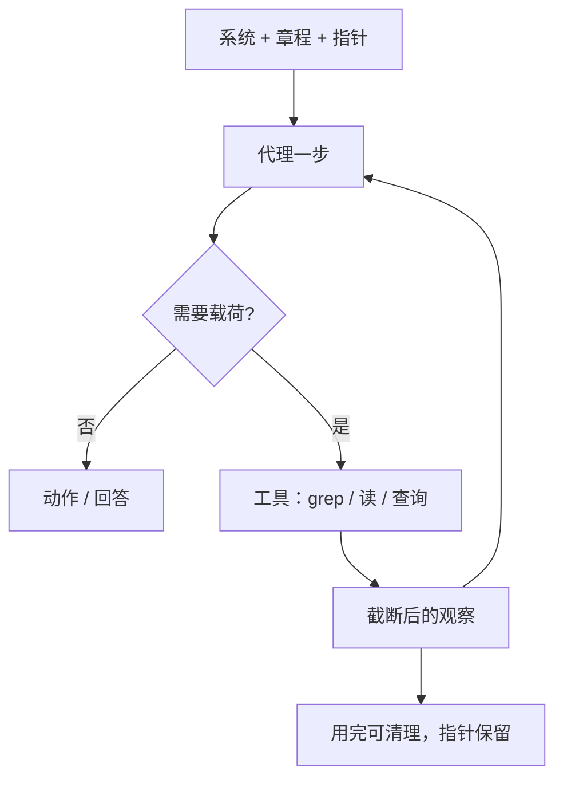

# Just-in-Time Context Retrieval

不要在推理前把所有可能有关的数据预处理进窗口；代理只持有轻量标识符，在运行时用工具把数据动态载入。

<footer>—— Anthropic Applied AI，Effective context engineering for AI agents，2025-09-29</footer>

许多 AI 应用仍在用嵌入检索：推理开始前把「可能有关」的块塞进提示。代理出现之后，Anthropic 观察到另一条策略：**just in time**（即时）上下文——窗口里主要是指针（路径、已存查询、链接），载荷通过工具在需要的那一步才进入。Claude Code 分析大型数据库时可以写针对性查询，再用 `head` / `tail` 看结果，而不把整表读进上下文。这与人类用文件系统、收件箱、书签工作的方式同构：工作记忆里是索引，不是整库。本篇写 JIT 作为运行时纪律，它与预检索的分界，以及和 [渐进式披露](/llm/progressive-disclosure)、[摘要压缩](/llm/compaction-summarize) 如何叠用。

## 问题

预检索假设「这一问要用的证据可以在第 0 步一次找齐」。对分类或单跳问答，这大致成立。对编码代理、多跳研究、数据探索，第 0 步不知道第 7 步会打开哪个文件。提前塞得越多，越早触发 [腐烂](/llm/context-rot) 与 [中间丢失](/llm/lost-in-middle)，索引过时的问题也越大：嵌入库与仓库不同步是常客。JIT 把「选什么」推迟到模型已经看见前几步的观察之后，用当前目标当查询。

代价是延迟与迷路。运行时探索比读预计算块慢；工具设计不好时，代理会浪费窗口去试错。Anthropic 写明：没有合适的工具与启发式，代理会误用工具、追死胡同、或认不出关键文件。JIT 不是「把检索器扔掉」，而是把检索器的调用权交给循环中的模型，并让 **标识符的元数据** 本身成为信号：`tests/test_utils.py` 与 `src/core_logic/test_utils.py` 同名不同义。

### 指针必须比载荷便宜

JIT 成立的会计条件是：标识符 + 工具 schema 的 token ≪ 载荷 token，且一次错误载入可以丢弃。文件路径、git blob、SQL 查询字符串满足；把「指针」做成整段摘要就不满足——那已是预取。工具返回值也应可截断：`head`、行范围、分页。Claude Code 对大对象的用法是查询与切片，不是 `SELECT *` 进窗口。返回整份 DOM 或整份 PDF 的工具，会把 JIT 打回预检索的费用曲线。

JIT 检索的「检索」是模型注意力意义上的载入，不一定是向量检索。grep / glob / SQL / 浏览器 都算。向量库可以当一种工具，而不是生成前必跑的隐式阶段。

## 方法

最小实现：系统提示描述工作区与工具；窗口常驻的是任务、短章程、工具列表；历史里只留指针与短观察。需要内容时调用 `read` / `grep` / `query`。读完用完即可 [清理工具结果](/llm/compaction-summarize)，指针仍在，必要时再读。这与 RAG 的差别是 **次数与时机**：RAG 通常一次 $k$ 块；JIT 是 0 到多次，查询随状态变。

混合策略被明确推荐。Claude Code：`CLAUDE.md` 之类章程 **预先** 丢进窗口（内容相对稳、每步都要用），仓库其余部分用 glob/grep **即时** 取。法律、金融等变化慢、结构清的语料，可以预取目录与关键条款，细节仍 JIT。决策边界随模型变强而右移：更强的模型可以更少预取、更多自主导航。Anthropic 的元建议仍是：做能用的最简单方案。

标识符的元数据是免费启发式。目录层级、命名、时间戳、文件大小，让代理在打开前估计复杂度与相关性。这是渐进式披露的输入，但 JIT 强调的是 **运行时才付载荷成本**。没有元数据的 blob 存储（只有向量近邻、没有路径）会逼代理把块内容当唯一信号，第一次检索就得拉正文，JIT 退化。

### 与嵌入预检索如何并存

预检索擅长：语料大、问题单跳、延迟预算紧、不允许模型乱翻。JIT 擅长：状态依赖的下一步、索引易过期、载荷极大。并存的一种做法是 **粗召回指针、细读即时**：向量检索返回路径或块 ID（轻），模型再决定读哪些 ID 的全文（重）。这与 [检索式压缩](/llm/retrieval-based-compaction) 兼容：若决定读，可以只把压缩视图放进窗口。不要两条管道各塞一份全文，费用会叠加，位置曲线更差。

## 机制

JIT 把上下文工程从「一次组装提示」变成「每步组装」。每一步的最优 token 集合不同，所以不能在会话开始时求一次最优。指针使状态机可逆：清理载荷不等于丢失地址。人类工作记忆容量有限、靠外部索引，Anthropic 用这个类比解释为何即时载入仍能完成超窗任务——任务知识在盘上，不在激活里。

失败机制也清楚。工具过载：功能重叠的工具让模型不会选，Anthropic 在工具设计文里要求最小重叠。观察过长：一次 JIT 调用返回 20k token，等于预取。没有丢弃策略：载入的文件一直留到窗口满，JIT 的「即时」只发生在第一次。正确闭环是载入 → 使用 → 结构化笔记或摘要 → 删除原文。

前缀缓存与 JIT 有摩擦。预检索的块若每问不同，前缀分叉，[前缀缓存](/llm/prefix-caching) 帮不上。JIT 若保持稳定章程在前、变化载荷在后，章程段仍可缓存。把随机检索块塞进系统提示前面，是在主动破坏缓存。

### 延迟与正确性的交换

预计算嵌入使首 token 快、但可能错块。JIT 使首几步快（窗口空），总墙钟可能更长（多轮工具）。评测应报任务成功与总 token，而不是单次 TTFT。编码代理上，搜错文件的成本往往高于多一次 grep。数据分析上，错误地载入全表可能直接顶满窗口。给工具加硬顶（最大行数、最大字节）是 JIT 的安全网，不是可选优化。

## 边界与工程取舍

Anthropic 博文是 2025-09-29 的工程立场，不是对照实验。He 等后来在长文档代理上测渐进式披露（见专篇），对「原始文件导航 vs 技能包」给出受控数字；JIT 作为原则仍以博文为准。无工具的纯聊天模型无法 JIT。权限必须在工具层执行：模型拿着路径不等于有权读；预检索至少还能在索引阶段做 ACL。JIT 把授权检查挪到每一次读。

过稳的章程会过时：`CLAUDE.md` 写死的构建命令与仓库不一致时，预取段会持续误导，危害比「没预取、让模型去看 README」更大。章程要短、要可验证。动态内容（工单、股价）不应预取进系统提示。

「Just-in-time」来自编译与制造，不是新的注意力算法。它不改变 softmax。它改变的是哪些 token 有资格进入 softmax 的输入。实现可以很土：grep 就行。

## 小结

- JIT 上下文让代理持有轻量标识符，在循环中按需用工具载入载荷，而不是在推理前堆块。
- 标识符的位置、命名、时间戳是导航信号；工具返回必须可截断。
- 混合常见：稳定章程预取，大而易变的仓库即时取；Claude Code 用 CLAUDE.md + glob/grep。
- 用完清理载荷、保留指针，否则 JIT 会退化成长窗口堆栈。
- 与向量预检索可衔接：检索返回 ID，全文即时读；注意前缀缓存与 ACL。
- 出处：Anthropic，*Effective context engineering for AI agents*，2025-09-29。
