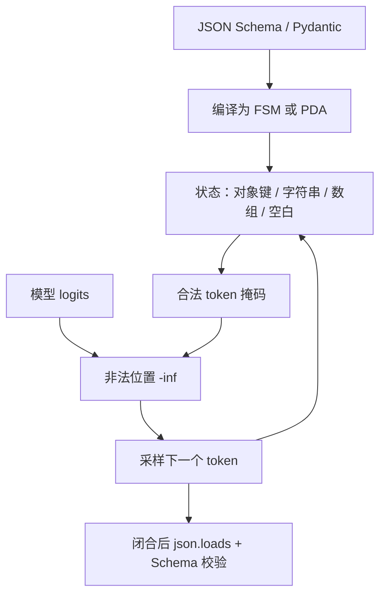

# JSON schema 约束解码

    
把合法续写写成自动机上的转移，再对词表建索引：每一步掩码可以是查表，而不必扫描整个词表去跑一遍 schema。

    <footer>—— Willard 与 Louf 的 Outlines 把 JSON Schema 降到引导生成；后续引擎把同一钩子接到服务热路径</footer>

工具调用、智能体状态机、评测判分器，都希望模型吐出能 `json.loads` 的对象，而不是「看起来像 JSON 的 Markdown」。提示里写 `请只输出 JSON` 能把失败率压低一截，却压不掉漏逗号、多尾逗号、键名幻觉、数字被切成非法子词。JSON Schema 约束解码把 Schema 编进采样掩码：类型、必填键、`enum`、嵌套对象与数组在逐步生成时就被强制。它是 [文法约束](/llm/grammar-decode) 的一个高价值特化，也是 OpenAI Structured Outputs、Outlines、XGrammar、各引擎 JSON mode 的共同产品形态。本篇只谈 Schema 这一层：哪些关键词能进自动机，哪些必须留给生成后的校验，以及流式半截 JSON 为什么不能当业务对象用。

## 问题

JSON 的表面文法是 CFG：对象、数组、值可以递归嵌套。Schema 在这份文法之上又加了 **结构与取值约束**：`type`、`properties`、`required`、`additionalProperties`、`enum`、`const`、`items`、`minItems`、`$ref`。无约束模型既会写非法 JSON，也会写合法但不符合 Schema 的 JSON——多一个未声明键、少一个必填键、把字符串写成数字。下游用 Pydantic 校验失败后重试，成本随嵌套与枚举变大而上升，且重试分布并不等于「Schema 上的条件分布」。

另一类失败发生在 token 边界。`"temperature"` 可能被切成多片；`true` / `false` / `null` 与数字的科学计数法各有多种切分；字符串里的转义 `\"`、`\uXXXX` 会让「当前是否仍在字符串内」成为必须跟踪的状态。只在字符正则上说「现在该出现键名」不够，必须相对于分词器定义消费规则。这与 Outlines 对词表索引的设定相同，只是字母表上的合法延续由 Schema 决定，而不是由用户手写的一条正则决定。

### Schema 松紧同时改变合法集合与模型自由度

`additionalProperties: true` 且不固定键序时，合法集合很大，掩码松，模型更常把键写乱或编造字段。把键序钉死、关掉额外属性、给每个字段 `enum` 或 `const`，合法集合变小，解析变稳，也更容易把模型逼进低概率合法 token，出现重复引号或最短骨架。产品上的「要不要约束键序」不是审美问题，而是语言大小、编译成本与采样质量的联合旋钮。

约束保证的是字节能通过 Schema 的结构检查，不保证字段值在业务上为真。`"age": 327` 可以完全合法。事实要靠检索、工具返回值或生成后的语义校验器，不要把 Schema 当成知识库。

## 方法

典型管线是：应用侧用 JSON Schema 或 Pydantic 模型描述对象 → 约束引擎把 Schema 编译成 FSM 或 PDA → 每步按当前状态掩码 logits → 生成结束后仍跑一次标准 JSON 解析与 Schema 校验作为断言。Outlines 的路径是把 Schema 能表达的结构降到正则或 CFG，再利用词表索引；对纯正则可表达的扁平对象，逐步开销接近查表。更深层的嵌套、`$ref` 循环与互递归对象则走上 [CFG / PDA](/llm/grammar-decode)。OpenAI 等托管接口的 Structured Outputs 把同一契约做成服务端保证：失败应表现为拒绝采样而非「尽力而为的 JSON 模式」。

编译时要把 JSON 的空白、键的引号、冒号与逗号写进自动机，而不是指望模型「记得加标点」。`enum` 与 `const` 变成有限字符串语言，适合预先展开到 token 路径。`pattern` 字段本质是正则，应走 [正则约束](/llm/regex-constrained-decode) 的编译器，并单独评估状态爆炸。数字的 `minimum` / `maximum` 往往 **不能** 便宜地编进逐步掩码：合法数字的 token 前缀集合与数值范围的关系不是局部的。工程上常见做法是结构用约束解码，范围用生成后校验或工具侧裁剪。

### 必填键、键序与 `oneOf`

`required` 要求在对象结束前某几个键都出现过。自动机因此不能只记得「现在在对象里」，还要记得已出现键的集合。键集合是 $2^k$ 的，键一多，状态膨胀。固定键序把问题降成一条链表：按约定顺序写完必填键再写可选键，状态数与键数线性相关。这是许多 JSON mode 默认钉死键序的原因。`oneOf` / `anyOf` 是若干分支文法的并；实现可以并行维护多个活前缀，或先让模型选判别字段再进入对应分支。判别字段若本身可被幻觉，分支会走错，Schema 仍可能满足——满足的是选中的那一支，不是业务意图。

### 流式与半截对象

客户端若在生成中途把缓冲区当 JSON 解析，会稳定地失败：缺闭合括号、字符串未结束、最后一个数字 token 还不完整。要对齐自动机状态来展示草稿（已知键可渲染，未闭合值标为 pending），或等接受态再投递。连续批服务里，每条请求的 Schema 可能不同，编译产物要缓存；同一 Schema 的不同序列仍处于不同状态，掩码不能广播成一份。

## 机制

设当前前缀的字节为 $w$，自动机状态为 $s(w)$。下一步分布是

$$
p_{\text{const}}(v \mid w) \propto p_\theta(v \mid w) \cdot \mathbf{1}[v \in \mathcal{M}(s(w))].
$$

若编译完备且 token 消费与分词器一致，生成结束时 $w$ 属于 Schema 对应的语言。这是结构层的定理，不是内容层的定理。`enum` 把某字段的支撑收到有限集合，模型不能「近义改写」键值——这对工具名、状态机枚举是优点，对自由文本字段则应用 `type: string` 而不是假装枚举能覆盖自然语言。

「JSON mode」若只禁止 Markdown 围栏、并不按 Schema 逐步掩码，只能降低非法率，不能保证必填键与类型。评测要分开报：可解析率、Schema 通过率、字段级准确率。三者下降点不同，混成一个「结构化成功率」会掩盖键幻觉。

### 可表示性空洞在 JSON 上的具体样子

数字 `0.1`、整数 `1000`、unicode 转义、空对象 `{}`、空数组 `[]` 都是高频空洞来源：分词器可能没有单 token 的 `:` 与 `"key"` 的理想拼接，或把 `.0` 切成模型在当前状态下不能走的片。结果是 Schema 允许、逐步掩码却走投无路，或被迫绕远路写出怪异空白。评测集应包含嵌套数组、空容器、unicode 键、大整数与布尔，而不是只测扁平的三个字符串字段。

## 边界与工程取舍

不要用逐步约束替代生成后的 Schema 校验。编译器与运行时都可能有 token 跨越 bug；校验器是廉价的断言。也不要把跨字段不变量（时间区间、校验和、外键存在）硬塞进 JSON Schema 的结构关键词——那会把自动机变成业务规则引擎，状态爆炸且仍然不完备。这类规则放在工具返回值或二次校验，失败则让模型在 **已合法的骨架** 上改字段，而不是整段重写。

托管 JSON mode、开源引擎、llama.cpp GBNF 生成的 JSON 文法，三者对 `additionalProperties`、`$ref`、`patternProperties` 的覆盖不同。移植时以官方 Schema 子集文档为准，不要假设 Draft 2020-12 的所有关键词都能进掩码。Willard & Louf（arXiv:2307.09702）给出索引式引导的复杂度论点；XGrammar（arXiv:2411.15100）给出 CFG 服务热路径的实现对照。具体某版的微秒数不要写进架构定义。

把所有 logit 关掉只留一个 token，等于按 Schema 最短路径打印模板，模型分数被忽略。调试字段内容变差时，先看 `enum` 是否过小、键序是否把高概率键排到后面，再看温度。过紧 Schema 会把多样本变成同一骨架。

### 与工具调用的交接

函数调用常被实现成「外层固定 JSON 对象，`arguments` 字段再套一层 Schema」。外层键名稳定，前缀缓存友好；内层参数才是约束的重点。参数里若嵌入自由文本（用户原话、检索片段），不要对那段文本再套正则或枚举，否则会把用户输入截断成「像参数的合法串」。约束的边界应停在结构，把不信任的字符串当不透明 payload，交给应用侧消毒——这与 [提示注入](/llm/prompt-injection) 的输出处理是同一条防线的不同层。

## 小结

- JSON Schema 约束解码把类型、必填键与枚举编进逐步掩码，目标是可解析且符合 Schema，不是事实正确。
- 键序、`additionalProperties` 与 `required` 的状态集合直接决定编译规模和模型自由度。
- 数值范围、跨字段不变量通常留给生成后校验；`pattern` 走正则编译器并防状态爆炸。
- 流式半截 JSON 不可当业务对象；掩码必须按序列，Schema 编译产物可跨请求缓存。
- 评测拆开可解析率、Schema 通过率、字段准确率；注意数字与转义上的可表示性空洞。
- 出处：Willard & Louf, *Efficient Guided Generation for Large Language Models*, arXiv:2307.09702（Outlines）；Dong et al., XGrammar, arXiv:2411.15100。引擎 JSON mode 以各厂商文档为准。
