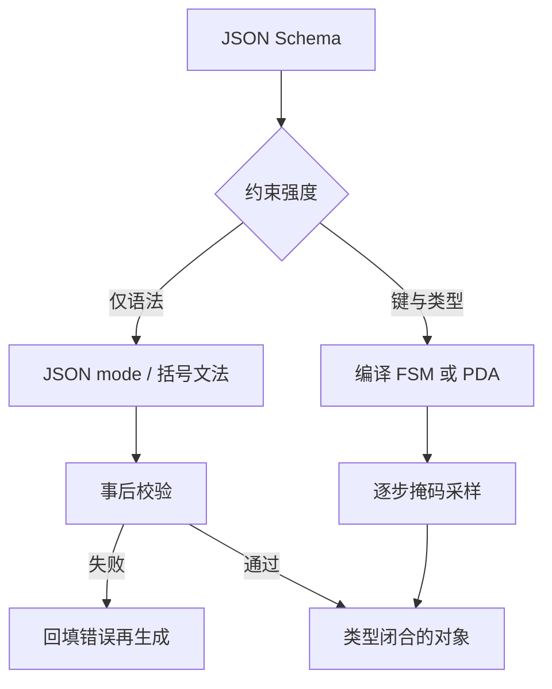

# JSON / 结构化输出

    
产品要的是能通过 schema 校验的对象，不是「看起来像 JSON」的散文；把 schema 编译进逐步掩码，合法集合在解码时就是闭的。

    <footer>—— 对照 JSON Schema 规范与 OpenAI Structured Outputs；解码引擎见 Willard 与 Louf 的引导生成及后续 CFG 实现</footer>

接口下游是解析器、数据库写入或另一个智能体。它们接受的是类型闭合的对象：缺字段、多余逗号、字符串里未转义的换行，都会在 `json.loads` 或校验器上炸掉。提示「请只输出 JSON」能把一部分概率质量推到花括号附近，却不能在逐步词表上禁止非法 token。JSON / 结构化输出把 **JSON Schema**（或等价类型定义）当成生成契约：要么事后校验再重试，要么在采样时把非法续写掩掉。后者的自动机与词表索引写在 [约束解码](/llm/constrained-decoding)；本篇写 schema 作为产品合同、JSON mode 与严格 schema 的档次差、以及它和 [function calling](/llm/function-calling) 参数块的分工。

## 问题

自然语言里的「结构化」是软的。模型可以输出 Markdown 代码围栏、前后解释、单引号、尾逗号、`True` 而不是 `true`。Schema 越深——嵌套对象、数组、枚举、`oneOf`——自由采样越容易在某一层出轨。重试有延迟与费用，且重试提示本身会污染上下文。需要在「完全自由」和「写死模板只填几个槽」之间，有一层按类型收缩支撑集的方法。

JSON Schema 本身比「是一个 object」苛刻得多：必填键、额外键是否允许、数字区间、字符串 pattern、依赖字段。产品真正要的常常是这张表，而不只是括号匹配。若解码器只保证 RFC 8259 意义上的合法 JSON，仍可能缺 `order_id`、把枚举写成近义词。问题因此分成两档：语法合法，与 schema 合法。混为一谈会在联调时互相指责。

### JSON mode 与 Schema 约束不是同一档

JSON mode 通常只约束「输出是一个 JSON 值」：对象或数组能闭合，字符串转义合法。它不规定键名集合。严格 schema 模式把 `properties`、`required`、`enum` 编进文法，键顺序有时还被固定以缩小语言。OpenAI 的 Structured Outputs、各引擎的 `guided_json` / grammar，都属于后一档的产品名；实现仍是逐步掩码或外部校验循环。选档时看下游：只做日志展示，mode 够用；要写入强类型 API，必须 schema。

Schema 合法仍可能语义荒谬：<code>"age": -3</code> 若类型是 integer 且未写 minimum，校验会放行。类型层与业务层要分开。把所有业务规则塞进 JSON Schema 的 pattern，会得到巨大、易炸的自动机，编译期先失败。

## 方法

先写一份与代码生成器同源的 schema，不要在提示里手抄一份、在校验器里再写一份。对象的 `additionalProperties` 默认是否允许，决定模型能不能发明键；生产入库应关掉。枚举用 schema 的 `enum` 而不是在 description 里列同义词。可选字段不要和「空字符串表示缺失」混用，否则解码器允许 `""`，下游又当缺失，行为分叉。

解码路径有三条。第一条：自由生成，事后用校验器，失败则把错误信息拼回对话再生成——实现简单，尾延迟差，且模型可能在解释错误时再次跑偏。第二条：JSON mode，语法闭合后再校验 schema，失败重试。第三条：把 schema 编译成 FSM / CFG，逐步只允许合法 token，一次通过的概率最高，编译与状态内存是代价。嵌套很深、pattern 很狂时，第三条会在编译期爆炸，应简化 schema 或改走校验循环。工具参数是第三条的典型客户：字段少、类型硬、失败代价高。

### Schema 编译进解码器

编译器面对的不是字符文法，而是 BPE / 词表。数字 `123` 可能是一个 token 或三个；`": "` 可能粘在键名后。约束引擎必须在 token 字母表上定义合法前缀，细节见 [约束解码](/llm/constrained-decoding) 里的可表示性空洞。工程上应固定分词器再编译文法，换模型等于重编译。键顺序若强制字典序或 schema 声明序，掩码更紧、更快，但与「JSON 对象无序」的直觉冲突——文档里要写死，客户端反序列化本来也不依赖序。

流式输出时，未闭合的对象对 `json.loads` 非法。要么等结束再解析，要么用支持增量的解析器按自动机状态展示草稿。不要把半截流式 JSON 直接写入数据库。`null`、空数组、缺键是三种不同的业务含义，schema 里应显式取舍，而不是指望模型「看着办」。

## 机制

掩码把每一步的分布改成条件于「当前前缀已是某合法 schema 前缀」。模型仍按 $p_\theta$ 在合法集合上打分；集合很小且模型很差时，会出现重复标点或极慢的挤牙膏——那是截断分布质量差，不是校验器坏了。固定键序相当于把对象语言变成近似的正则或浅 CFG，状态数下降。`oneOf` 与递归 `$ref` 把语言推向 CFG，需要下推自动机，缓存未命中时逐步开销上升。

与 function calling 的分工是：工具循环关心 *何时调用、调用谁*；结构化输出关心 *这一段 token 能否成为指定类型的值*。工具的 `arguments` 往往就是一份小 schema。完整助手答复也可以是一个 JSON 对象（例如只返回 `answer` 与 `citations`），这时没有工具角色，但仍走同一套解码。不要把「返回 JSON」实现成再包一层假工具，那会污染消息角色、让模板更脆。

温度与 schema 一起作用。高温会在合法键之间乱跳，但仍被掩码挡在类型外；低温加过紧 schema 可能总走同一骨架。评测结构化任务时，采样参数属于实验条件，见 [Temperature / Top-k / Top-p](/llm/sampling-temperature-topp)。

### 与 function calling 的分工

若产品只要一个对象、没有副作用，用结构化输出即可，不必走工具协议。若对象来自外部系统，应调用工具，观察可以是 JSON，最终用户可见答复可以是自然语言或另一份 schema。两套 schema 不要同名不同义。并行工具调用时，每个 `arguments` 独立约束；不要用一个巨大 JSON 把多次调用捏在一起，那会让部分失败无法按 id 回填。

## 边界与工程取舍

结构化输出不提高事实准确率。合法的 `"capital": "悉尼"` 仍然是错的。要把事实钉住，用检索或工具，见 [向量检索与切分](/llm/rag-chunking)。它也不替代鉴权：生成符合 schema 的删除指令，执行权仍在宿主。超大 schema（整份 OpenAPI）不适合一次性编进逐步掩码，应拆成小对象或只约束顶层信封。

各引擎的 JSON 实现覆盖面不同：unicode 转义、数字的科学计数法、对 `format: date-time` 是文法还是事后正则，都要实测。不要假设云厂商的 Structured Outputs 与开源 `guided_json` 在失败时行为一致——有的抛错，有的回退自由生成。回退最危险：表面上「总有输出」，类型契约已经破了。客户端应校验，不要只信响应头里的 `json_object` 标记。

引用 JSON Schema 规范、OpenAI Structured Outputs 说明、以及 [约束解码](/llm/constrained-decoding) 所列的 Outlines / XGrammar 论文。不要把某一版云 API 的字段名写成 IETF 标准。

## 小结

- JSON mode 保证语法闭合；严格 schema 才保证键、类型与枚举。
- 产品契约应与代码同源；`additionalProperties`、缺键与空字符串要显式定义。
- 逐步掩码一次通过最好，复杂 pattern 可能迫使改回校验—重试。
- Token 化与 schema 字母表不对齐会造成空洞，须锁定分词器再编译。
- 结构合法不等于事实正确，也不等于已授权执行。
- 工具参数与助手侧 JSON 答复共用同一套类型思想，但角色不同，不要用假工具硬套。
- 出处：JSON Schema；OpenAI Structured Outputs；Willard & Louf, arXiv:2307.09702；Dong et al., XGrammar, arXiv:2411.15100。
