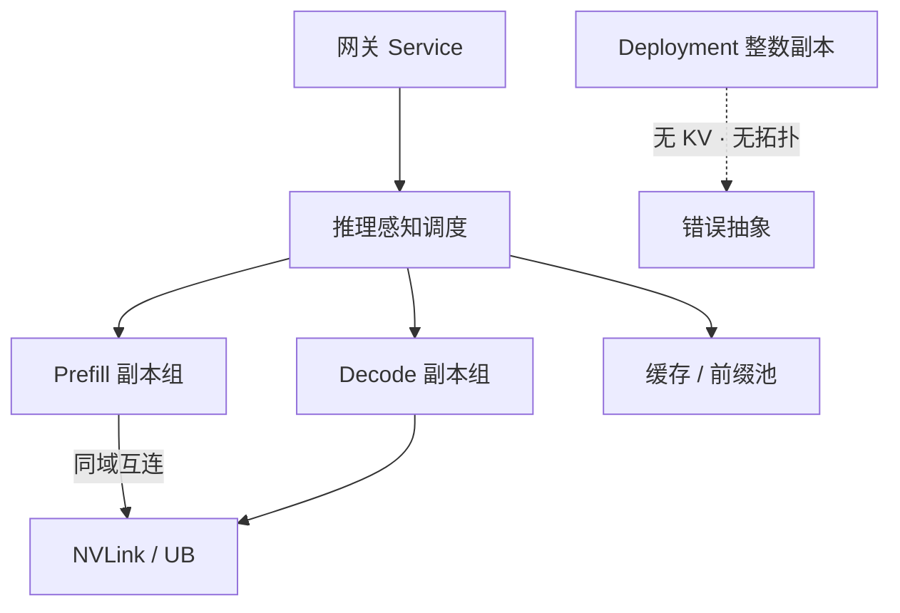

# K8s 推理工作负载

    
Deployment 假定副本无状态、可随时杀掉再拉起；自回归推理的状态在 KV 里，调度单位是 GPU 拓扑与迭代，不是均质的 Pod 整数。

    <footer>—— 对照 Kubernetes Deployment 的副本语义，以及 Orca / vLLM 把调度落在模型迭代上的服务引擎</footer>

把 LLM 塞进集群，第一反应往往是：镜像打好，写一个 Deployment，`replicas: N`，前面挂 Service。这对无状态 HTTP 成立。生成式推理不成立：每条请求在 GPU 上持有 [分页 KV](/llm/paged-attention)，副本之间不能随便挪；卡与卡之间有 NVLink / UB 域，[张量并行](/llm/infer-tp) 与 [专家并行](/llm/infer-ep) 必须落在同一通信域；prefill 与 decode 的 SLO 不同，常要 [PD 分离](/llm/pd-disaggregation)。Kubernetes 默认调度器看见的是 CPU、内存、以及设备插件报上来的 `nvidia.com/gpu: 1`。它不知道 KV 占用、不知道机柜是一块逻辑加速器，也不知道杀掉一个 Pod 等于丢掉该副本上所有会话状态。本篇把「K8s 上跑推理」写成工作负载类型问题：何时还能用 Deployment，何时必须自定义调度。

## 问题

Deployment 的契约是：任意 `n` 个就绪 Pod 可互换，滚动更新时先起后杀或先杀后起，水平扩缩只改整数副本。推理引擎的契约是：每个副本是一份（或一组）权重加一块 KV 池，进程内还有 [连续批](/llm/continuous-batching) 的运行集。杀 Pod 不经过排空，等于对所有在途会话做一次硬抢占且不换出。扩一个副本很慢——要加载数十到数百 GB 权重——缩一个副本很贵——KV 蒸发。副本还不可互换：绑了某租户前缀缓存的那张卡，与刚启动的冷副本，对 TTFT 不是同一个东西。

默认调度的第二失败是拓扑。要 8 卡 TP 的 Pod，若被拆到两台只有 PCIe 的机器，NCCL/HCCL 会在以太网里死去。超节点上若按 1 卡一个 Pod 铺满，UB 域被切碎，宽 EP 组不起来。Deployment 没有「必须同一 NVLink/UB 域」的一等字段；拓扑管理器与设备插件只能做局部 NUMA 对齐，做不到柜级约束。

### 无状态副本 vs 有状态加速器进程

Web 无状态：状态在数据库，Pod 是纯计算。推理有状态：状态的热路径在 HBM。可以把会话 ID 存进 Redis，但下一步 token 仍要本地 KV。因此「K8s 无状态」最多适用于网关、分词、以及把引擎当黑盒调用的前端；引擎本身是有状态的、拓扑敏感的、启动昂贵的工作负载。用 Deployment 硬套，不是风格问题，是语义错误。

Job/CronJob 适合离线批推理：跑完即焚，KV 不必跨 Pod 存活。在线交互、多轮、前缀缓存，都不是 Job。StatefulSet 给出稳定身份，仍不理解 GPU 装箱与迭代级抢占，只比 Deployment 多了有序编号。

## 方法

把控制面拆开。入口仍可以是标准 Service / Gateway：OpenAI 兼容 HTTP 见 [协议](/llm/openai-compat-api)。后面的引擎不要用 Deployment 的滚动整数去表达。最小可用的自定义是：一种 CRD 描述「一份模型副本」——要多少卡、要哪种互连域、是 P 池还是 D 池、权重来源、最大 KV 块——再由控制器去创建紧密耦合的 Pod 组（或多个容器共享设备），并用扩展调度器做放置。Volcano、Kueue、DRA（Dynamic Resource Allocation）一类机制的共同点是：调度决策看见的是拓扑与配额，而不是只看见 `gpu: 8`。

扩缩策略必须是引擎知情的。HPA 按 CPU 加副本，对 decode 几乎总错：CPU 很低，HBM 已满。应按队列深度、KV 占用、TTFT/TPOT 违约率来扩，且扩之前要等权重加载完成再接流量。缩容必须先排空：停止新请求、等运行集结束或把 KV [换出/迁移](/llm/scale-down-kv)，再删 Pod。PD 分离时，P 与 D 是两类工作负载，比率随提示长度变，不能共用一个 `replicas`。

### 自定义调度要管的三件事

放置：副本的全体 rank 落在同一 Scale-Up 域，跨域只走 Scale-Out 流量。装箱：多模型、多 LoRA、小请求不要一人独占 8 卡，见 [显存装箱](/llm/gpu-packing)。隔离：租户配额与设备切分见 [多租户](/llm/multi-tenant-gpu)。这三件事默认 kube-scheduler 的过滤器链做不完，需要设备插件 + 拓扑标签 + 队列（inference queue）上的策略。可以用 Deployment 的，只剩：无 KV 的嵌入服务、纯 CPU 分词、以及单卡、可丢会话、可冷启动的小模型演示。

KServe / InferenceService、llm-d、生产级 vLLM Operator 都在把「推理工作负载」从 Deployment 里抬出来。选哪一个产品不重要，重要的是不要把引擎副本当成 nginx。

## 机制

Kubernetes 调度是一次绑定：Pod 落到某节点，此后 kubelet 拉起容器。推理调度是持续的：每迭代改运行集，见 [vLLM 调度器](/llm/vllm-scheduler)。两层不要互相代替。集群层决定「这份权重住哪几张卡」；引擎层决定「这毫秒哪些请求进 GPU」。Deployment 把两层压成「有 N 个一样的进程」，既不能在绑定时装箱，也不能在绑定时谈 KV。自定义控制器的合法职责停在集群层：创建、放置、排空、故障迁移；不要在控制器里实现 token 级批处理。

滚动更新的机制也应改成权重版本切换：新副本加载新权重，网关按比例切流，旧副本排空 KV 后再下。对多 LoRA，基座常驻、适配器热更新，更不应为每个适配器起一个 Deployment。

### 设备是可分配资源，不是整数标签

`nvidia.com/gpu: 1` 把卡当成可数的球。MIG、超节点份额、整柜 72/384 卡逻辑加速器，都要求更细或更粗的资源对象。DRA 与厂商设备插件把「域」「切片」「内存字节」暴露出来之后，调度器才能拒绝「跨域 TP」。没有这些对象，YAML 里写再多 `affinity` 也只是启发式，一次节点维修就会把拓扑打散。

## 边界与工程取舍

完全抛开 Kubernetes 也可以：Slurm、自研编排、云厂商的模型即服务。K8s 的价值是生态（证书、配置、网关、多租户命名空间），不是它的默认副本语义适合 LLM。不要为了「云原生」把宽 EP 拆成几十个可独立重启的单卡 Deployment。也不要把自定义调度做成第二个 kube-scheduler 却不处理排空：那只是把 Deployment 的杀 Pod 换了个 API。

混合集群里 CPU 服务继续用 Deployment，推理用 CRD，网关统一对外。观察性要同时拉 Pod 指标与引擎指标（KV 块、批大小、TTFT），否则 HPA 仍会看错信号。

本篇不绑定某一家 Operator 的 CRD 字段。原则是：无状态用 Deployment；有 KV、有拓扑、有 PD 池用自定义工作负载。出处是 Kubernetes 工作负载 API 的语义，加上 Orca（OSDI 2022）与 vLLM（SOSP 2023）把状态放在迭代与块上的事实。

## 小结

- Deployment 的可互换副本、快速杀起、按整数扩缩，与 KV 状态、拓扑域、慢加载的推理引擎冲突。
- 集群调度管放置与排空，引擎调度管迭代与块；两层都要，但不能互相冒充。
- 在线推理应使用感知 GPU 拓扑与配额的自定义工作负载；Job 留给离线批。
- HPA 应看队列与 SLO，不看 CPU；缩容必须先排空 KV。
- 单卡可丢会话的小模型，才是 Deployment 的合理剩余。
- 出处：Kubernetes Deployment 语义；Yu et al., Orca, OSDI 2022；Kwon et al., vLLM, SOSP 2023。
