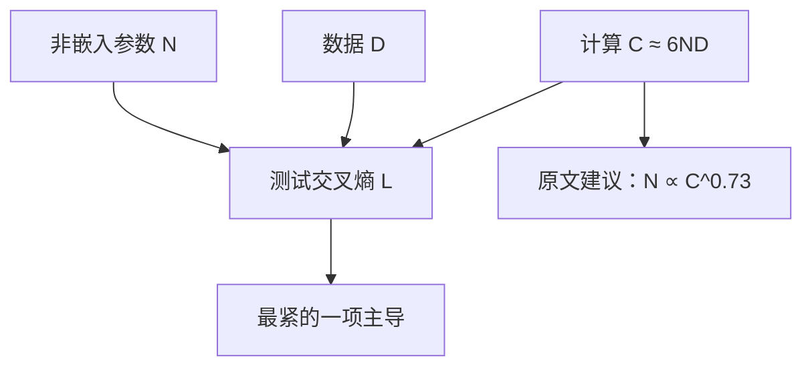

# Kaplan 2020 扩展律原文

语言模型的测试损失随非嵌入参数量、数据集大小与训练计算呈平滑的幂律；当其中一项成为瓶颈，损失由该项主导。

<footer>—— Kaplan et al., Scaling Laws for Neural Language Models, 2020</footer>

2020 年 OpenAI 的 Kaplan、McCandlish、Henighan 等人把「更大往往更好」收成可拟合的曲线族。他们在 Decoder-only Transformer 上系统变化参数量 $N$、数据 $D$ 与计算 $C$，对象是测试集交叉熵，而不是某一张下游榜。规划语言——先拟合再决定下一个模型长多大——由此进入预训练。给定 $C$ 时他们建议 $N$ 涨得比 $D$ 快，这一条后来被 [Hoffmann](/llm/hoffmann-chinchilla) 修正；**幂律形状、三项瓶颈、$C\approx 6ND$ 会计、以及「大模型更样本高效」**仍是原文的贡献。概念综述见 [Kaplan 扩展律](/llm/kaplan-scaling)；本篇写 2020 年论文实际测了什么、指数钉在哪、以及早期停止与临界 batch 这些常被口诀省略的章节。

## 问题

当时选模型大小主要靠单次消融或经验规则，深度、宽度、步数缠在一起，无法回答「计算加倍时应该加宽还是加数据」。Kaplan 等人要可外推的标度：固定架构家族，扫 $N,D,C$，看语言建模损失是否在对数坐标上接近直线。若是，就可以在小模型上拟合，再规划大模型。

计算与 $N$、$D$ 不独立。他们采用稠密 Transformer 的近似 $C \approx 6ND$（前向约 $2ND$，反向约两倍）。给定 $C$，更大的 $N$ 意味着更少 token。扩展律必须同时描述三条轴，以及另外两条充裕时「最紧的一项主导」的饱和形状。标度对象选交叉熵，是因为噪声小于准确率、跨模型可比；下游只作为转移现象另报。

### 非嵌入参数作为 $N$

词表与上下文把嵌入表撑得很大，小模型的参数量会被词表主导，宽度扫描失真。原文用**非嵌入参数**计 $N$，使不同词表设定下的容量更可比。复现或引用指数时必须声明这一口径；把嵌入算进去，小模型端的斜率会弯。这一选择后来被多数稠密扩展论文沿用。幂律说的是在他们扫到的尺度窗口里、对数坐标下近似直线。原文没有声称损失可以按同一指数无限下降。数据重复、优化失败、上下文或 tokenizer 改变，都会让直线折弯。贡献是指出存在一段可规划的直线。

## 方法

实验是一系列不同大小的 Transformer 语言模型，变化训练步数与数据量，在 WebText2 一类网络文本上记测试损失。当 $D$ 极大时，损失随 $N$ 近似

$$
L(N) \propto N^{-\alpha_N},\qquad \alpha_N \approx 0.076;
$$

当 $N$ 极大时随 $D$ 近似 $L(D)\propto D^{-\alpha_D}$（$\alpha_D$ 约 $0.095$ 量级）；对计算则 $L(C)\propto C^{-\alpha_C}$（$\alpha_C$ 约 $0.050$）。更完整的可分形式把两项瓶颈写在一起，使 $N$ 或 $D$ 不足时由对应项主导。这些数字是那一次架构与数据上的拟合，不是通用物理常数。

在固定 $C$ 的计算最优分配上，他们从拟合推出 $N$ 大约随 $C^{0.73}$、$D$ 大约随 $C^{0.27}$。按这条建议，很大的模型只看相对较少的 token 即「计算最优」。论文同时讨论：**更大的模型达到同一损失所需 token 更少**（样本效率随宽度上升），于是若数据是瓶颈，把计算用于更大的 $N$ 是合理的。Hoffmann 后来表明，学习率余弦与训练长度耦合会让大模型显得更样本高效、从而把分割推偏；但「先用损失标度做分配」的方法被保留。

其他原文章节常被忽略。**过拟合**：当 $D$ 相对 $N$ 过小，测试损失在某步后回升，扩展律进入数据瓶颈区。**临界 batch size**：最优或临界 batch 随损失水平变化，与梯度噪声标度有关，影响「同样 $C$ 应走多大 batch、多少步」。**深度对宽度**：给定非嵌入 $N$，深度与宽度的多种拆分在损失上接近，架构细节弱于尺度。**迁移**：语言建模损失改善时，部分下游（如 Winograd 一类）跟着改善，但拟合仍应以交叉熵为准。

### 早期停止与「充分训练」不是同一张图

部分曲线来自未训到数据耗尽或未走到余弦终点的运行。把这些点与充分收敛的点混在一张损失面上，会改变最优分割。2020 年论文已经区分不同训练时长下的形状，但计算最优那条流行引用，后来被证明对日程敏感。读原文时应把「损失随 $N$ 下降」的图与「给定 $C$ 如何切 $N$ 与 $D$」的图分开：前者更稳，后者是派生政策。

## 机制

论文没有从第一性原理推出 $\alpha_N$。经验上，过参数化网络在平滑损失面上常表现为对容量与样本量的幂次误差下降。指数应视为对 Decoder-only、Adam 类优化器、当时网络文本的描述统计。换 MoE、换重复数据、换 μP 或换日程相对寿命，指数会动。

$6ND$ 会计假设几乎全部 FLOPs 在线性层上，序列长度计入 $D$ 的方式一致。激活重计算改墙钟不改这套 FLOPs；混合精度改吞吐也不改系数来源。规划时必须声明：$N$ 是否含嵌入、$D$ 是否含重复、$C$ 是理论 FLOPs 还是 GPU-hours。

把下游准确率直接拿去拟合幂律，噪声通常大于损失。同一损失对应的下游提升还随任务饱和而变。Kaplan 把标度对象定在交叉熵上，是为了让外推稳定；从损失到任务需要另一次校准，不能把 2020 年的 $\alpha$ 套到某一张 2026 年的榜上。

### 为何分配指数后来被改写

余弦学习率把预定步数编进日程。为把大 $N$ 塞进预算，大模型往往步数更少、日程按更短寿命排，最后损失不能代表充分训练。于是拟合读出「用更少 $D$ 也很好」。这不影响「三项瓶颈 + 幂律」的定性图像，但影响 $C$ 固定时的最优分割。Hoffmann 的 IsoFLOP 与对齐余弦，是对这一协议漏洞的修补，不是对 Kaplan 测量哲学的否定。

## 边界与工程取舍

原文扫的是稠密自回归 Transformer 与当时的网络文本。稀疏专家、状态空间、多模态、数据约束下的重复，都要自己的拟合。上下文长度改变每个 token 的计算与激活显存，严格说 $C$ 的会计也要重写。优化失败点会拽偏拟合，小规模外推两个数量级必须留误差带。

工业界后来用 Chinchilla 比例当计算最优起点，再用过训把小模型推过该点以换推理成本。这是对 Kaplan 规划语言的续写：仍然用损失对尺度作图，只是政策从「偏大 $N$」改成「等比例」再改成「部署导向的过训」。引用 2020 年论文时，应把「存在可规划幂律」与「请按 0.73 去切预算」分成两句。

「符合 Kaplan」有时被用来形容任何随对数参数下降的曲线。更精确的用法是：非嵌入 $N$、交叉熵、三项可分幂律、$C\approx 6ND$，以及那次拟合给出的偏大模型分配。后一项尤其不可未经说明就沿用。

## 小结

- Kaplan 等 2020 年表明，语言模型测试交叉熵随 $N$、$D$、$C$ 在很宽范围内呈幂律下降，最紧的一项主导。
- $N$ 计非嵌入参数；$C\approx 6ND$；$\alpha_N,\alpha_D,\alpha_C$ 是该设定下的拟合。
- 原文建议的计算最优偏向前更大的模型（约 $N\propto C^{0.73}$），这一分割被 Chinchilla 修正，测量框架被保留。
- 更大模型更样本高效、临界 batch、深度–宽度弱依赖、过拟合区，都是原文章节，不只是一条分配口诀。
- 标度对象是损失不是下游；指数随架构与数据而动。
- 出处：Kaplan et al., *Scaling Laws for Neural Language Models*，2020（arXiv:2001.08361）。规划层面的转述见 [Kaplan 扩展律](/llm/kaplan-scaling)。
