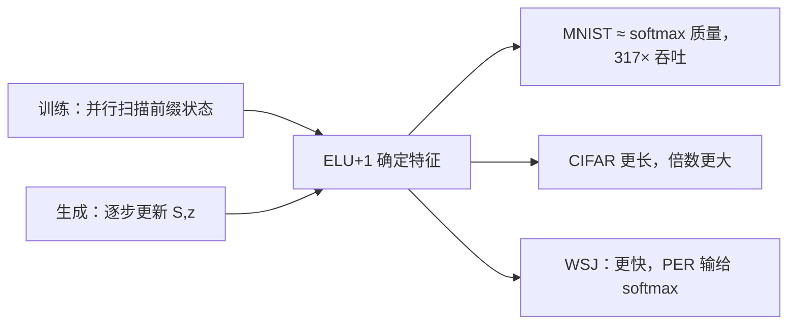

# Linear Transformer 原文

    
把自注意力写成核特征的线性点积，再用矩阵乘的结合律，复杂度从平方降到线性；自回归实现于是变成对状态的迭代，Transformer 显出与 RNN 的亲属关系。

    <footer>—— Katharopoulos、Vyas、Pappas、Fleuret，Transformers are RNNs，ICML 2020</footer>

Angelos Katharopoulos、Apoorv Vyas、Nikolaos Pappas 与 François Fleuret 的 ICML 2020 论文，标题里的 *are RNNs* 不是比喻：因果线性注意力的前缀状态 $S_t,z_t$ 逐步更新，生成时内存与时间步无关，训练却仍可用扫描并行。它比 [Performer](/llm/choromanski-performer) 早一年，特征是确定的 $\phi(x)=\mathrm{elu}(x)+1$，不逼近 softmax。核化与结合律的代数见 [Linear Attention](/llm/linear-attention)。本篇写原文作为实验论文：在哪些任务上「几乎一样好、生成快两个数量级」，在语音上又明确输给 softmax，以及 4000× 这类数字绑定了什么基线。

## 问题

2019–2020 年，Transformer 已经在翻译与语言模型上成立，但自回归解码每步都要读增长的键值列表，长度 $N$ 的生成是平方的。Reformer 用 LSH 降理论复杂度，常数大，MNIST 这种 $N=784$ 上往往不快。需要一种：**训练可并行，推理常量化状态**，并且尽量保住点积注意力的接口。作者把问题收成核特征：若 $\mathrm{sim}(q,k)=\phi(q)^\top\phi(k)$，则对 $N$ 的二次可以换成对特征维的线性。剩下的经验问题是：$\phi$ 这么弱，图像与语音还能不能用。

论文同时要揭示结构：线性因果注意力就是 RNN。这不是为了用 BPTT 训练——扫描仍然并行——而是为了说明生成时不必存 KV，只需存 $S,z$。对当时「Transformer 不能流式」的批评，这是一条代数回答。

### 实验场是像素与语音，不是 GLUE

主实验：MNIST 与 CIFAR-10 的逐像素自回归、WSJ 约 80 小时语音识别（CTC）。合成复制任务对照 Reformer。没有大规模语言预训练，没有针测。读这篇去论证「线性注意力已可替代 GPT softmax」，超出原文合同。像素任务的好处是 $N$ 从 784 到 3072，生成步数足够让常量化状态的吞吐差显出来；语音则提供 softmax 仍然更准的反例，防止把加速写成全面胜利。

作者单位含 Idiap 与 EPFL。实现是自定义注意力核，不是后来的 Flash 生态。墙钟数字对 2020 年的 softmax 朴素实现，不是对 2022 年的分块精确注意力。

## 方法

架构仍是多层多头，只换注意力。特征 $\phi=\mathrm{elu}+1$ 保证非负，分母不易翻号。因果形式每步 $O(d_\phi d_v)$ 更新状态。训练用前缀和，不必逐步循环。对照：softmax Transformer、Reformer（多轮哈希，论文按 Kitaev 等的建议设桶）。MNIST：8 层 8 头。为公平墙钟，生成时 softmax / Reformer 也缓存键值（stateful softmax），线性模型只缓存 $S,z$。

MNIST 结果（论文表 1 量级）：线性模型最终困惑度与 softmax 几乎同一档（约 0.65 bpd 量级），吞吐约 **142.8 图/秒**，相对 softmax **约 317×**；单卡可同时生成一万张，因为状态大小与已生成像素数无关。CIFAR-10 长度更长，作者报告自回归预测加速可到 **约 4000×**——分母是逐步 softmax 生成，分子是常数状态递推，序列越长倍数越大。语音：线性每 epoch 大约 **3×** 快于 softmax，音素错误率则明显落后；相对 Reformer，线性在收敛与最终 PER 上都更好。复制任务上线性比 Reformer 更稳地靠近 softmax 损失。

### 4000× 必须连着基线一起读

倍数来自自回归逐步预测：softmax 每步做一次与已生成前缀的注意力，总工作随步数平方累积；线性每步只更新固定大小状态。训练一个 epoch 的加速远没有这么夸张——MNIST 训练时间各方法接近，因为 $N=784$ 尚小。把 4000× 写进「预训练步时」是张冠李戴。Reformer 在短 $N$ 上哈希开销压过收益，所以 MNIST 上它既没有质量优势也没有速度优势；这是原文用来说明「渐近记号不是墙钟」的情节，后来线性注意力的工程文反复借用。

## 机制

结合律是唯一代数来源：$\sum_j \phi(q)^\top\phi(k_j)\,v_j=\phi(q)^\top(\sum_j \phi(k_j)v_j^\top)$。softmax 的 $\exp(q^\top k)$ 一般不能写成有限维确定特征的内积，因此本文不是 softmax 的精确改写。RNN 观点：$(S_t,z_t)$ 是充分统计量，查询是读出。与经典 RNN 的差别在于训练用扫描而不是逐步反传过全部时间，以及多头仍是注意力接口。专文写了数值与秩；原文强调的机制贡献是 **把加速从「训练矩阵乘」挪到「生成递推」**——读者若只看训练 FLOPs，会觉得线性注意力在 $N=784$ 上没必要。

论文摘要写「up to 4000× faster on autoregressive prediction of very long sequences」。限定词是 *autoregressive prediction* 与 *very long*。复述时不要删这两个状语。

### 和 Performer、和后来的线性 RNN

Performer 换随机特征去逼近 softmax 核，主场是蛋白质与 ImageNet64，理论条款更重。本文的 ELU 核更软，尖峰更弱，但实现简单、无随机种子合同。RetNet、RWKV、Mamba 把门控与结构化状态当一等公民，已离开 2020 年的纯核注意力定义。不要把 ICML 2020 写成这条谱系的终点，它是「注意力可以有 RNN 生成形态」的起点。

## 边界与工程取舍

### softmax 在 ASR 上赢，是原文自己报的

WSJ 上 softmax 收敛更好、PER 更低。作者没有用更大 $\phi$ 或更多层去抹平差距。图像生成「看起来差不多」不能外推到需要辨音的序列。精确拷贝、针测后来被证明是线性核的短板，原文只用合成 duplication 轻触。部署时若任务是 ASR 或检索，应把这篇当作「生成吞吐」文献，而不是质量上限。

没有融合 CUDA 核时，$O(Nd^2)$ 的状态更新可能慢于短序列上的分块 softmax。2020 年的 317× 在 2026 年的 FA2 前填上会缩水甚至反转；仍然成立的是 **解码状态常量化** 这一命题，只要你真正逐步生成很长。特征维接近 $N$ 时线性优势消失。因果实现必须是前缀扫描，双向和会泄未来。

出处：Katharopoulos et al.，*Transformers are RNNs: Fast Autoregressive Transformers with Linear Attention*，ICML 2020，PMLR 119。代数展开见 Linear Attention 专文。

## 小结

- ICML 2020 用确定核特征把注意力变成可扫描的线性算子，并指出因果情形就是 RNN。
- MNIST 质量接近 softmax、生成约 317×；CIFAR 上自回归预测倍数可到约 4000×，分母是逐步 softmax。
- WSJ 语音上更快但 PER 落后，原文没有隐瞒。
- 不逼近 softmax；随机特征路线留给 Performer。
- 出处：Katharopoulos et al.，ICML 2020。
