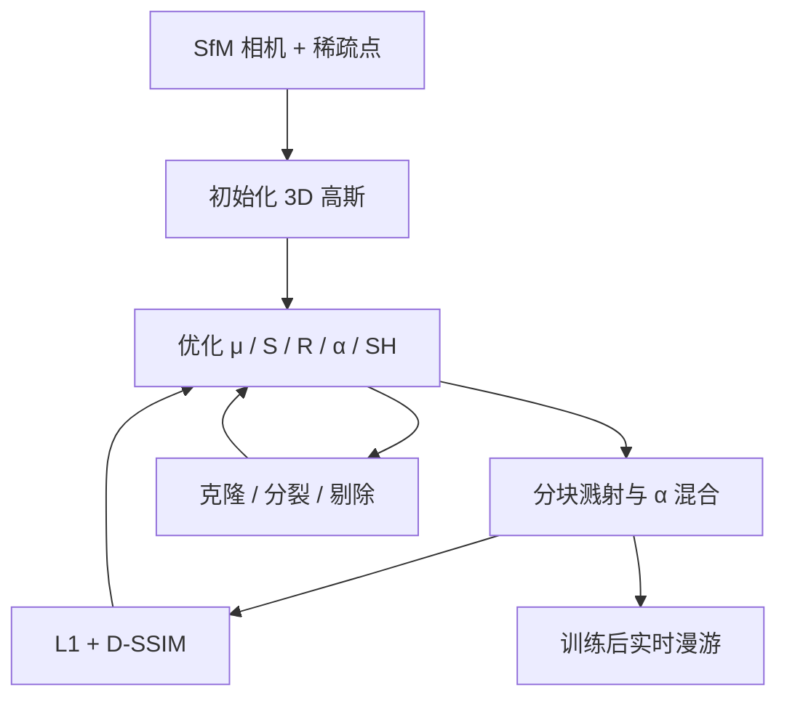

# 3D Gaussian Splatting

从 SfM 稀疏点出发，用各向异性三维高斯表示场景；优化与密度控制交错进行，再靠分块光栅化在 1080p 上跑到实时。

<footer>—— Kerbl, Kopanas, Leimkühler, Drettakis，ACM TOG / SIGGRAPH 2023</footer>

Bernhard Kerbl、Georgios Kopanas、Thomas Leimkühler 与 George Drettakis 的 *3D Gaussian Splatting for Real-Time Radiance Field Rendering*（arXiv:2308.04079，ACM TOG 42(4)）把新视角合成从「沿射线查神经网络」拉回显式原语。目标很具体：无界完整场景、1080p、视觉质量追上当时最好的辐射场，同时训练时间可竞争、渲染 $\geq 30$ fps。World Labs 的 Marble / Atlas 后来把高斯溅射当成高保真导出，那是产品选用这一表示族；本篇只写 2023 年论文的三条构件——三维高斯、自适应密度控制、分块可微光栅化——不把生成式世界的一次前向写成这篇的训练循环。

## 问题

网格与点云显式、适合 GPU 光栅化，但从多视照片恢复干净拓扑很难。NeRF 一类连续辐射场用体积积分拟合外观，画质高，却要沿射线步进 MLP 或查网格，随机采样又慢又噪。加速版（体素、哈希、点）往往在完整室内外场景和 1080p 上仍达不到实时。点基方法多半要 MVS 几何；只有 SfM 稀疏点时，估法线、当平面圆盘都不稳。

需要一种表示：连续、可微、空处不算；又能投影成二维、用标准 $\alpha$ 混合画出来。输入与当时 NeRF 管线相同：SfM 标定的相机加顺便得到的稀疏点（NeRF-synthetic 甚至可随机初始化）。问题变成：原语用什么参数化、如何在优化中生灭高斯、如何在整幅图上一次排好可见性而不对每个像素做昂贵排序。

### 三维高斯而不是带法线的圆盘

每个高斯由均值 $\mu$、世界系协方差 $\Sigma$、不透明度 $\alpha$、球谐颜色构成。三维密度是

$$
G(\mathbf{x})=\exp\bigl(-\tfrac12(\mathbf{x}-\mu)^\top\Sigma^{-1}(\mathbf{x}-\mu)\bigr).
$$

投影到相机后得到二维协方差，再按深度做 $\alpha$ 混合，图像形成与 NeRF 的前向体积混合同构，求值却是溅射。协方差必须半正定，直接梯度下降会走出非法矩阵，故优化 $S$（尺度，指数激活）与 $R$（旋转），再令 $\Sigma=RSS^\top R^\top$。初始化用到最近三个点的平均距离，先当各向同性小球。

Marble 产品里的溅射是生成器写出的粒子云，见 [高保真表示](/llm/marble-gaussian-splats)；Atlas 是深度→点云→溅射写出链，见 [三维写出](/llm/atlas-3d-writeout)。二者都引用这篇的表示与光栅化，都不替代「多视照片 + 数万步优化」的经典循环。

## 方法

优化与渲染交错。损失是 $\mathcal{L}_1$ 加 D-SSIM。位置用类似 Plenoxels 的指数衰减；$\alpha$ 走 sigmoid。每隔若干步做密度控制：位置梯度大、覆盖不足的小高斯**克隆**一份并沿梯度挪开；用一个过大高斯去贴精细结构则**分裂**成两个、尺度除以约 1.6，位置从原高斯当 PDF 采样。过透明或过大的高斯剔除。这样平坦墙面留下少数扁椭球，细结构和遮挡边界变密。

### 16×16 分块与一次 Radix 排序

光栅化把屏幕切成 $16\times 16$ 瓦片。视锥与 99% 置信椭圆求交做剔除；近平面外极端位置加保护带，避免投影协方差数值炸掉。每个与若干瓦片重叠的高斯被实例化，键 = 视空间深度 + 瓦片 ID，整幅图一次 GPU Radix 排序。每瓦片得到有序列表，线程块协作把高斯装进共享内存，像素前向混合，累积 $\alpha$ 饱和则该像素停；整瓦片像素都饱和则瓦片停。反向对参与混合的高斯回传，每像素额外存储是常数级。可见性顺序是**近似**的：没有每像素再排序，高斯很扁、深度交叉时可能排错；论文认为随着优化收敛、椭球贴上表面，误差可忽略。

这套光栅化受 Pulsar 等软件光栅启发，但坚持按深度近似的 $\alpha$ 混合、各向异性溅射、对所有贡献高斯回传。顺序无关的混合或 CNN 后处理会引入时间闪烁；论文把稳定实时预览当成一等目标。

## 机制

各向异性协方差是参数效率的来源：沿切向铺开、沿法向压扁，一块墙几颗高斯就够。各向同性点云要密一个数量级才有类似的边。球谐让高光随相机走，而不把高光烤死在表面——这对「看起来真」贡献大，对「这是什么几何」贡献小。密度控制解决 SfM 点太稀：欠重建区域靠克隆长出新几何，过重建区域靠分裂把大斑打碎。没有这一步，优化只会把现有球拉成错误的形状。

实时来自「空处没有原语」加「排序一次、按瓦片共享」。NeRF 每条射线独立步进，空空间也要采样；高斯只存在于表面附近。训练也受益：前向够快，才能在可接受时间内交错做密度控制。论文强调完整室内外与大深度复杂度，而不是人体捕获里那种浅深度的单物体高斯。

### 与后续生成式世界的信息差

Kerbl 等假设**静态**多视、已知相机、可对训练视求光度。生成模型一次写出高斯，没有这篇的克隆/分裂循环，空洞分布不同。评测应对着训练相机与用户新相机分开看：训练视角漂亮只说明拟合。从高斯抽网格、做碰撞，是另一份几何推断，论文没有承诺流形表面。度量重建、换光照路径追踪，超出「新视角合成」合同。

开源实现里的 CUDA 核（tile、排序、混合）是这篇算法的落地点。后续 gsplat 等库改了存储与核融合，数学对象仍是三维高斯加 $\alpha$ 混合。不要把某个库的默认 SH 阶数写成 2023 年论文的唯一规格。

## 边界与工程取舍

动态物体、曝光变化、镜面与半透明超出设定。近似排序在毛发、栅栏、玻璃上可能闪。高斯数量随场景涨，显存是点数 × 每点参数；移动端要量化与层次，那是工程，不是原文贡献。无界场景仍要处理远景与背景，论文用数据集验证，不是任意公里级城市。SfM 失败则初始化失败。许可与实现以官方代码为准。

World Labs 若把溅射当导出，保的是在类似观察条件下的外观，不是 CAD。需要物理引擎时另出碰撞网格。把 2023 年演示的 30 fps / 1080p 直接写成 2026 年产品规格，忽略了生成资产与捕获资产的密度差。

## 小结

- 3DGS 用各向异性三维高斯作显式辐射场，从 SfM 稀疏点初始化，交错优化与密度控制。
- 分块光栅化 + 整图 Radix 排序使 1080p 新视角达到实时，训练也因此快得起来。
- 图像形成与体积 $\alpha$ 混合同构，求值是溅射不是射线 MLP。
- 静态多视捕获是原文设定；生成式世界只复用表示，不复用训练环。
- 出处：Kerbl、Kopanas、Leimkühler、Drettakis，*3D Gaussian Splatting for Real-Time Radiance Field Rendering*，ACM TOG 2023，arXiv:2308.04079。
