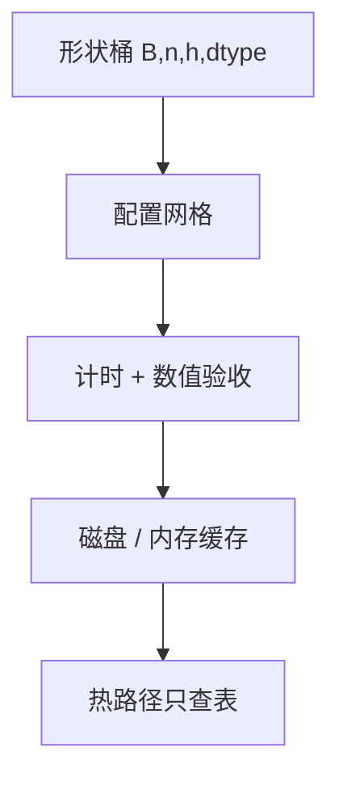

# 内核自动调优

同一算法的块大小、流水深度和向量宽度是硬件相关的离散空间；靠编译器或运行时搜一轮，往往比手写一组「通用」常量更接近屋顶。

<footer>—— Chen et al., TVM, OSDI 2018；Ansor：Zheng et al., OSDI 2020；Triton 的 autotune 为运行时网格搜索</footer>

[上一课](/llm/torch-compile-inductor)把算子融进 Triton/CUDA。融完之后仍有离散超参：tile、$B_r,B_c$、warp 数。TVM 把张量程序与自动调度分开；Ansor 用层次化搜索生成调度；Triton `@triton.autotune` 在若干配置上计时取最快。FlashAttention 的块大小同样是 SRAM 容量约束下的搜索，不是公式给出的唯一整数。本课写 *何时搜、缓存键是什么*，避免每条请求现场扫网格把 TPOT 打穿。

## 问题

会计给出的屋顶是上界。实际核用错 tile，有效带宽可能只有峰值一半。[上一课](/llm/torch-compile-inductor)的 `max-autotune` 会触发搜索，首次极慢。服务形状又是动态的：$n$、$B$、头数、是否因果、元素类型。缺口是：搜索空间按哪些键缓存，以及动态形状如何落到最近的桶而不每步重搜。

错误配置不只是慢：共享内存溢出、占用率过低、或数值路径不同（累加顺序）。调优必须验收数值，不能只看毫秒。

CUTLASS / cuBLAS 的启发式选择也是一种自动调优，只是搜索在库内。换一种布局（HND vs BSHD）等于换了一个问题，缓存不能共用。

## 方法

离线：对部署会见到的 $(B,n,h,d,\mathrm{dtype})$ 桶跑 autotune，把最优配置写进磁盘缓存。在线：只允许在冷启动或新桶首次出现时搜，并加超时回退到安全配置。Triton 的 key 应包含动态维的量化桶，而不是原始 $n=137$。注意力核的 $B_c$ 受 SRAM 与 $d$ 限制，搜索空间其实不大，但 *每个 dtype 与是否 GQA* 都要单独来。

与[FlashAttention](/llm/flashattention) 家族：FA2/FA3 已在常见头维上调过；自写 Triton 注意力才需要你自己的 autotune。不要在生产路径上对 FA 再套一层网格搜。

## 机制

搜索是在屋顶线上找更接近 $I_{\star}$ 的点：更好的 tile 提高复用、降低 bank conflict。它不改变算法复杂度。缓存命中后，decode 步不再付搜索。连续批的形状抖动若跨越桶，会看到 TPOT 锯齿——应把桶做粗，或对混合批次用「最坏形状」配置换稳定性。

## 边界与工程取舍

不要每进程冷启动全网格（集群同时扩容会打满 GPU 做调优）。多卡要按 SKU 分缓存，A100 的最优不是 H100 的。下一课离开单核，处理 TP 的集合通信：自定义 allreduce。

出处：Chen et al., OSDI 2018；Zheng et al., OSDI 2020；Tillet et al., Triton, MAPL 2019。

## 小结

- tile 与占用率是离散搜索，不是会计恒等式。
- 按形状桶离线调、热路径查表；验收数值。
- 布局与 dtype 必须进缓存键。
- 动态 $n$ 要量化到桶，否则每步重搜。
- FA 家族已调过的核不要再套一层网格。
- 下一课：TP 上的自定义 allreduce。
- 出处：Chen et al., 2018；Zheng et al., 2020。
