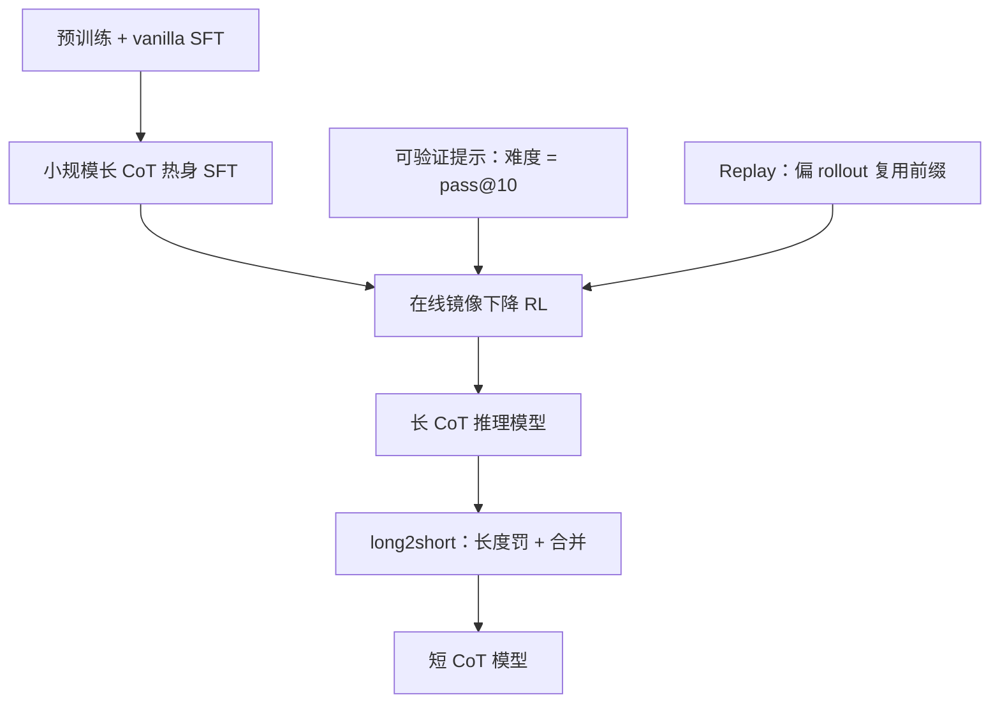

# Kimi k1.5

我们把强化学习的上下文扩到 128k，并观察到性能随思维链长度继续涨；偏 rollout 让长轨迹不必每次从零再生成。

<footer>—— Kimi Team，Kimi k1.5: Scaling Reinforcement Learning with LLMs，arXiv:2501.12599</footer>

预训练按 Kaplan / Chinchilla 扩参数与数据，会先碰到高质量文本耗尽。2025 年 1 月月之暗面把 **Kimi k1.5** 写成另一条轴：用可验证奖励让模型自己探索，把搜索步数写进自回归上下文，而不是外挂 MCTS、价值网络或过程奖励模型。模型是多模态的；报告重点在 RL 配方、long2short，以及与 o1 对照的长链 / 短链分数。服务侧 KV 调度见 [Moonshot 长上下文服务](/llm/moonshot-serving)，本篇不写生产调度。

## 问题

已发表的 LLM+RL 很少给出能跟闭源推理模型打的数。若奖励只能打最终答案、轨迹只有 2K，模型学不到「先走错再改」——价值函数还会把探索中的错误步骤当成负优势掐掉。k1.5 的判断是：只要上下文够长，思维链本身就是被压扁的搜索树；增加 token 预算约等于增加搜索步。缺的是让 128K 级 rollout 在集群上可负担，以及一套不依赖 PRM 的稳定策略优化。

提示集质量同样是一等公民。覆盖面、难度谱、可验证性缺一，就会奖励黑客：选择题可猜对、证明题难自动判。报告用模型自身的 pass@10 当难度代理，并丢掉「不思考也能 N 次猜中」的题（$N=8$ 可去掉大部分易黑客题）。

### 四段课程：预训练、普通 SFT、长链 SFT、RL

开发顺序：预训练 → vanilla SFT → 长 CoT SFT → RL。长链热身集很小，靠提示工程引出规划、评估、反思、探索，再轻量 SFT，把这些动词内化成格式。RL 提示跨 STEM、竞赛、一般推理，含纯文本与图文；标签体系按学科配平。编码题若网上没有测试用例，用标准答案程序自动造测例（排除需要 special judge 的题）。

长 CoT：AIME 77.5、MATH-500 96.2、Codeforces 第 94 百分位、LiveCodeBench 62.5、MathVista 74.9、MMMU 70.0、MathVision 38.6。短 CoT：AIME 60.8、MATH-500 94.6、LiveCodeBench 47.3、IF-Eval 87.2。这些是报告自报，对标 o1 / GPT-4o / Claude 3.5 的当时公开点。

## 方法

目标是最大化最终答案奖励 $r\in\{0,1\}$（规则或奖励模型判匹配），不训练逐步价值。策略优化用**在线镜像下降**变体：每一轮把当前 $\pi_{\theta_i}$ 当参考，最大化奖励减 $\tau\,\mathrm{KL}(\pi_\theta\|\pi_{\theta_i})$。闭式解引出可吃 off-policy 样本的平方代理损失；实践中用同题 $k$ 条样本的平均奖励当基线，外加对数比的 $\ell_2$。每轮结束重置优化器，因为参考策略变了。

### 偏 rollout、长度罚与采样

128K 级轨迹从零生成太贵。**偏 rollout** 把旧轨迹大段放进 replay，只补生成后半，避免整条重采样。长度奖：在同题 $k$ 条里，答对的偏短得正、偏长得负；答错且长则明确为负。先不加权训练，再恒定打开，以免开局就被长度项掐死探索。采样上，课程从易到难；优先采样与 $1-s_i$ 成比，$s_i$ 为该题历史成功率。

$$
\max_{\theta}\mathbb{E}\big[r(x,y,y^*)-\tau\mathrm{KL}(\pi_\theta(x)\|\pi_{\theta_i}(x))\big]
$$

这是相对熵正则的策略改进，不是带 GAE 的 PPO。基线是同题经验均值，因此不需要 critic 网络。

## 机制

把搜索树展成一条因果序列之后，错步只要最终能改对，就会得到正奖励——这与「逐步优势必须为正」相反，却正是长链要学的试错。上下文越长，可写入的分支持、反例与修订越多，等价于不实现 MCTS 的并行宽度。偏 rollout 不改变这一目标，只改变轨迹的生成成本：前缀是旧策略的，后缀是新策略的，所以优化必须能吃 off-policy；镜像下降的 KL 锚在上一轮 $\pi_{\theta_i}$ 上，正好匹配。

长度罚防止「越训越长」的过思考。long2short 把长链上已学会的规划，用长度约束和权值合并压回短链，使短 CoT 在 AIME / LiveCodeBench 上仍远高于 GPT-4o 一类非思考模型。多模态联合训练让同一套 RL 信号可以打在 MathVista 上，而不是先做一个纯文本推理模型再接视觉适配器。

报告明确写：强结果可以不依赖 MCTS、价值函数与 PRM。这是在「能把 RL 上下文拉到 128k」的前提下成立。窗口更短时，过程监督可能重新变得必要；不要把这句话扩成对所有 7B 蒸馏模型的禁令。

### 和 o1、和后来的 K2

o1 是闭源对照点，k1.5 提供可核对的训练实践（提示过滤、偏 rollout、镜像下降、long2short）。它仍是「思考模型」叙事：产品形态是长链或蒸馏短链，不是 [Kimi K2](/llm/kimi-k2) 那种万亿 MoE 的 agent 底座。K2 的 MuonClip 与工具合成不在 k1.5 报告里。奖励黑客防护（去掉多选/判断/证明、猜答案过滤）是 RL 能扩的前提；换一套不可验证的开放聊天奖励，配方不会自动成立。

## 边界与工程取舍

底座结构、层数与预训练 token 量在这份 RL 报告里不是主表，不要用猜测填满一张 Llama 式规格。128K 是 RL 上下文，不等于免费的 128K 文档 QA 产品窗口。偏 rollout 引入前缀来自旧策略的偏差，调 $\tau$ 与每轮重置优化器是稳定性旋钮，不是可省略的实现细节。短链 SOTA 依赖长链已经训成；只做长度罚、没有长链教师，再造不出 60.8 AIME。

代码测例自动生成依赖有标准程序且不需要 special judge 的题，竞赛工程题覆盖不全。图文与文本共享策略，视觉奖励稀疏时可能被文本数学梯度盖住。所有头条分数是自报；AIME 题量小，应参照他们是否多次采样，转引时写基准版本。

出处 arXiv:2501.12599。不要把 Mooncake / FAST 2025 的服务数字写进 k1.5 的 RL 表，也不要把 k1.5 写成 K2 的稠密小版本。

## 小结

- Kimi k1.5 用可验证奖励在 128K 上下文上做 RL，把规划与改错学进自回归思维链。
- 优化为在线镜像下降变体，无 critic、无 PRM、无 MCTS；偏 rollout 降低长轨迹成本。
- 提示按覆盖、难度（pass@10）与可验证性过滤；长度罚与课程/优先采样管效率。
- long2short 把长链能力压进短链，短 CoT 仍明显高于当时非思考闭源点。
- 出处：Kimi Team，*Kimi k1.5: Scaling Reinforcement Learning with LLMs*，arXiv:2501.12599，2025。
