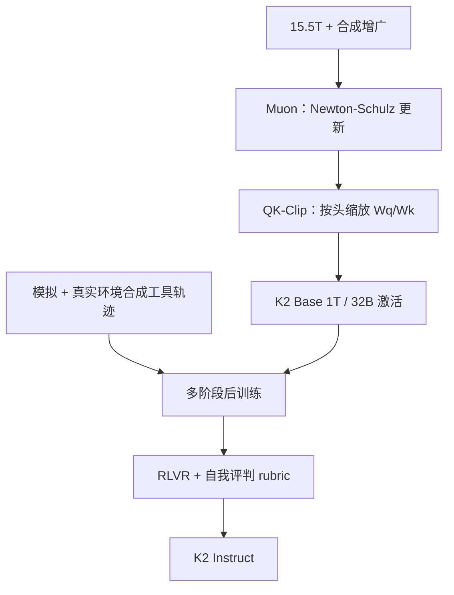

# Kimi K2

MuonClip 把 Muon 的 token 效率与 QK-Clip 的稳定性接到一起；K2 在 15.5T token 上预训练，全程没有一次 loss spike。

<footer>—— Kimi Team，Kimi K2: Open Agentic Intelligence，arXiv:2507.20534</footer>

[k1.5](/llm/kimi-k15) 把推理写成可拉长的 RL 上下文。2025 年 7 月的 **Kimi K2** 换了一条产品轴：**非思考**的万亿 MoE，针对工具使用、软件工程与可行动的智能。结构近 [DeepSeek-V3](/llm/deepseek-v2-paper) 式超稀疏 MoE + MLA，但优化器换成 [Muon](/llm/muon) 加 QK-Clip。开源 Base 与 Instruct；报告写明当前检查点**不支持视觉**。

## 问题

高质量人类文本越来越少，「每个 token 学到多少」变成与参数量同级的系数。AdamW 仍是默认，但 Moonlight 已显示同等数据下 Muon 更省 token。把 Muon 拉到万亿 MoE 时，注意力 logits 爆炸比 AdamW 更频繁：soft-cap 只截 softmax 输入，点积本身仍可涨；QK-Norm 又不适配 MLA——推理期键没有完整物化。需要一种**事后缩放投影权重**、而不改当前步前向的稳压。

后训练的缺口是另一面。自然数据里几乎没有「多步工具、长期计划、可验证交互」。只靠人类示范，agent 上不去；必须合成可检验的工具轨迹，再用可验证奖励与自我评判把开放域也纳入 RL。

### 超稀疏 MoE：384 选 8，加 1 个共享专家

公开规格：总参约 **1.04T**，激活 **32B**；61 层（含 1 层稠密）；注意力隐宽 7168，64 头，[MLA](/llm/deepseek-v2-paper)；专家隐宽 2048，**384** 专家、每 token 选 **8**、共享专家 1；[SwiGLU](/llm/swiglu)；词表 160K；上下文 **128K**。相对 V3 式设计，报告说按标度律**减少头数**以利长上下文、**提高稀疏度**以提高 token 效率。

32B 激活决定 FLOPs，1T 总量决定装载与专家并行。Tau2-Bench 66.1、ACEBench-En 76.5、SWE-Bench Verified 65.8、SWE-Bench Multilingual 47.3、LiveCodeBench v6 53.7、AIME 2025 49.5、GPQA-Diamond 75.1——均为非思考设置下的报告数。

## 方法

### MuonClip：Muon 更新之后做 QK-Clip

Muon 步：动量矩阵经 Newton–Schulz 正交化，再按 $\sqrt{\max(n,m)}\cdot 0.2$ 把更新 RMS 对齐 Adam，然后带 weight decay 的参数更新。QK-Clip 读这一步前向已经算好的每头最大 logit $S_{\max}^h$。若超过阈值 $\tau$（K2 用 **100**），只缩放该头的投影：MLA 里头专用的 $q^C,k^C$ 乘 $\sqrt{\gamma}$，头专用旋转 $q^R$ 乘 $\gamma$，**共享 $k^R$ 不动**以免串头。$\gamma=\tau/S_{\max}^h$。当前步前向/反向不变，只调节之后的权重范数。中等规模（约 9B 激活 / 53B 总参）上，纯 Muon 的最大 logit 会过 1000；K2 全量训练里 logit 先顶在 100，约 30% 步数后自己落到常规区间，损失曲线无尖峰。

预训练 **15.5T** 高质量 token，并加合成数据「把已有高质量 token 再挤一遍」。基础设施按训练效率与研究效率一起设计，细节以报告系统节为准。

### Agent 数据与联合 RL

后训练多阶段。核心是大规模 **agentic 合成**：在模拟与真实环境里造工具、代理、任务与轨迹，并校验正确性。RL 联合两条奖励：可验证任务上的 RLVR（代码测试、数学等价），以及开放域上的自我评判 rubric——模型学着给自己的输出打分，使对齐从静态偏好集扩到没有外部 checker 的任务。目标是「会调用工具把事做完」，不是把 k1.5 的长思维链再蒸一遍。

## 机制

Muon 的 token 效率来自对二维权重更新做近正交约束，减少 Adam 在行空间里的冗余步。爆炸 logits 是这条效率的副作用：更新更大，QK 尺度漂得更快。QK-Clip 把稳压放在**权重**而不是激活，因此不破坏 MLA 的推理路径，也不像 soft-cap 那样在已经饱和的点积上切一刀。共享旋转键不剪，是为了不把一个头的过热写进所有头的相位。$\tau=100$ 在训练后半不再需要调，说明裁剪是过渡护栏，不是永久扭曲几何。

Agent 合成把「工具使用」从稀有自然演示变成可无限采样的分布。RLVR 保证有 checker 的域（仓库补丁、数学）不会被文风黑客；rubric 自我评判则覆盖没有单一标准答案的助手行为。两者必须联合，否则模型会在 SWE-Bench 上变强、在开放工具对话上只会套模板。

QK-Clip 不是 QK-Norm。Norm 改当前步的 $q,k$；Clip 改下一步的 $W_q,W_k$。把 Gemma 3 的 QK-Norm 抄到 K2 的 MLA 实现上，形状会对不上。

### 和 DeepSeek-V3、和 k1.5

架构家族相似：MLA、共享专家、超稀疏路由。差别在优化器（MuonClip vs Adam 系）、头数/稀疏度的标度律选择、以及后训练以 agent 合成为主而不是纯推理长链。k1.5 是思考模型与 128K RL 上下文；K2 Instruct 按非思考评测，SWE-Bench 与 Tau2 才是头条。不要用 k1.5 的 AIME 77.5 去要求 K2 的 49.5——后者不是同一解码制度。LMSYS Arena（报告引用 2025-07-17、三千余票）把 K2 写成当时开源第一、总榜约第五，那是聊天偏好，不是 SWE 主表。

## 边界与工程取舍

1T 权重的专家并行、MLA 推理核、160K 词表，都不是「换成 Llama 配置就能服」。无视觉：图要另接系统，不要把 k1.5 的 MathVista 数字接到 K2。15.5T「零尖峰」是这条 MuonClip 跑的结果，不保证换数据混合仍零尖峰。合成轨迹的环境覆盖决定 agent 上限；环境外的工具会表现为自信的错误调用。15.5T 的合成增广是「把已有高质量 token 再挤一遍」，不是凭空多出一套互联网；配比与合成器都不随权重开源，复现的是结构选择而不是损失曲线。rubric 自我评判可能自我强化文风，需要外部红队，不能当成已完成对齐。

不要编一层层宽之外的隐藏「思考版 K2」写进这篇。Base 与 Instruct 用途不同：续训用 Base，工具调用用 Instruct。许可与再分发以当时模型卡为准。SWE-Bench 多语 47.3 低于英语 Verified 65.8，说明仓库级 agent 仍偏英语轨迹；把英文脚手架直接接到中文仓库会掉点。合成环境若覆盖不到某类 API，模型仍会自信地乱调——这是数据覆盖，不是 MoE 路由能补的。

出处 arXiv:2507.20534；权重见 `moonshotai/Kimi-K2-Instruct`。Muon 原文与 Moonlight 是优化器前史，不要给 K2 另编一篇只讲 Muon 的会议号。

## 小结

- Kimi K2 是约 1.04T / 32B 激活的 MLA MoE：384 专家 top-8、1 共享、61 层、128K、无视觉。
- MuonClip = Muon + 按头 QK-Clip；15.5T 预训练宣称零 loss spike。
- 后训练以可校验的工具轨迹合成为核心，再联合 RLVR 与自我评判 RL。
- 评测主场是非思考设置下的 agent / SWE / 代码 / STEM，不是 k1.5 式长链。
- 出处：Kimi Team，*Kimi K2: Open Agentic Intelligence*，arXiv:2507.20534，2025。
