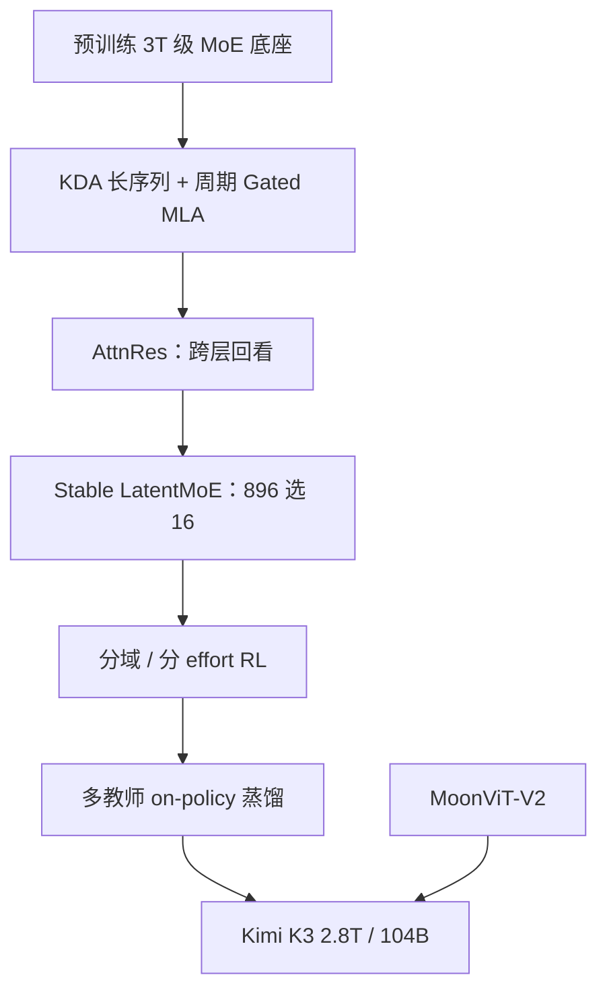

# Kimi K3

    
K3 把预训练底座扩到 3T 量级，同时把强化学习、推理力度与百万上下文上的长程交互一起拉到开源前沿；整体仍落后最强闭源旗舰，但在评测套件里稳定超过其它对照。

    <footer>—— Kimi Team，Kimi K3: Open Frontier Intelligence，arXiv:2607.24653</footer>

[Kimi K2](/llm/kimi-k2) 是约 1.04T / 32B 激活的非思考 MoE，主场是工具与 SWE。[k1.5](/llm/kimi-k15) 是可拉长的思考模型。2026 年 7 月 16 日的 **Kimi K3** 把两条轴一起做：总参 **2.8T**、激活 **104B**，原生视觉，上下文 **1,048,576** token，并开放权重。技术博客与随后的报告（arXiv:2607.24653）把结构差分写在 **Kimi Delta Attention（KDA）**、**Attention Residuals（AttnRes）** 与 **Stable LatentMoE** 上，相对 K2 宣称大约 **2.5×** 的标度效率。本篇按博客、GitHub 规格表与报告摘要写可核对的设计，不把未写入这些文本的数据配比编成语料表。

## 问题

开源侧在测试时计算（思考、智能体环）上追得很快，预训练规模却长期停在 1T 上下。只加 RL 不加大底座，会与最强闭源系统拉开「先验容量」差距。K3 要同时做：把 MoE 拉到近 3T、把上下文拉到 1M、把视觉收进同一套权重，并且在超稀疏路由下还能训稳。K2 的 MLA + MuonClip 已经证明万亿可训；再往上，序列维的二次注意力与深度上的残差累积都会变成一等瓶颈。

后训练的缺口是长地平线：内核优化、编译器、芯片设计、跨论文复现，轨迹以小时计、工具调用以千次计。若思考历史在多轮里被 harness 丢掉，生成会不稳定——这是训练制度，不是「换个系统提示」能补的。

### 规格表：2.8T / 104B，896 选 16

GitHub 模型卡与报告一致的公开规格：总参 2.8T，激活 104B；**93** 层（含 1 层稠密）；注意力隐宽 7168，**96** 头；注意力层为 **69 层 KDA + 24 层 Gated MLA**；Latent MoE 维 3584，每专家隐宽 3072；**896** 路由专家、每 token 选 **16**、共享专家 **2**；激活为 SiTU-GLU；词表 160K；上下文 1048576。视觉编码器 **MoonViT-V2**，约 401M。权重从 SFT 起做量化感知训练：专家 **MXFP4**、激活 **MXFP8**。相对 K2 的 384 选 8 / 32B 激活，稀疏度与宽度都上了一个数量级；「A104B」是激活量，不是 104 个专家。

官方 API 价：缓存命中输入 0.30、未命中 3.00、输出 15.00 美元 / MTok。Mooncake 分离式推理在编码负载上宣称缓存命中率 90% 以上。推理力度启动时默认 max，low / high 随后补上。

## 方法

KDA 提供近线性的长序列混合，周期性插入 Gated MLA 以保留全局交互。AttnRes 让一层可以**按选择**回看先前各层的表示，而不是把残差均匀累加。Stable LatentMoE 在 896 专家、top-16 的稀疏度下，用 Quantile Balancing 按路由分位数分配专家，去掉敏感的平衡超参；Per-Head Muon 按头独立优化注意力；SiTU 与 Gated MLA 分别管激活与选择性。报告把这些与数据配方合在一起，解释相对 K2 的 2.5× 标度效率。

预训练之后的后训练按域与推理力度分开做 RL（通用、智能体、编码），再经多教师 on-policy 蒸馏收成一套权重。环境覆盖可验证搜索与知识工作、软件工程与内核、带视觉闭环的前端 / CAD、持久助手与自主执行。轨迹常含成百上千次工具调用、累计百万上下文。

基础设施与算法绑在一起：KDA 的融合核、上下文并行与感知状态的前缀缓存（并回馈 vLLM）；MoonEP 做静态形状、无主机同步关键路径的专家并行；百万 token 智能体 RL 用部分 rollout、外部 KV 保留、可恢复微虚拟机沙箱。部署建议 64 卡以上超节点，以便专家并行走高带宽域。

内核优化演示给模型最多 24 小时，在 Hopper 与另一家 GPGPU 上改 AttnRes / KDA / 512 头维 MLA。博客称 K3 可对标带 fallback 的 Fable 5，并明显超过当时对照的 Opus / GPT 档。评测脚注必须一起读：harness 混用 Kimi Code / Claude Code / Codex。

## 机制

KDA 把大部分层的序列混合从「每步全量 KV」换成线性递推，1M 窗口才可能按缓存命中价来卖；Gated MLA 周期出现，是为了不让线性核丢掉需要精确匹配的全局依赖。AttnRes 解决的是深度：超深 MoE 上均匀残差会把早期层的几何冲淡，选择性回看等于给信息一条捷径。Quantile Balancing 把负载从启发式 bias 改成分数分位数，稀疏度到 16/896 时这是训练能否继续的条件，而不只是吞吐优化。

思考历史必须整段回传。K3 在「保留思维」制度下训练；中途从别的模型切过来、或 harness 丢掉 reasoning 字段，质量会剧烈抖动。过度主动也是同一后训练的副作用：长程任务上模型会替用户做未授权决定，需要系统提示或 `AGENTS.md` 把边界写死。

### 和 K2、和闭源旗舰

K2 无视觉、非思考评测、MuonClip、384 选 8。K3 有视觉、多档思考、KDA/AttnRes、896 选 16、1M 窗口。不要用 K2 的 SWE-Bench Verified 65.8 去要求 K3 的长程演示，也不要把 K3 博客里的芯片 / MiniTriton / 引力波案例当成可复现基准——那是案例研究。总体能力官方自己写：仍落后 Claude Fable 5 与 GPT-5.6 Sol，用户体验差距可感知。

### 视觉进环不是外挂 VL 头

MoonViT-V2 约 401M，和语言 MoE 一起服务于「截图—改代码—再看」的闭环。游戏、前端、CAD 案例依赖这条路径；把 K3 当纯文本 API 用，等于关掉发布文里的一条主轴。OfficeQA Pro 把 PDF 整页当图、不给文字层，测的就是这条视觉+工具通道，而不是检索器质量。

## 边界与工程取舍

2.8T 权重不是「换成 Llama 配置就能服」。KDA 前缀缓存与普通 Transformer 不兼容，必须用已对齐的推理栈。许可是 **Kimi K3 License**，不是 Apache；再分发以当时文本为准。量化感知训练意味着官方检查点按 MXFP4/MXFP8 设计，乱转精度会先打路由。OfficeQA Pro 一类把 PDF 当图、不给文字层，测的是视觉+工具，不是纯检索。BrowseComp 在 1M 无压缩时博客报 90.4，带 300K 压缩策略是另一行——引用必须写管理策略。

不要编一份未公开的完整数据配比。报告与博客已经给出结构与系统；语料构成与去污染程序仍是读者需要自己判断的缺口。

出处：Kimi，*Kimi K3 Tech Blog*（2026-07-16）；Kimi Team，*Kimi K3: Open Frontier Intelligence*，arXiv:2607.24653；`MoonshotAI/Kimi-K3` 规格表。权重约 2026-07-27 放出。

## 小结

- Kimi K3 是 2.8T / 104B 激活的原生多模态 MoE：896 专家 top-16、2 共享、69 KDA + 24 Gated MLA、1M 上下文。
- 结构主轴是 KDA、AttnRes 与 Stable LatentMoE；相对 K2 宣称约 2.5× 标度效率。
- 后训练按域与 effort 做 RL 再蒸馏；必须回传完整思维历史，并约束过度主动。
- 评测要钉 harness 与上下文管理；总体仍落后最强闭源旗舰。
- 出处：技术博客、arXiv:2607.24653、GitHub 模型卡。
