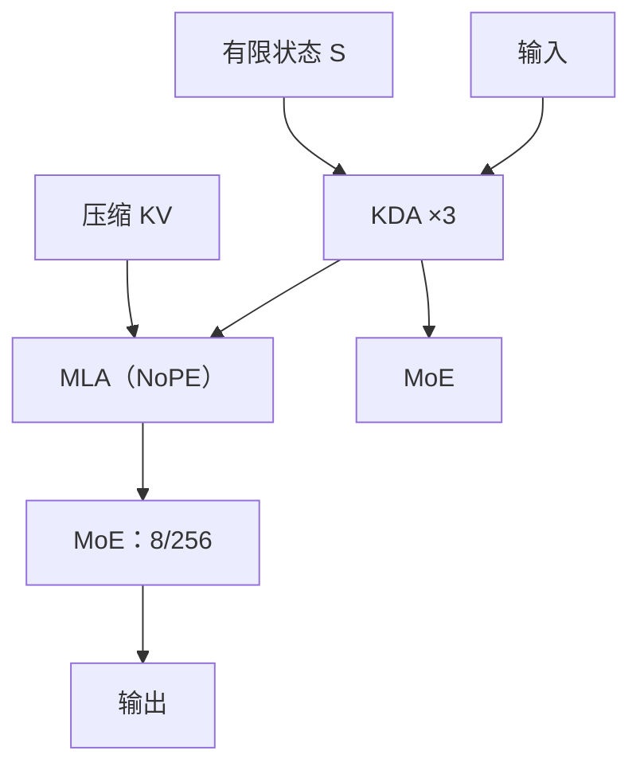

# Kimi Linear 与 KDA

    
在公平对照下，混合线性注意力第一次在短上下文、长上下文与 RL 放缩上都超过满注意力；核心是比 Gated DeltaNet 更细的通道门控。

    <footer>—— Kimi Team，Kimi Linear: An Expressive, Efficient Attention Architecture，arXiv:2510.26692</footer>

[Gated DeltaNet](/llm/gated-delta-net) 用标量遗忘乘在 delta 更新上：清得掉整表，也能定点改写。Moonshot 的 **Kimi Linear** 把这条规则再拆细：每个特征维自己的遗忘率，得到 **Kimi Delta Attention（KDA）**，再与 [MLA](/llm/mla) 按 **3:1** 层间混合。公平对照是同一套 1.4T token 配方、同样 48B 总参 / 3B 激活的 MoE，比满 MLA 与混合 GDN（GDN-H）。主结果：MMLU-Pro 51.0（MLA 47.2，GDN-H 47.9）；RULER-128k 84.3（MLA 81.3）；KV 最多减约 75%；1M 上下文解码 TPOT 1.84ms 对 MLA 的 11.48ms，约 **6.3×**。本篇写通道门控与混合比，不把后续 Kimi K3 的 2.8T 配方写进这篇实验。

## 问题

代理与测试时放缩把推理轨迹拉得很长，softmax 注意力的二次代价与线性增长的 KV 成为吞吐上限。线性注意力把历史压进有限矩阵状态，短序列上长期弱于满注意力；门控与 [DeltaNet](/llm/delta-net) 缩小了差距，但有限状态在长程检索上仍理论吃紧。纯线性因此不够；全部换成满注意力又买不走缓存。混合——少数全局层加大量线性层——是工程折中，但以往规模小、评测窄，且线性侧往往只用头级标量门（GDN / Mamba-2 一类）。

KDA 要回答的是：在有限 RNN 记忆上，遗忘粒度能否从「一头一个 $\alpha_t$」变成「一维一个」，同时仍走分块并行、而不是退回逐步循环。通道门控接近 [GLA](/llm/gated-delta-net) 的细粒度衰减，但更新仍是 delta，不是纯加法外积。硬件上，一般 DPLR（对角加低秩）转移矩阵算得起，却比经典 delta 更重；需要一种特化 DPLR，既少算、又仍像 delta 规则。

### 为何标量门不够用

GDN 的

$$
S_t=\alpha_t(I-\beta_t k_t k_t^\top)S_{t-1}+\beta_t k_t v_t^\top
$$

把整张快权重乘同一个 $\alpha_t$。要忘掉某一通道的联想，只能连邻居一起淡。语言里「实体指针」与「语体」的寿命不同，头级门控被迫折中。KDA 把 $\alpha_t$ 换成 $\mathrm{Diag}(\boldsymbol{\alpha}_t)$，让有限状态按维调控，并顺带承担位置 / 近因偏置——全文 MLA 层于是可以 **NoPE**，把位置职责交给 KDA。

3:1 来自消融：训练 / 验证困惑度在 3:1 最好；7:1 训练损失相近但验证差；1:1 验证差不多却更贵；纯满注意力（0:1）更差。不要把 3:1 写成普适定律，它是这篇配方下的最优点。

## 方法

KDA 递推：

$$
S_t=(I-\beta_t k_t k_t^\top)\,\mathrm{Diag}(\boldsymbol{\alpha}_t)\,S_{t-1}+\beta_t k_t v_t^\top,\qquad o_t=S_t^\top q_t.
$$

相对 GDN，对角门出现在 Householder 之前，形成特化 DPLR。分块展开用 WY：块内秩一连乘收成稠密表示，辅助向量 $w,u$ 由块内递推解出，再走 UT 变换压非矩阵乘 FLOPs。作者强调这比通用 DPLR 算法更轻，且与经典 delta 更一致。核实现放在 Flash Linear Attention 的 `fla/ops/kda`，并接到 vLLM。

Kimi Linear 的层：Norm → KDA 或 MLA → Norm → MoE。实现上每 3 个 KDA 块插 1 个 MLA 块。MoE 对齐 Moonlight 但更稀：256 专家中激活 8 个（含 1 个共享），48B / 3B；第一层稠密以稳住训练。MLA 层 NoPE，推理可收成高效 MQA，也免去 RoPE 基数与 YaRN 调参。对照里另有 Kimi Linear（RoPE）以检验 NoPE。

1.4T 公平预训练上，短上下文知识 / 推理 / 中文几乎全面高于 MLA 与 GDN-H。缩放律拟合给出相对 MLA 约 **1.16×** 计算效率（compute-optimal）。RULER 128k 上 84.3 且约 **3.98×** 加速，落在帕累托前沿。指令微调后短任务同样领先。开放权重：`moonshotai/Kimi-Linear-48B-A3B-Instruct`。

### 混合补的是检索，不是再加一层门

纯线性的瓶颈是长程精确检索：有限 $d_k\times d_v$ 装不下任意针。周期 MLA 提供全连接捷径，KDA 承担大部分长度上的递推与位置。层间混合优于头间混合，理由是基础设施简单、训练更稳。不要把头级 GDN 的「再混几个 softmax 头」直接当成 KDA 的 3:1。

## 机制

从在线学习看，线性注意力是无界相关目标上的累加；DeltaNet 是对 $\|S^\top k-v\|^2$ 的一步 SGD；GDN 再加权重衰减。KDA 把衰减做成对角，相当于每个快权重通道自己的 $L_2$ 寿命，有限记忆的分配更准。位置上，数据依赖的对角转移可视为可学习的乘性位置编码，放松 RoPE 的正交约束；实验把位置完全交给 KDA，MLA 不再旋转。

硬件机制是：对角加秩一仍能 WY 分块，GEMM 吃满；通用 DPLR 的额外项被特化掉。解码时四分之三的层没有随长度增长的 KV，只剩 MLA 的潜向量缓存，故宣称最多约 75% 的 KV 下降——前提是 3:1 且 MLA 用压缩 KV。1M 上 TPOT 几乎不随长度爬，才能把 batch 做大，6.3× 是这个组合的结果，不是单核魔法。

附录另有 5.7T 更长训练；主文公平对照钉在 1.4T。引用「第一次超过满注意力」必须带上这一设定：同数据、同参、同配方，不是拿旗舰 MoE 去打小稠密 Transformer。

## 边界与工程取舍

### 有限状态没有消失

3:1 只是把四分之一的层留作全连接；针在草堆里仍可能落在从未被 MLA 看见、又被 KDA 遗忘的通道上。NoPE 的 MLA 依赖 KDA 提供位置，KDA 层若被错误地换成纯 GDN 标量门，外推配方要重做。前缀缓存必须同时存 MLA 的 KV 与 KDA 的 $S$；只缓存注意力平面会在多轮里重算线性状态。KDA 核已放进 Flash Linear Attention；没有这条分块实现，通道对角门控会退回逐步循环，48B 级预训不成立。指令微调与 RL 后训练被作者当作第三条对照轴：短任务领先之外，还要看长输出轨迹上 KV 是否真的少 75%。配方锁死 1.4T 是为了禁止「更多数据假装成更好核」。开放的 Instruct 权重便于复现下游，不替代表 3 的基座对照。与 Qwen3-Next 同为 3:1 混合，但不能互换核与位置编码；迁移时重做缩放律，不要抄另一家的学习率。

与 [Qwen3-Next](/llm/qwen3-next-hybrid) 对照：两者都是 3:1 线性 + 满注意力，线性侧都源于 GDN。差别是 KDA 用通道门控、满注意力用 MLA+NoPE；Qwen3-Next 用 GDN + 带输出门的 Gated Attention、RoPE 只旋前 25% 维。不要把两篇的吞吐数字交叉替换。内核与 checkpoint 见 arXiv:2510.26692 与 Hugging Face 卡片。

出处：Kimi Team（Zhang, Lin, Yao, Yang 等），*Kimi Linear: An Expressive, Efficient Attention Architecture*，arXiv:2510.26692。GDN 见 Yang, Kautz, Hatamizadeh，ICLR 2025。MLA 见 DeepSeek-V2。

## 小结

- KDA 在 gated delta 上把遗忘做成通道对角，并特化 DPLR 以便分块并行。
- Kimi Linear 以 3:1 混合 KDA 与 MLA（NoPE），48B/3B，1.4T 公平对照超过满 MLA。
- MMLU-Pro 51.0、RULER-128k 84.3；1M 解码约 6.3× TPOT。
- KV 下降来自「多数层无增长缓存」，不是取消所有注意力。
- 出处：Kimi Team，arXiv:2510.26692。
