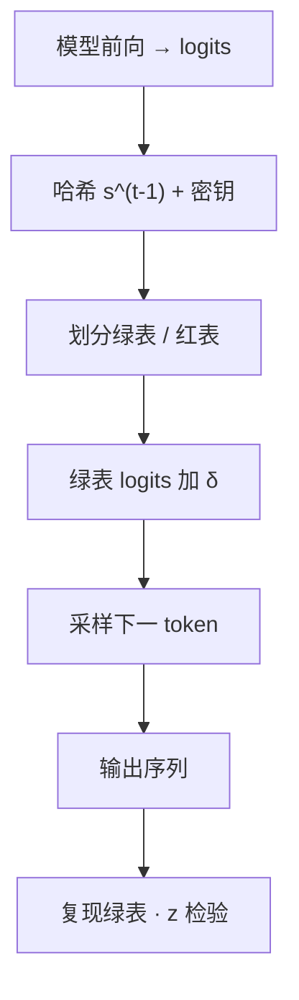

# Kirchenbauer 水印

生成前用前一枚 token 的哈希伪随机划出绿表，再把绿表 logits 抬高一个常数；检测端不必加载模型，只需复现同一张表并做比例检验。

<footer>—— Kirchenbauer et al., A Watermark for Large Language Models, ICML 2023</footer>

服务端要回答的不是「这段文字像不像人写的」，而是「这段文字是否由我们这套带密钥的采样规则生成」。Kirchenbauer、Geiping、Wen、Katz、Miers、Goldstein 把这件事收成一次**采样钩子**：模型照常算出词表上的 logits，服务在采样前把词表划成绿表与红表，软性地抬高绿表。检测是另一条独立流水线，只需要哈希函数、密钥和待测 token 序列，不必访问权重或生成 API。本篇写这条钩子如何嵌进连续批服务、统计量如何构成，以及它和束搜索、低熵补全的边界。对抗性改写与擦除手法不属于服务架构，不在这里展开。

## 问题

自回归一步产出的是整张词表上的分布。若服务对采样过程不加约束，输出在统计上与「用同一模型、同一温度、无密钥的采样」无法区分，事后审计只能靠分类器。分类器要随模型与风格漂移再训练，且对短片段不稳。水印把可检测性提前做到**采样合同**里：生成方持有密钥，验证方用同一密钥复现每一步的绿表，把「绿表命中是否异常偏高」写成可解释的 $p$ 值。

第二条约束是质量。低熵续写几乎被前文钉死——「Barack」后面几乎只能是「Obama」——硬性禁止红表会把合法续写掐掉。服务因此需要一种只在高熵位置真正改分布、在低熵位置几乎不动的软规则，并且改动必须发生在已经算完的 logits 上，不能要求重训。

### 检测为何不能绑在推理引擎上

若检测必须再跑一遍同一模型，审计方就要持有权重或消耗生成配额，第三方平台无法独立核验。Kirchenbauer 等人的设计把嵌入放在采样、把检测放在哈希复现：检测复杂度与词表划分同阶，相对一次前向可忽略。这对服务拆分很关键——生成集群继续吃 GPU，审计服务可以是无状态的 CPU 进程，按密钥版本水平扩展。

密钥是哈希的种子材料，不是模型权重。轮换密钥等于换一套绿表序列；旧文本要用旧密钥验。把密钥写进镜像环境变量而不做版本，审计会在发布后集体失明。

## 方法

硬规则（论文 Algorithm 1）用前一枚 token $s^{(t-1)}$ 的哈希播种伪随机数，把词表对半划成绿表 $G$ 与红表 $R$，下一步只从 $G$ 采样。它容易分析，但对低熵位置过狠。软规则（Algorithm 2）引入绿表比例 $\gamma\in(0,1)$ 与硬度 $\delta\gt 0$：绿表大小为 $\gamma|\mathcal{V}|$，只把绿表位置的 logits 加上 $\delta$，再 softmax 采样。$\delta=0$ 退回无水印；$\gamma=1/2$、$\delta\to\infty$ 接近硬规则。

检测复现每一步的绿表，统计长度为 $T$ 的片段里落在绿表的次数 $|s|_G$。原假设 $H_0$ 是「文本的生成不知道绿表规则」，则 $\mathbb{E}[|s|_G]=\gamma T$，方差为 $T\gamma(1-\gamma)$。单比例 $z$ 统计量为

$$
z=\frac{|s|_G-\gamma T}{\sqrt{T\gamma(1-\gamma)}}.
$$

硬规则 $\gamma=1/2$ 时退化为论文里的 $z=2(|s|_G-T/2)/\sqrt{T}$。选定阈值（例如 $z\gt 4$，单侧假阳性约 $3\times 10^{-5}$）后，拒绝 $H_0$ 即判定含水印。图 1 的例子用 OPT-6.7B、$\gamma=0.25$、$\delta=2$ 的多项式采样，约 28 个绿表 token 对上无水印期望的 9 个，偶然概率约 $6\times 10^{-14}$。代码在 `jwkirchenbauer/lm-watermarking`。

### 钩子挂在采样器，不挂在注意力核

连续批引擎里，水印是**逐步、按请求**的。同一步 batch 里每条序列的前一 token 不同，绿表就不同，不能把 $\delta$ 写成一张全 batch 共享的偏置。实现上是在 logits 写出之后、采样之前，对每条请求的一行做一次划表与加性偏置。计算量是 $O(|\mathcal{V}|)$ 的向量加，相对 [SDPA](/llm/sdpa) 与 MLP 可忽略；真正要小心的是与温度、top-$k$、top-$p$、约束解码的顺序——偏置应加在截断词表之前还是之后，必须写进服务合同，否则检测端按全词表复现会和实际采样不一致。

束搜索可以把「绿表密度」写进候选打分，论文称为把水印熨进高似然序列，以较小的困惑度代价换更高的 $z$。这对服务意味着：同一套 $(\gamma,\delta)$ 在多项式采样与束搜索上的可检测长度不同，监控面板要按解码算法分桶，而不是只报一个平均 $z$。

## 机制

软规则的作用可以看成对高熵位置做一次与密钥绑定的温度再分配。当分布尖锐时，即使绿表不含众数，加上有限的 $\delta$ 也很难把质量从众数拉开，于是低熵片段几乎不贡献水印信号；当分布平坦、许多 token 都说得通时，$\delta$ 把质量推向绿表，信号在这些位置积累。论文用 spike entropy 描述这一现象：总可检测性取决于整段的累积熵，而不是每一枚 token 都「看起来被改过」。短到约 25 个 token 的片段在他们的设定里已可检测，前提是这段里有足够的高熵位置。

$z$ 随 $\sqrt{T}$ 涨：同样的绿表超额比例，更长的片段更显著。这解释了服务侧的一条运营事实——系统提示、固定模板本身不需要被水印（它们常是用户或产品写的），水印打在模型新生成的续写上；审计切片若太短或几乎全是模板，应拒绝给出结论而不是给出假阴性。

水印不改变 KV，也不改变训练分布。它是解码期对 $p(\cdot\mid\text{prefix})$ 的逐点改写。前缀缓存、[分页](/llm/vllm-paged)、分离式 PD 都可以照常工作，因为钩子发生在每步 logits 之后。

### 与分类器检测的分工

零样本分类器（如 DetectGPT 一类）拟合的是模型的曲率或风格特征，随解码温度、指令调优和领域漂移失效。Kirchenbauer 水印把可检测性变成密码学式的共享随机源：不知道密钥的人无法系统性地偏向绿表，于是 $H_0$ 下的假阳性由 $z$ 的尾部给出，而不依赖「这段像不像 OPT」。服务若同时开分类器与水印，前者用于无密钥的存量文本，后者用于本产品生成的带密钥文本；不要用分类器的准确率去校准 $z$ 阈值。

后续可靠性分析见 Kirchenbauer 等人的 companion 文本 *On the Reliability of Watermarks for Large Language Models*（arXiv:2306.04634），讨论改写后信号如何衰减。那是稳健性评测，不是一份「如何抹掉」的配方；生产上应把它读成「审计切片策略与密钥保管」的输入。

## 边界与工程取舍

低熵代码与表格会让有效熵不够，$z$ 上不去，这不是实现 bug。此时应加长审计窗口，或承认该片段不可判定，而不是加大 $\delta$ 把语法写坏。$\delta$ 过大会抬高困惑度，用户侧表现为用词别扭；$\gamma$ 过小则绿表太窄，同样伤质量。论文常用的 $(\gamma,\delta)=(0.25,2)$ 是他们在 OPT 上的工作点，换词表规模与解码算法要重新扫。

约束解码、JSON 文法、[SGLang](/llm/sglang) 的压缩 FSM 会把合法词表收成很小的集合。若合法集合与绿表交集为空，软规则在该步几乎失效；若先文法掩码再加水印，检测端必须用同一掩码后的词表来划绿表，否则 $z$ 的原假设被破坏。多语言 token 化、字节回退、特殊 token 是否参与哈希，都要进协议。哈希只吃前一枚 token 时，局部修改会影响相邻一步的绿表，这是设计使然，用来让信号沿序列耦合；服务文档应写明窗口，而不是暗示「改一个词只影响一个位置」。

投机解码、并行采样会让「前一 token」在草稿路径上分叉。水印必须按**最终被接受的序列**定义绿表，草稿上的偏置若与接受准则不一致，检测端按最终文本复现会对不齐。正确做法是：草稿可以不打水印，只在目标模型的接受/重采样路径上打；或者草稿与目标共享同一哈希规则，但实现复杂度立刻上升。

不要把 Kirchenbauer 水印写成隐写术或图像水印。它没有嵌入比特串到像素里，也没有改权重。它是带密钥的绿表偏置加公开可复现的比例检验。SynthID 一类方法是另一条产品线，见后续条目，不要混成一篇「所有水印」。

## 小结

- Kirchenbauer 水印在采样前用前一 token 的哈希划绿表，软规则给绿表 logits 加 $\delta$，无需重训。
- 检测复现绿表并做 $z$ 检验，不加载模型；假阳性由阈值对应的尾部概率给出。
- 服务里钩子按请求作用于每步 logits，与 KV 布局、连续批正交；须固定与 top-$p$、约束掩码的顺序。
- 可检测性来自累积熵；低熵片段应标为不可判定，而不是盲目加大 $\delta$。
- 密钥要版本化；审计是独立 CPU 服务，不绑在 GPU 引擎上。
- 出处：Kirchenbauer et al., *A Watermark for Large Language Models*, ICML 2023，PMLR 202:17061–17084（arXiv:2301.10226）；代码 https://github.com/jwkirchenbauer/lm-watermarking。
