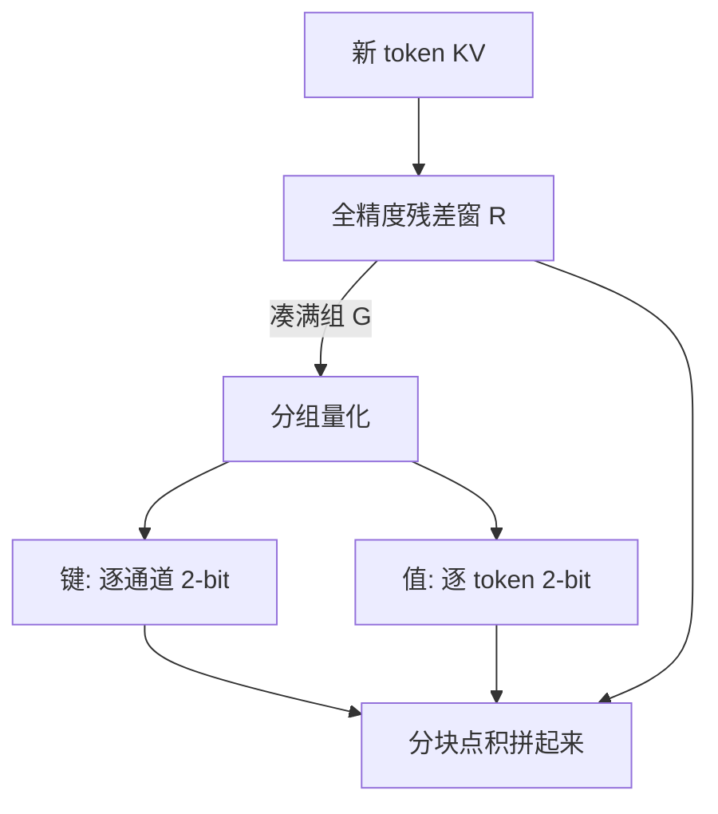

# KIVI / 逐通道 KV 量化

    
键的异常值长在通道上，值的误差却应按 token 关进各自的格子；不对称地量化二者，才能在 2-bit 上还留住可用的注意力。

    <footer>—— Liu、Yuan 等，KIVI，ICML 2024</footer>

把 KV 打到 2-bit，逐 token 的朴素取整会在键上崩掉：少数通道幅度极大，尺度被它们绑架，其余通道量化阶梯过粗。Liu、Yuan、Jin、Zhong、Xu、Braverman、Chen、Hu 的 KIVI 先量了流行模型里 KV 的元素分布，再给出免调的非对称方案：键按通道量化，值按 token 量化，并留下一小段全精度残差窗口接住正在生成的局部上下文。本篇写为什么轴不能对称，以及流式追加时如何把「跨 token 的通道量化」做下去。8-bit 档见 [KV INT8 / FP8](/llm/kv-int8-fp8)，预算对照见 [KV 作为长上下文](/llm/kv-as-long-context)。

## 问题

服务要把许多请求批在一起，KV 随 $n$ 与 batch 涨，加载它使算力空转。减头需要训练或升训；驱逐会丢掉可见性；卸载受 PCIe 限制。量化看起来最便宜：不改权重，只改缓存字节。已有系统把 round-to-nearest 的 4-bit 套到 KV 上往往还能用；到 2-bit，同一套逐 token 量化在键上会把质量打穿。

作者把键、值看成形状 $n\times d$ 的表（$d$ 为通道，即头维展开或按头看均可）。他们比较逐 token（一行一个尺度）与逐通道（一列一个尺度）在 2-bit 下的组合，发现：键必须走通道轴，值必须走 token 轴；把值按通道量化，或把键按 token 量化，生成任务上的分数会塌到不可用。这不是调参运气，而是两种张量在注意力里扮演的角色不同。

逐通道不是「每个头一个尺度」，而是沿序列方向、对固定通道上的许多 token 共用一个 $(s,z)$。异常通道自己消化巨大的 $s$，正常通道保留细阶梯。

## 方法

### 键按通道，值按 token

键参与 $q k^\top$。若某通道幅度长期很大，逐 token 尺度会被该 token 上这个通道的峰值拉爆，同一 token 里其他通道被量化到几乎为零，点积失去方向信息。逐通道量化把峰值关在那一列里，其他列的 $s$ 可以很小。值参与加权和 $A V$：它是按 token 混合的，误差应关在单个 token 内部，以免一个位置的量化噪声渗进所有位置。实验上，2-bit 下「K 通道 + V token」接近 16-bit 基线，「K token + V token」明显掉点，其余组合接近崩溃。

### 分组与残差窗口

通道量化要跨若干 token 才能估 $s$。自回归却一次只来一个 token。KIVI 把缓存拆成两组：已满组的 $X^{K}_{g},X^{V}_{g}$ 按组大小 $G$（论文常用 $32$）量化存放；尚未满组的残差 $X^{K}_{r},X^{V}_{r}$ 保持全精度，长度不超过残差上限 $R$（常用 $128$）。新 token 先进入残差；残差满 $G$ 的倍数时，把最老的一组量化并入分组缓存。注意力对分组部分用反量化后的矩阵乘，对残差部分用全精度乘，再把分数拼起来做 softmax。这是流式友好的数据结构，不必每次重写整段历史的尺度。

### 免调、硬件向的 2-bit

算法不微调权重。实现上分组量化按块做，方便 CUDA 核。论文在 Llama（含 Llama-2）、Falcon、Mistral 的生成任务上报告：质量接近满精度，峰值显存（含权重）可降到约 $1/2.6$，从而 batch 最高约 $4$ 倍，真实推理负载上吞吐约 $2.35$–$3.47$ 倍。这些数字含权重占用，故压缩比看起来低于「仅 KV 从 16-bit 到 2-bit」的理论 $8$ 倍——权重仍占一截，残差窗口也仍是 16-bit。

## 机制

令键为 $X_K\in\mathbb{R}^{n\times d}$。逐通道 2-bit 对每个 $j$ 用该列的动态范围确定 $s_j$，于是

$$
X_K[:,j]\approx s_j\cdot \hat{X}_K[:,j]+z_j.
$$

异常列 $s_j$ 大、量化噪声绝对值大，但查询若也在该方向上大，相对误差仍可能可接受；正常列 $s_j$ 小，方向信息得以保留。值 $X_V$ 按行量化，使 $A$ 的第 $i$ 个权重只放大第 $i$ 行的误差，相当于对混合系数加了一点对角扰动，而不是把某一通道的误差广播到所有 token。

残差窗口的机制与 [汇点加窗口](/llm/kv-eviction) 不同：这里不删远历史，只是远历史更吵、近历史更准。注意力仍能读到 $n$ 个位置，针测理论上仍「看得见」针，只是针的键被 2-bit 污染。这与驱逐的失败模式相反：驱逐是看不见，量化是看走样。

组大小 $G$ 太小，尺度估计不稳、元数据占比高；太大，通道统计里混进分布漂移，且残差要等更久才能量化。$32$ 是论文默认，不是定理。

## 边界与工程取舍

2-bit 对核不友好。整数栅格要与反量化、布局、分页块对齐，否则带宽红利被打散的 scale 加载吃掉。残差窗 $R$ 越大越准、越占显存；长生成时 $R$ 相对 $n$ 可以忽略，短生成时残差可能占大头，压缩比会难看。前缀缓存必须把量化轴、 $G$、$R$、比特数写入键，否则 16-bit 前缀和 2-bit 后缀在块边界上接不上。

不是所有任务都对 2-bit 键宽容。精确复制、逐字引用、极长针测更吃键的方向精度；聊天闲聊更吃近处残差。上线应用针测与长对话后半段，不要只用短 CoQA 签字。KIVI 不管窗口外记忆，也不替代 MLA：MLA 在训练里学低秩，KIVI 在推理里加噪声。二者可叠，归因要分开。

若 8-bit 已经让 decode 离开带宽墙，再上 KIVI 的收益主要是容量（更大 batch），不是延迟。端侧则可能相反：容量是硬约束，2-bit 加残差窗是少数能把 4K 上下文塞进几百 MB 的办法之一，但要接受校准几乎只能「用了看」。

不要把逐通道键量化理解成「SmoothQuant 搬到 KV」。SmoothQuant 迁移的是激活异常值到权重；KIVI 不改权重，只规定 KV 两套轴。故事相邻，实现不是同一套 scale。

## 小结

- KIVI 是免调的非对称 2-bit KV 量化：键逐通道，值逐 token。
- 对称地交换两根轴会在 2-bit 下崩溃；8-bit 更宽容，不构成反例。
- 用组大小 $G$ 的量化段加长度 $R$ 的全精度残差，解决通道量化与流式追加的矛盾。
- 可见集仍是全长，误差是噪声不是删除；与窗口淘汰、MLA 不是同一轴。
- 峰值显存与吞吐收益来自更大 batch；核与元数据决定能否兑现带宽。
- 精度、组参数必须进入前缀缓存契约。
- 出处：Liu、Yuan 等，*KIVI: A Tuning-Free Asymmetric 2bit Quantization for KV Cache*，ICML 2024。
