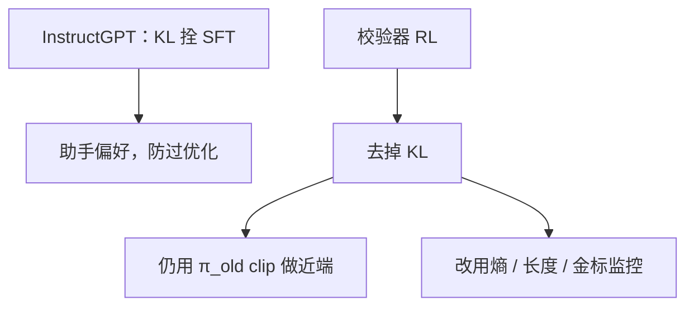

# 无 KL 的 RL

参考策略若只代表短答习惯，KL 就是在打压长链；可验证对错一旦当奖励，参考不再等于人类喜欢的分布。

<footer>—— InstructGPT 把 KL 放进奖励；DAPO / 部分 R1-Zero 配方去掉 KL，让策略离开冷启动</footer>

[上一课](/llm/dynamic-sampling-rl)保证组内还有分叉。分叉要走向与 SFT 不同的长推理时，[RLHF](/llm/rlhf-pipeline) 默认的 KL 锚会把它拉回去。缺口是：**KL 在助手 RLHF 里是约束，在推理 RL 里常常是错误的目标。** 本课写何时去掉对 $\pi_{\mathrm{ref}}$ 的 KL。不重推 PPO clip，不重写 [DPO](/llm/dpo) 的 $\beta$。

## 问题

InstructGPT：最大化 $r_\phi$ 的同时用 $\beta\,\mathrm{KL}(\pi\|\pi_{\mathrm{ref}})$ 防止过优化与语言崩坏，$\pi_{\mathrm{ref}}$ 是 SFT，代表「还像人话的指令模型」。推理 RL：奖励是校验器，$r^\star$ 与 SFT 短答分布几乎正交，KL 打压的是我们要的行为。DAPO 明确去掉 KL；R1-Zero 从基座直接 RL，参考若是基座补全，KL 更没有对齐含义。

去掉 KL 不等于没有近端约束。clip 与 $\pi_{\mathrm{old}}$ 仍限制一步走多远。少的是「永远靠近某份冻结 SFT」。过优化通道改成校验器黑客与熵塌，用金标、熵、长度监控替代 KL 曲线。参考模型占显存与前向，去掉它也是系统收益，但不要把省显存写成算法进步。

### KL 进奖励还是进损失

有 KL 时，InstructGPT 放进逐步奖励，使 GAE 已含「别离 SFT 太远」。再在损失加一项就是双倍 $\beta$。无 KL 时两项都删。不要留一个很小的 $\beta$「图个安心」而不看它是否在压长度——那是未声明的长度惩罚。

DPO 的 $\beta$ 不是可选装饰，没有它损失未定义。无 KL 的 on-policy RL 与 DPO 不是同一开关。

## 方法

可验证主场：目标只剩裁剪策略梯度 + 可选熵，参考模型可以不加载，省一份前向。仍建议存一份 SFT 做**离线评测**（语言质量、指令遵循），不进梯度。开放偏好 / 安全：保留 KL 或保留安全 RM 硬门；无 KL 时语言崩坏与拒答丢失都更快。混合任务不要共用一个 $\beta=0$。

若必须折中：KL 只加在非推理 token（用户可见摘要），思维段 $\beta=0$。这已是产品设计，要与后课混合思考一起锁。

## 机制

KL 把最优策略拉向 $\pi_{\mathrm{ref}}$。$\pi_{\mathrm{ref}}$ 与 $r$ 一致时，这是正则；不一致时，这是偏差。Gao 的过优化曲线在有 KL 时拐点更晚——那是偏好 RM 的朋友。校验器没有「更大的 RM 金标」，金标就是隐藏测例；KL 推迟的是能力上升，不是黑客。无 KL 后，Clip-Higher 与熵监控成为一等公民，因为近端只剩一步 clip。

参考模型仍可用于重要性采样的分母以外的诊断：逐步 KL 曲线可当「走了多远」的日志，只要不反传。

## 边界与工程取舍

多目标里若还有有用 RM，对 RM 那条通道保留 KL，对校验器通道 $\beta=0$，实现上要分项。服务语言质量下降时，用冷启动 SFT 再 RL（R1 相对 R1-Zero 的路径），而不是突然加回大 $\beta$ 把长链打回去。下一课截断重要性采样：无 KL 且多 epoch 复用轨迹时，off-policy 校正更关键。

去掉 KL 之后，近端只剩 clip 与生成预算；熵、长度、隐藏测例要升为一等监控，不能再看 KL 曲线假装还在锚。

## 小结

- 助手 RLHF 的 KL 锚在推理 RL 里常与校验器目标冲突，可以去掉。
- 近端仍靠 $\pi_{\mathrm{old}}$ clip；监控改熵、长度、隐藏金标。
- DPO 的 $\beta$ 不能类比成「可选 KL」。
- 安全与开放偏好不要盲目 $\beta=0$。
- 出处：Ouyang 等 InstructGPT 的 KL；Yu 等 DAPO 去 KL；DeepSeek-AI R1-Zero。
