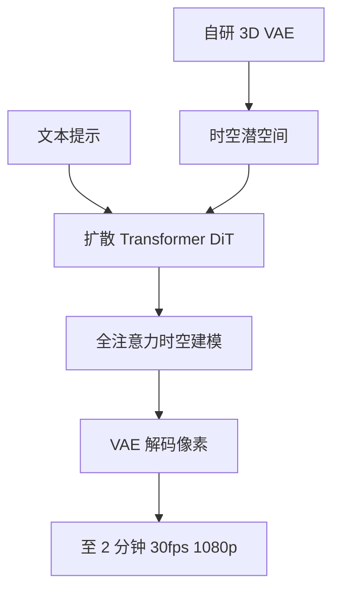

# Kling

    
可灵能生成复杂时空运动并模拟物理世界特征，把文本提示变成高品质 AI 视频；最长约两分钟，30fps，分辨率至 1080p，并支持多种宽高比。

    <footer>—— Kuaishou Technology，Kuaishou Unveils Proprietary Video Generation Model 'Kling'，2024-06-10</footer>

快手于 2024 年 6 月 10 日通过官方新闻稿发布自研视频生成大模型 **Kling**（可灵）。稿件把能力写在产品语言上：复杂时空运动、物理世界特征、概念组合与想象力；把规格写在可核验的数字上：最长约两分钟、30 帧每秒、最高 1080p、多种宽高比。架构只写到官方愿意公开的粒度——**基于扩散的 Transformer（DiT）**，并自研潜空间编解码与时间建模。闭源视频模型只引快手投资者关系与新闻稿、官方站点，不引用第三方「逆向工程」里的层数、损失或数据表，也不把后来的 1.6 / 2.x / 3.x 产品页倒填进 2024 年 6 月这次发布。

## 问题

短视频平台要的生成器，不是实验室里固定 4 秒方形切片，而是创作者会用的时长、画幅与运动。固定秒数迫使模型在填充或截断里浪费容量；只做空间压缩则时间维随帧数爆炸。物理观感——快速移动物体、剧变场景、复杂人体——是短视频的日常，也是早期文生视频最容易碎的地方。快手把问题收成：一条能进剪辑产品的生成管线，而不是一篇可复现的训练配方。

同日新闻稿把可灵放进快手大模型产品线：此前已有通用语言模型「快意」KwaiYii（稿件写 1750 亿参数）与文生图「可图」KeTu。可灵要补的是视频这一模态，并先在中国用户的剪辑应用「快影」里做内测，而不是先开源权重。

### 官方架构句是上限，不是骨架图

新闻稿原文级的方法学只有三句。其一，整体是 diffusion-based transformer（DiT）。其二，潜空间编解码：自研 **3D VAE**，同步做时空压缩，在重建质量与训练效率之间取平衡。其三，时间建模：设计计算上可承受的 **全注意力** 作为时空模块，同时抓帧内局部空间与跨帧动态，以复现运动信息。没有层数、没有隐维、没有噪声日程、没有文本编码器名字、没有参数量。把社区猜测的「类 Sora 压缩比」写进本文，越界。

「模拟物理世界」是官方能力陈述，与 [Sora](/llm/sora) 博客里的 world simulator 叙事同类：都是观察，不是可查询的牛顿解算器。失败模式（穿透、因果颠倒、文字）新闻稿未列，不能用演示片当成物理引擎已完成。

## 方法

公开方法只能按产品合同写。输入：文本提示。输出：视频，规格上限为约两分钟、30fps、1080p、多宽高比。内测通道：快影（KuaiYing）申请试用；演示与说明指向官方站 `kling.kuaishou.com`（后续全球站域名以当时 IR 为准）。生成器在潜空间里做扩散，解码回像素——这是 3D VAE 那句话的推论，不是额外的实现细节。

2024 年 7 月 25 日快手再发 IR：可灵基础模型升级，**全球网页端公测**（中文 `klingai.kuaishou.com`，英文 `klingai.com`）。稿件回顾：6 月 6 日起接受申请、超百万申请、超过 30 万用户获早鸟；当日向所有人开放 beta，每日发放 66 点「灵感值」，约合六条免费标准视频。中国大陆同步上线订阅：金 / 铂金 / 钻石，月费人民币 66 / 266 / 666，对应 660 / 3000 / 8000 灵感值。图生视频等能力被写成「此前迭代已交付、网页端已上线」的产品项，仍无训练配方。

### 全注意力时空块是官方点名的机制，不是开源实现

稿件把全注意力写成「把时间与空间信息整合进一次分析」，以捕捉快速运动、剧变场景与复杂人体。这与当时开源视频模型常见的「2D 空间注意力 + 1D 时间注意力」形成对比——但对比只停在官方句子：快手没有公布是 3D 全注意力还是分解后的高效近似，也没有公布窗口、因果掩码或序列并行。3D VAE「同步时空压缩」同样没有给出 $4\times 8\times 8$ 这类数字；不要借用 [Wan 2.1](/llm/wan-2-1) 或 [HunyuanVideo](/llm/hunyuan-video) 的压缩比来填空。

## 机制

能讨论的机制只有输入输出与官方模块名。DiT 意味着去噪对象是潜空间里的 token 网格，而不是像素 U-Net 的默认假设；3D VAE 意味着时间与空间一起降维，两分钟 30fps 才可能进入可训练 / 可服务的 token 预算。全注意力意味着任意两个时空位置原则上可以强耦合，这既解释「大运动」宣传，也暗示服务成本随分辨率与时长陡增——IR 没有谈批处理或蒸馏。

概念组合与想象力被写成提示遵从的另一面：不是只复制训练集里见过的物体组合。物理特征被写成运动与接触更像真实世界。二者都是定性。与 OpenAI Sora 2024 年 2 月博客相比：Sora 多写了时空 patch 与压缩网络；可灵多写了 3D VAE 与全注意力这两句，但同样**不含**可复现训练。评测若要比，只能比双方当时官方演示与规格上限（时长、帧率、分辨率），不能比未公开的 FVD。

KwaiYii 与 KeTu 同属快手大模型矩阵，不是可灵的文本编码器或图像编码器。不要把 1750 亿 LLM 画进视频 DiT 的交叉注意力。灵感值与订阅是计费，不是采样步数。

### 产品通道先于研究发布

可灵的发布顺序是：剪辑 App 内测 → 全球 Web beta → 订阅档。这与 Wan、HunyuanVideo「先技术报告与 GitHub」相反。工程含义是：延迟、队列、内容审核、肖像与版权策略都以产品条款为准，技术稿不会单独给一条安全一章。后续版本若官方只谈画质或原生音频，应另文按发布日引用，不回写到 2024 年 6 月 10 日。

## 边界与工程取舍

闭源。无法复现、无法消融。新闻稿没有失败案例表。两分钟是能力上限，不是每条提示都稳定到 120 秒无崩溃。1080p 与多宽高比意味着服务端要为不同网格备算力，未谈。3D VAE 的压缩伪影会成为生成伪影的上限，压缩比未知。全注意力的二次代价如何被「计算高效」近似，未知。

不要引用非官方综述里的模块图当作快手设计。不要把可灵写成已开源。全球站与中国站的配额、功能开关以当时页面为准。与 Veo、Sora 比较音频或 4K 时，用各自发布日的官方文本；2024 年 6 月这篇没有原生音频。

出处：Kuaishou Technology，*Kuaishou Unveils Proprietary Video Generation Model 'Kling;' Testing Now Available*，2024-06-10（IR / PR Newswire）。全球公测见 2024-07-25 *Kuaishou Launches Full Beta Testing for ‘Kling AI’ to Global Users*。站点当时为 kling.kuaishou.com；架构细节以两篇官方稿为上限。

## 小结

- 可灵是快手 2024 年 6 月发布的闭源文生视频模型，规格上限约两分钟、30fps、1080p、多画幅。
- 官方架构句：DiT + 自研 3D VAE 时空压缩 + 全注意力时空建模；其余未公开。
- 先在快影内测，7 月 25 日全球 Web beta，并给出灵感值与订阅档。
- 「物理模拟」与「概念组合」是定性能力，不是可复现评测表。
- 与开源 Wan / HunyuanVideo 比较只能比双方写过的接口，不能借用它们的压缩比或块数。
- 出处：快手 2024-06-10 与 2024-07-25 官方新闻稿。
