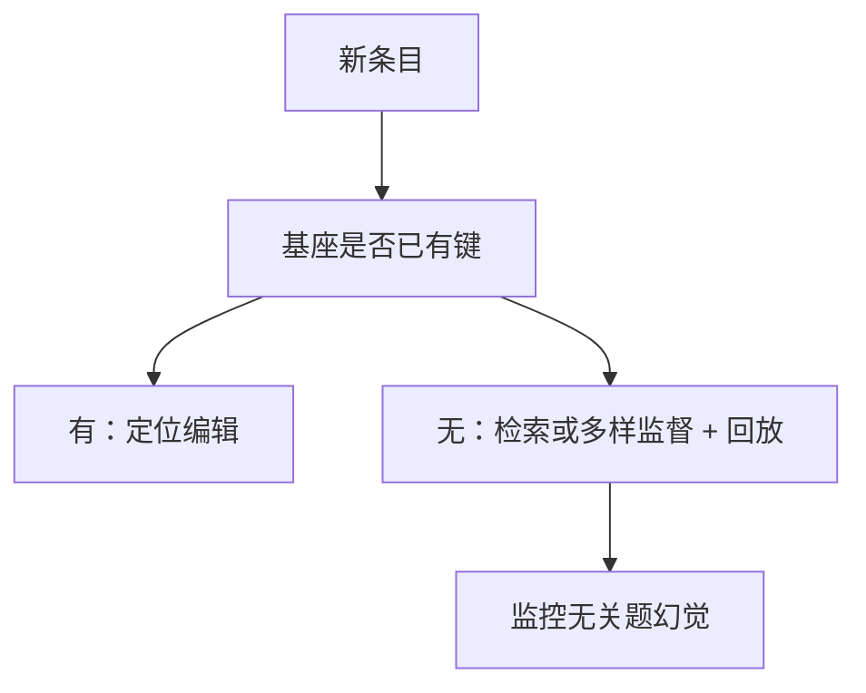

# 知识注入的限度

微调会让模型更愿意陈述训练里见过的新事实，也会让它在没见过的新事实上更敢幻觉；注入不是把条目写入可靠词典。

<footer>—— Gekhman 等，Does Fine-Tuning LLMs on New Knowledge Encourage Hallucinations?（ACL 2024）；对照 Berglund 等反向诅咒、ROME 的键不对称</footer>

[ROME / MEMIT](/llm/rome-memit)能改已有槽里的客体。产品常想做的另一件事是**灌入原本没有的知识**：新法规、新 API、内部人名。做法往往是把条目写成指令对再 SFT。Gekhman 等人 2024 年的实验表明：模型对「预训练里已有的事实」微调很听话；对「预训练没有的新事实」，SFT 既难真正学会，又会抬高在其它未知问题上的幻觉率。本课写这条限度。下一课转向对偶操作：遗忘。

## 问题

[LIMA](/llm/lima) 与[内在秩](/llm/lora-intrinsic-rank)都暗示：后训练擅长改接口，不擅长长新世界模型。知识注入却假设 SFT 能把 $(s,r,o)$ 写成可检索的权重。若 $s$ 在预训练里没有稳定键（ROME 意义下），[仅回复损失](/llm/response-only-loss)只会让模型在训练提示的措辞下背 $o$；换一种问法就回到先验，或编一个同样自信的 $o'$。

Gekhman 等人把例子分成模型已知与未知，再微调未知事实，测量：未知事实的掌握、以及无关未知问题上的幻觉。结果支持「新知识微调鼓励幻觉」：模型学会了「对没把握的题也要像示范那样给出具体答案」。

### 反向诅咒是键不对称的生成版

Berglund 等人的反向诅咒：用「A 是 B」训练，模型不会自动回答「B 是谁」。这与 ROME 里反向提示不共享键一致。注入一条正向句，不等于注入一张无向知识图。关系抽取式产品若假设对称，会在反向查询上静默失败。

Ovadia 等人比较微调与检索：时效知识更适合索引。本课不展开 RAG 实现，只把「不要用 SFT 当知识库」当作限度。

## 方法

先探针：这条知识是否已在基座补全里以某种措辞出现。已有则用 ROME/MEMIT 或小学习率校正，而不是大 SFT。没有则优先检索；若必须内化，用多样释义、正反向、多跳模板同时监督，并保留大量已知事实回放，抑制「未知→随便编」的接口漂移。学习率按[全参要小](/llm/lora-vs-full-lr)；[LoRA](/llm/lora) 更难写入新键，表现为只在训练句式上对。

[chat template](/llm/chat-template) 下，把知识写进系统提示不是注入权重，是上下文条件；上下文消失则知识消失。不要把长系统提示的成功当成注入成功。

评测必须含：训练措辞、释义、反向、无关未知、已知事实保持。只报训练句准确率，会选出背诵器。

## 机制

SFT 强化的是「在此类提示后给出具体完成」的策略。示范都是有答案的，模型把「具体完成」泛化到无槽可取的提示上，幻觉上升。已知事实上，键已存在，SFT 主要校准措辞，幻觉不必升。这与 NEFTune 减少背诵不同：注入任务偏偏要精确记忆，噪声与多样性的权衡更紧。

编辑改指定 $Wk=v$，不训练「要答得具体」这一接口策略，因此对无关未知的伤害通常小于灌表 SFT。但编辑不创造新键：主体从未出现过，没有槽可写。限度是结构的，不是超参没扫好。

领域 DAPT 用全文 LM 把术语推进先验，比对话表注入更接近「长出键」。仍不保证事实图对称，只是降低完全 OOV。

## 边界与工程取舍

内部知识有权限与过期问题：写入权重难以按文档撤回，这直接接到[机器遗忘](/llm/machine-unlearning)。能检索就检索。必须内化的流程性知识（如何填内部工单）属于技能，不是三元组，SFT 更合适。评测幻觉要用封闭题 +「我不知道」许可，否则模型被训练成永远具体。

## 小结

- 预训练已有键的事实可编辑或轻 SFT；没有键的新事实难以内化。
- 对新事实做 SFT 会强化「未知也具体作答」，抬高无关幻觉。
- 反向与释义不自动成立，需单独监督或接受不对称。
- 系统提示是上下文，不是注入。
- 时效与可撤回知识用检索；SFT 留给技能与接口。
- 出处：Gekhman 等，ACL 2024；Berglund 等，反向诅咒；Meng 等，ROME/MEMIT。
