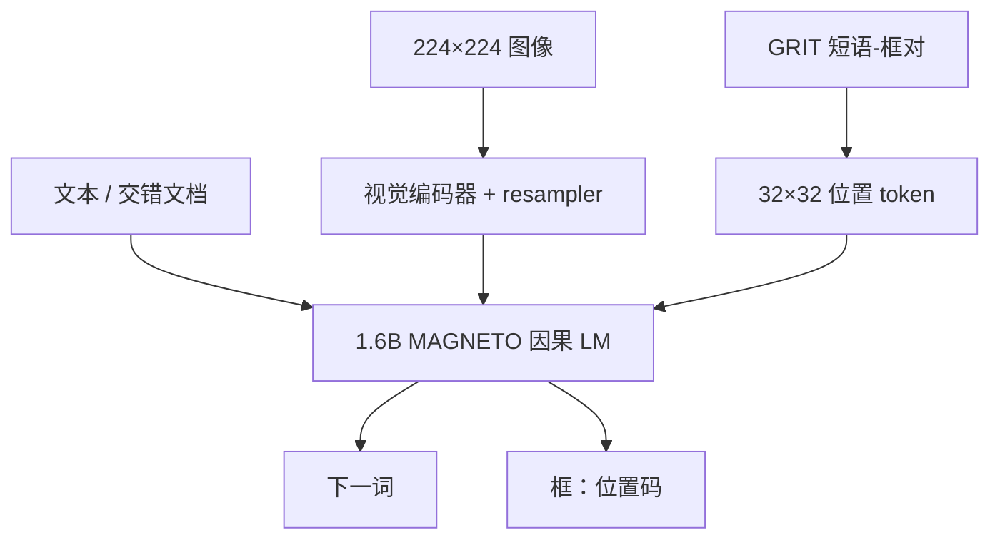

# Kosmos-1 / 2

语言不是你需要的全部：把感知对齐进因果语言模型之后，再用 Markdown 式超链接把短语钉到离散位置码上，接地才能成为与下一词预测同一套解码。

<footer>—— Huang 等，Kosmos-1，arXiv:2302.14045；Peng 等，Kosmos-2，arXiv:2306.14824</footer>

微软 2023 年的 **Kosmos** 把「通用多模态 LLM」写得很早、容量却刻意不大。**Kosmos-1**（NeurIPS 2023）是约 **1.6B** 的 MAGNETO 因果 Transformer：CLIP 系视觉编码器加 resampler，吃文本、图文对与交错网页，做零样本 / 少样本看图与 OCR 苗头。**Kosmos-2**（ICLR 2024）不改结构，从 Kosmos-1 初始化，把 **GRIT** 接地图文对加进语料，用位置 token 把字幕里的短语链到框。本篇写 1 的感知对齐与 2 的接地格式；不把 Kosmos-G / 后续更名型号的层表写进来。

## 问题

2023 年初，GPT-3 已经证明语言侧的上下文学习，视觉仍多是独立的 caption / VQA 专家。要把感知接进**同一个**下一词解码器，需要：视觉特征如何变成语言模型能读的前缀；交错文档如何提供「图在句子中间」的梯度；容量只有约 1.6B 时，不能靠堆 70B 掩盖对齐错误。Kosmos-1 的问题是对齐与通用性，不是竞赛级 MMMU。

Kosmos-1 仍不能指物。用户画一个框问「这个」，或模型说「左边那只猫」却不输出坐标，交互停在纯文本。检测器外挂会把 LLM 变成配音。Kosmos-2 要的是：框与短语都是词表里的离散符号，接地任务仍是语言建模。

### MAGNETO 小模型，不是冻住的 65B Flamingo

语言骨干：24 层 MAGNETO，隐维 2048，32 头，FFN 8192。视觉：24 层、隐维 1024、FFN 4096，输入 $224\times 224$、patch 14。图像经编码器与 resampler 变成一段连续嵌入，用特殊符号标出图像段起止，再与文本嵌入拼接。可训练参数合计约 1.6B。MAGNETO 相对标准 Pre-LN 在子层上多归一化，论文把它当作跨模态训练稳定性的选择。损失只计离散 token——文本；连续视觉前缀当条件。

1.6B 是全模型口径。不要写成「1.3B 语言 + 可忽略视觉」。分辨率 224 决定细字上限；Kosmos-2 的 32×32 位置网格是在这张小画布上切 bin，不是高分辨率检测器。

## 方法

Kosmos-1 数据：纯文本、图文对、交错图文。训练目标一律下一词。评测走 caption、VQA、OCR 相关与语言理解，并展示少样本多模态。Kosmos-2 在此之上加入 GRIT：从 LAION-2B 与 COYO-700M 子集抽字幕，抽取名词短语与指称，用检测 / 接地管线把短语链到框，再写成超链接式字符串。连续坐标离散化：宽高各 32 bin（每 bin $7\times 7$ 像素），词表加 **1024** 个位置 token。框写成起点与终点两个位置码，可多框、用分隔符。Markdown 风格把「短语」链到「位置码序列」。训练仍只对文本与位置码计损失。指令阶段混 LLaVA-Instruct、语言指令，以及由 GRIT 构造的「给短语出框 / 给框出短语」。

### 指与被指是同一套位置码

接地：提示里写短语，模型续位置码。指称：用户提供位置码（或代词 + 框），模型在条件于该区域时回答。把 `<grounding>` 一类控制符加在 caption 前，可得到带框的描述。论文报告短语接地、指称理解 / 生成，以及与 Kosmos-1 对照的 Flickr30k / VQAv2：接地能力加上去之后，VQA 略降、caption 略升——技能组合不是免费扩容。

## 机制

Kosmos-1 的机制是：视觉前缀占用上下文里的一段键值，后续词的查询可以读图；交错数据让「后文指前文的图」出现在预训练里，而不只出现在微调模板。容量小，世界知识浅，零样本更像格式与感知对齐，而不是学科推理。

Kosmos-2 把几何收进词表：位置码与词在同一 softmax 里竞争。模型学的是「短语之后该接哪两个 bin」，而不是回归头上的 $L_1$ 框损失。超链接格式提供对齐监督：短语跨度与框在同一序列邻接，注意力不必跨整段字幕去猜指称。32×32 量化把框误差钉在约 7 像素，对 224 图够用，对 4K 截图不够——那不是加几个 token 能解决的，要把编码器分辨率一起抬。

### 和检测头、和更晚的接地 MLLM

外挂检测器：LLM 输出文本再由 Grounding-DINO 找框，两套误差。Kosmos-2 是单解码器。更晚的 Shikra、Kosmos 谱系之外的 grounded LLaVA，容量与分辨率都大一号，榜不可直接当「格式赢了」。Kosmos-2 的贡献是**数据格式 + 小模型可训**，不是 2024 年开源 70B 的 OCR 上限。

语言任务表上 Kosmos-2 与 1 大致持平、个别 SuperGLUE 有升有降。不要写成「接地必然伤害语言」或「必然提升」；原文的叙事是「新能力、旧任务可比」。

## 边界与工程取舍

1.6B 进不了和 GPT-4V 同一张雷达图。224 输入、resampler 压缩，文档理解不是产品目标。GRIT 来自网页图文，框噪声、短语对齐错误会变成位置码上的标签噪声。位置词表与聊天模板绑死，换视觉塔分辨率必须重定义 bin，不能热插拔 448 编码器还用 32×32、7 像素 bin。推理要约束位置码的语法（起止、范围、成对），否则会抽到非法索引。

不要把 MAGNETO 写成普通 Llama 层表。不要把 Kosmos-1 的少样本当 Flamingo-80B 的少样本。开源实现（Transformers 的 Kosmos-2）用 `<patch_index_xxxx>` 一类表面形式，应与论文 Markdown 超链接对照，而不是混用两种模板还怪模型不会接地。

服务上「用户画框」要把像素坐标映射到 32×32 再写成位置码，映射错一档表现为指错物体。生成框后要把 bin 映回像素再画，评估用官方量化，不要在连续坐标上另算 IoU 还声称复现失败。网页接地数据含人物与商标，产品层仍要过滤。

出处：Huang 等，*Language Is Not All You Need: Aligning Perception with Language Models*，arXiv:2302.14045（NeurIPS 2023）；Peng 等，*Grounding Multimodal Large Language Models to the World*，arXiv:2306.14824（ICLR 2024）。架构细节以 Kosmos-2 文中复述的 24/2048/32 为准。

## 小结

- Kosmos-1 用约 1.6B MAGNETO + 视觉 resampler 做感知与语言的因果对齐，数据含交错图文。
- Kosmos-2 同一结构，加 GRIT 与 32×32 位置 token，把接地写成下一词问题。
- 指与被指共用位置码；VQA 相对一代略有波动，不是免费技能包。
- 分辨率与容量决定它是格式论文，不是高分辨率文档模型。
- 出处：Huang 等 arXiv:2302.14045；Peng 等 arXiv:2306.14824。
