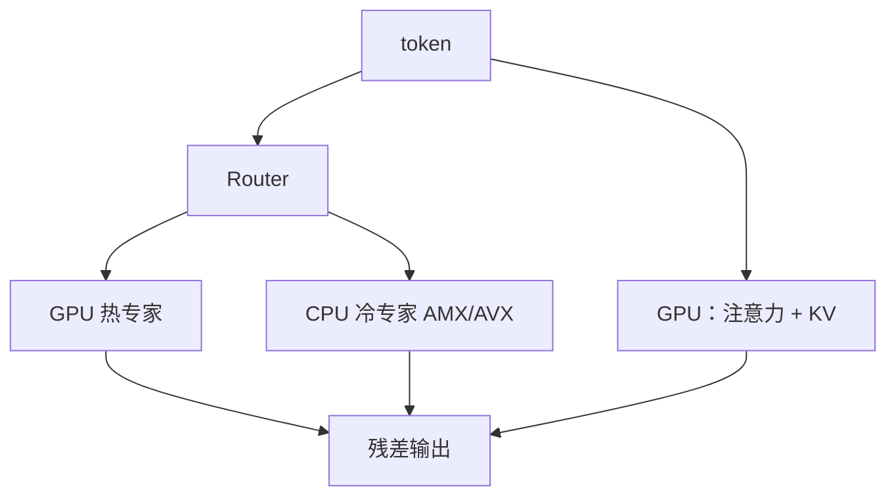

# KTransformers CPU/GPU 混合推理

    
注意力与 KV 留在 GPU，专家权重放进内存条：MoE 的稀疏性把「显存墙」拆成「哪些专家此刻真的要算」。

    <footer>—— Chen et al., KTransformers, SOSP 2025；实现于 kvcache-ai/ktransformers</footer>

Mixture-of-Experts 的参数量主要在专家里，每 token 却只激活一小撮。把整网塞进 GPU 是在为从未点亮的矩阵付 HBM 租金。KTransformers（清华 MADSys、Approaching.AI 等，Apache-2.0）把这条不对称写成系统：GPU 跑注意力（DeepSeek 上是 MLA）并持有 KV；CPU 用 AMX / AVX-512 核跑专家。SOSP 2025 论文相对既有混合方案报告 prefill 加速 4.62–19.74×、decode 1.25–4.09×。本篇写放置、核与异步调度，不把某一张 4090 上的 tokens/s 抄成所有 SKU 的 SLA。

## 问题

671B 级 MoE（DeepSeek-V3/R1）在单卡 24 GB 上「按稠密模型」不可部署，不是因为注意力算不动，而是专家权重体积。DRAM 容量按 TB 买比 HBM 便宜一个数量级，但带宽和矩阵吞吐差一截。朴素 offload 会在两处死掉：CPU 侧 GEMM 仍走通用 PyTorch / llamafile，prefill 被 CPU 钉死；CPU 与 GPU 逐步同步，CUDA graph 切不成一张，launch 与 PCIe 等待叠在 decode 上。

低并发、长提示的本地或边缘场景，GPU 算力经常闲着等 CPU 专家；高并发则相反，专家变成多 token 的小 batch，算术强度上去，AMX 才划算。同一套核不能既服务「每专家 1 个 token」又服务「每专家几十个 token」，否则 decode 会在铺满 tile 的开销里打转。

### 热路径不是专家

Decode 每步都要读当前层全部驻留 KV，带宽敏感，必须靠近 GPU。Router 选出的专家只碰该 token 的那几列权重。于是正确的切分是：**KV 与注意力在 GPU，专家在 CPU（或按热度部分回灌 GPU）**。把 KV 也卸到主机，TPOT 会变成 PCIe 故事，见 [KV 卸载](/llm/kv-offload)。

混合推理降低的是「同时在线的权重体积」，不是「模型记得的内容」。没激活的专家不在 GPU 上，不等于它们可以从检查点里删掉。量化（INT4/INT8）是另一轴，和放置正交：CPU 核吃的是量化后的布局，GPU 注意力仍按引擎的 KV 精度走。

## 方法

系统从 HuggingFace Transformers 注入替换模块：CPU 上是融合 MoE + AMX/AVX-512 GEMM；GPU 上可注入 FlashInfer 注意力，权重可选 Marlin 一类量化核。异步任务调度把动态形状的 CPU/GPU 前向收进**一张** CUDA graph，避免逐步 launch。论文里的 Expert Deferral 故意推迟一部分专家，给 CPU/GPU 重叠留窗口，CPU 利用率从常低于 75% 拉到接近 100%，额外吞吐最高约 1.45×，一组基准上平均精度下降不超过 0.5%。

kt-kernel 是可独立使用的 CPU 核库，并已接到 SGLang：`--kt-method` 选 AMXINT4 / AMXINT8 / LLAMAFILE 等，`--kt-num-gpu-experts` 控制留在 GPU 的专家数，`--kt-cpuinfer` 对齐物理核，`--kt-threadpool-count` 对齐 NUMA。放置策略包括 uniform、frequency、front-loading、random；`--kt-enable-dynamic-expert-update` 按运行期路由统计改放置。`--kt-max-deferred-experts-per-token` 打开流水。原生 FP8 / RAWINT4 还有 `--kt-gpu-prefill-token-threshold`：短于阈值走混合 prefill（不额外占一层专家显存），长于阈值走逐层 GPU prefill（更快，但要多留一层 MoE 的 VRAM）。

### AMX 核与 AVX-512 的切换

权重按 cache 层级排：专家矩阵纵向切成任务、横向切成贴 L2 的块，块内再切成 AMX tile。输入常驻 L3，权重从 DRAM 进 L2，tile 乘累加在寄存器，中间结果必要时停 L1。同专家的任务尽量同调度，减少反复打 DRAM。SOSP 文与 LMSYS 集成博文写：单路 Xeon 上 AMX 核持续吞吐最高约 **21.3 TFLOPS**，相对 oneDNN/PyTorch 基线约 3.9–4×。低算术强度（每专家 token 数 ≤4 的微基准）改走与同一布局兼容的 AVX-512，相对死用 AMX 最高约 1.20×。这是**核的测量**，不是某一颗至强的铭牌峰值。

## 机制

MoE 前向是 $y = x + \sum_i g_i(x)\, E_i(x)$，大多数 $g_i=0$。混合系统把 $E_i$ 的驻留介质变成放置表的函数。GPU 专家降低 CPU 访存与 PCIe 上激活往返；太多 GPU 专家会把本该给 KV 的 HBM 吃掉。动态更新在偏斜路由上有用，但依赖工作负载：提示长度、并发、GPU 专家数都要进实验记录，不能假设「frequency 永远优于 uniform」。

Expert Deferral 的数值代价来自改变执行顺序与可能的部分重叠，不是改公式。论文把精度下降写成平均值上限，不保证每一个下游任务。生产上应把 deferred 数当实验旋钮，过质量门再放大。NUMA：双路机器必须按节点切线程池与权重副本，否则 AMX 核再快也被跨路 QPI/UPI 拖成内存墙。

SGLang 集成把 GPU 张量并行与 CPU/GPU 混合专家并行叠在一起。多卡时「热专家」可以在 GPU 之间再切；CPU 侧仍是容量池。不要用单卡 4090 的博客数字去填 8×L20 + 双路 Xeon 的容量表——LMSYS 文里那是另一套并发与量化。

### 和 llama.cpp 卸载不是同一条产品

llama.cpp 把层或专家按内存层级换入换出，通用、门槛低，但 AMX 路径长期不是为 MoE 专家形状打磨的。KTransformers 的主张是：布局、tile、调度、CUDA graph 捕获必须为「每层一次稀疏专家」重做。代价是硬件面变窄：吃满数字需要 Sapphire Rapids 及以后的 AMX，以及足够的 DDR。没有 AMX 时 llamafile 后端仍能跑，只是 prefill 会回到 CPU 瓶颈叙事。

## 边界与工程取舍

单 GPU + 大内存适合本地 671B 级体验与低 QPS；要高并发、紧 TPOT，仍应把专家留在 GPU 或走多机 EP。延迟路径上 CPU 专家的尾延迟受频率、C 状态、内存带宽争用影响，和 GPU kernel 的可预期性不同。量化布局与 GPU 权重文件是两套路径：`--kt-weight-path` 指向转换过的 CPU 权重，和 HuggingFace 的 GPU 权重并列，漏转换就会在运行期炸。

不要把 21.3 TFLOPS 写进至强选型表当铭牌。不要把 Deferral 的 0.5% 平均掉点理解成「免费重叠」。动态专家迁移会与前缀缓存、CUDA graph 抢生命周期，开启前先固定并发与提示分布再 A/B。

内存账要分开算：CPU 侧是量化后的专家权重加 NUMA 副本；GPU 侧是注意力、KV、热专家与 CUDA graph 的固定开销。512 GB DRAM 跑 671B 级 INT4 专家常见，但不是公式——层数、专家数、是否双路复制都要按检查点实际体积量。PCIe 上往返的是激活与路由结果，不是整网权重；一旦把 KV 也走这条总线，混合方案的前提就没了。并发一高，每专家 token 变多，CPU 核从「算得动」变成「算不完」，这时应加 GPU 专家数或换成多卡 EP，而不是再买内存条。

出处：Chen 等 *KTransformers: Unleashing the Full Potential of CPU/GPU Hybrid Inference for MoE Models*, SOSP 2025；https://github.com/kvcache-ai/ktransformers 与 kt-kernel README；LMSYS *Accelerating Hybrid Inference in SGLang with KTransformers CPU Kernels*（2025-10-22）。

## 小结

- 混合推理把 KV/注意力放 GPU、把稀疏专家放 CPU，用 MoE 激活稀疏换 DRAM 容量。
- AMX 核按 cache 切块，高 ARI 走 AMX、低 ARI 走 AVX-512；论文测到单路约 21.3 TFLOPS。
- 异步调度 + CUDA graph + Expert Deferral 用来叠 CPU/GPU，而不是逐步同步。
- SGLang 用 `--kt-num-gpu-experts` 等参数管热专家与 NUMA。
- 这是低并发、大模型的容量策略，不是高 QPS 替代多卡 EP。
- 出处：SOSP 2025 论文与 kvcache-ai 仓库。
