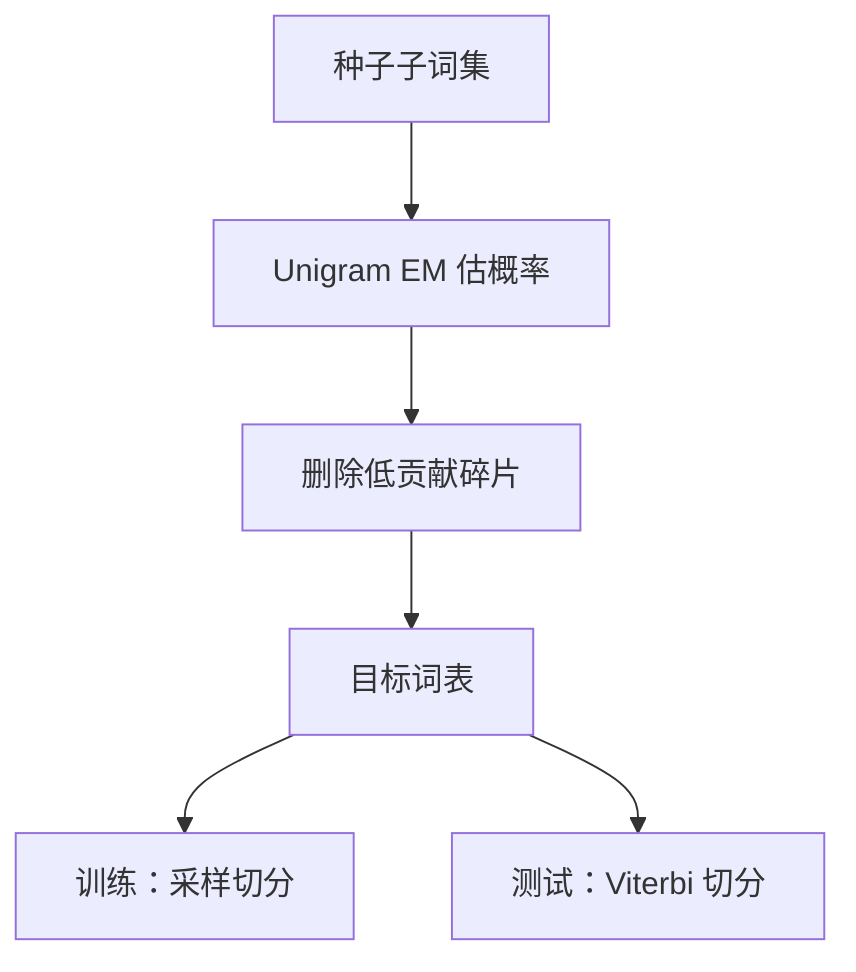

# Kudo Unigram 论文

与其死守一条贪心切分，不如用一个 unigram 语言模型给同一句多种子词切分，训练时采样，解码时取可能切分。

<footer>—— Kudo, Subword Regularization: Improving Neural Network Translation Models with Multiple Subword Candidates, ACL 2018</footer>

[Sennrich BPE](/llm/sennrich-bpe) 把切分固定成一条贪心路径。Kudo 2018 的缺口是：**这一条路径被模型当成真理，分词噪声与领域偏移都会伤**。他提出子词正则：用 unigram LM 在子词序列上定义 $p(x)$，训练时从多种切分中采样。SentencePiece 的 unigram 模式实现了这条。本篇对照论文，不把 SentencePiece 工程手册重写一遍。

## 问题

BPE 编码确定性：同一词总是同一碎片。若训练语料的空格、噪声与测试不同，碎片错位，嵌入从未对齐。字符级过稳但序列长。Kudo 要在训练引入切分的随机性，使模型对「哪一种合法切分」鲁棒，推理仍可用最可能切分或 n-best。

Unigram 假设子词独立，句子概率是碎片概率之积。词表用 EM 一类迭代从种子碎片里剪到目标大小。这与 BPE 的合并方向相反：从大候选集删除，而不是从小到大合并。

### 正则化的是输入符号，不是权重衰减

采样切分等于对输入做数据增强。论文把它写成翻译训练的一部分，BLEU 提升来自鲁棒性。它不是语言模型的 dropout 理论证明，是 NMT 实验。Unigram 词表与 BPE 词表即使 $|V|$ 相同，碎片集合也不同，不可把一篇的 BLEU 差解释成「算法永远更优」。对照必须锁语料与预处理。

## 方法

### 种子、EM、采样与 Viterbi

建一个较大的种子子词集（高频子串），用 unigram LM 的 EM 估计每个碎片概率，删掉对似然贡献小的，直到 $|V|$。编码：在格子上做 Viterbi 得最优切分，或按概率采样。训练 NMT 时对每个句采样一切分；测试用 Viterbi。

## 机制

多种切分让同一词干的不同碎片边界都见过梯度，形态变化不那么依赖「碰巧与训练合并一致」。测试若仍 Viterbi，则与训练分布有差——这是正则的典型代价，论文用实验表明净效果为正。若测试也采样，翻译解码会引入额外随机，一般不用。

相对 BPE，unigram 对罕见专名的切分更「碎」还是更「整」取决于种子与删除过程，没有单方向。工程上后来 SentencePiece 同时提供 BPE 与 unigram 后端，选择是超参。

Subword dropout（后来 BPE dropout）用另一机制打乱 BPE 切分。Kudo 原文的主路径是 unigram 采样。引用「子词正则」时要说清采样来自哪一个模型。

### 对 LLM 词表的遗产

当代大模型更多用字节级 BPE，而不是训练期切分采样。论文的遗产是：**切分是模型的一部分，可以随机化**。数据受限、形态丰富语言仍可能从正则里获益。不要用 2018 的 NMT BLEU 证明某 LLM 必须改 unigram。

## 边界与工程取舍

Unigram 独立假设很强，碎片之间的合并偏好（BPE 显式编码了历史合并）丢失。实现比 BPE 重（EM、格子）。解码器若与训练不同（另一个 SentencePiece 模型），采样分布作废。多语言大词表上 EM 贵，工业上常退回 BPE。

论文评测仍是翻译。没有报告十亿参数 LM 的 perplexity。附录对照到此为止：问题（单一切分过拟合）→ 方法（unigram + 采样）→ 当代默认并未全盘采用。

题名 *Subword Regularization: Improving Neural Network Translation Models with Multiple Subword Candidates*。作者 Taku Kudo。ACL 2018。SentencePiece 是同一作者线的工具，论文与工具不要混成一篇实验。

## 小结

- Kudo 2018 用 unigram LM 定义多种合法切分，训练采样当正则。
- 词表由 EM 删除而非 BPE 合并得到。
- 测试常用 Viterbi，与训练分布有意不一致。
- 遗产是「切分可随机化」；现代 LLM 默认仍多为 BPE。
- 出处：Kudo, ACL 2018。
