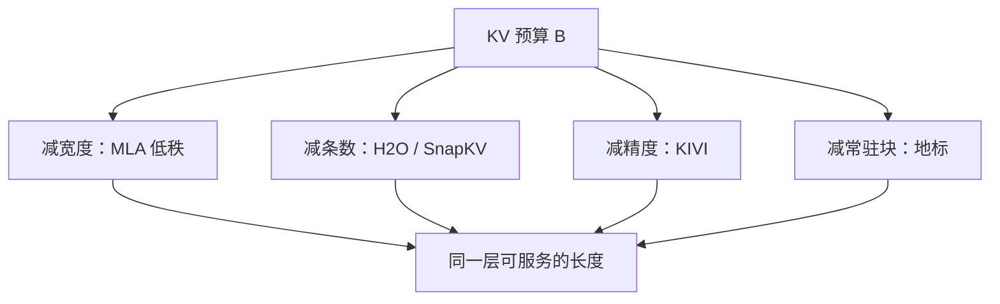

# KV 压缩作为长上下文手段

上下文能有多长，最终受制于你愿意为过去每一个标记留下多少字节的键值；把长度问题写成预算问题，压缩、淘汰与低秩才有同一把尺子。

<footer>—— 对照 DeepSeek MLA、H2O、SnapKV 与 KIVI</footer>

讨论长上下文时，人们常先谈位置外推、窗口与针测。服务端真正先撞墙的，往往是 decode 阶段按 token 追加的 KV 缓存：每层每步要读过去全部键值，体积随 $n$ 线性涨，带宽随 $n$ 线性涨，注意力分数仍是 [二次](/llm/attention-quadratic-cost)。把「能接住多长的提示和生成」改写成「这一层的 KV 预算是 $B$ 个槽或 $B$ 个字节」，稀疏、量化、低秩和地标就变成同一种资源分配，而不是互不对话的技巧清单。本篇做这张对照，不展开每一种算法的全部超参；[MLA](/llm/mla) 与 [Landmark](/llm/landmark-attention) 各有专文。

## 问题

满注意力的承诺是：位置 $t$ 仍能精确读到位置 $1$ 的键。兑现承诺的存储是每层 $O(n h_{\mathrm{kv}} d_k)$ 的缓存。GQA 只减头数，长度一到数十万仍然爆。滑窗把预算钉在窗口 $w$ 上，但窗外的键权重精确为零，长程事实只能靠隐状态残渣。产品要的往往是第三种：预算固定，内容仍尽可能可检索。

于是问题不再是「要不要长上下文」，而是预算花在哪一轴上。可以减精度（量化）、减条数（淘汰与选择）、减每条的秩（低秩潜向量）、减必须常驻的块数（地标与页式 KV）。四条轴可以组合，但不能假装它们损失相同：丢掉一条键和把这条键从 FP16 打到 2-bit，失败模式完全不同。

## 方法

### 预算写成同一条不等式

令每层可保留的 KV 字节为 $B$。满精度、满条数时 $B\propto n\cdot h_{\mathrm{kv}}\cdot d_k$。压缩无非是让右边变小而左边不变：

$$
n_{\mathrm{keep}}\cdot h_{\mathrm{kv}}\cdot d_k\cdot b_{\mathrm{bit}}\;\le\; B
$$

$n_{\mathrm{keep}}$ 是仍驻留的 token 数，$b_{\mathrm{bit}}$ 是每元素位数，秩压缩则把 $d_k$ 换成潜宽 $d_c$。长上下文方法的差别，就是上式里动哪一个因子、误差由训练补偿还是由推理硬吃。

先写 $B$，再选算法。否则会把「能跑 128K」和「针测 128K」混成一句：前者可能只是量化后塞进了显存，后者还要求 $n_{\mathrm{keep}}$ 里真有那根针。

### 四条轴上的代表方法

**低秩（训练期写入）.** DeepSeek-V2 的 MLA 把每个 token 的键值联合压进 $c^{KV}$，decode 只缓存潜向量与很小的解耦 RoPE 键。$n_{\mathrm{keep}}$ 仍等于序列长，省的是每条宽度。误差在训练里被权重补偿，不是事后 PCA。

**淘汰（推理期丢 token）.** Zhang 等人 2023 年的 H2O（Heavy-Hitter Oracle）保留两类键：累积注意力分数高的重击中 token，以及最近窗口。其余驱逐。$n_{\mathrm{keep}}$ 有上界，精度仍是满的。Li 等人 2024 年的 SnapKV 针对长提示：用提示末尾一段观察窗的注意力，找出前缀里真正被看着的位置，把前缀 KV 压成更短的集合再开始生成。H2O 更像生成过程中的在线驱逐；SnapKV 更像生成前对 prompt 做一次内容相关的压缩。

**量化（推理期减精度）.** Liu 等人的 KIVI 把 KV 打到极低比特，并且不对称：键按通道量化（通道上的异常值更显著），值按 token 量化。最近若干 token 常留更高精度，以免刚写出的局部上下文失真。$n_{\mathrm{keep}}$ 可以仍是全长，省的是 $b_{\mathrm{bit}}$。看不见的键没有被删，只是被噪声污染。

**块目录.** [Landmark Attention](/llm/landmark-attention) 让 $n_{\mathrm{keep}}$ 在细路上变成「选中块 × 块长」，粗路只扫地标。它改的是哪些条在细算集合里，而不是每条多少比特。

### 训练补偿还是推理硬吃

MLA 与 Landmark 改的是训练计算图，权重按瓶颈活。H2O、SnapKV、KIVI 默认是即插即用的推理变换，不更新模型参数。前者质量上限由瓶颈容量决定，部署要融合核；后者实现快，但误差没有被训练看见，长提示上可能突然丢掉唯一证据，或在量化噪声里分不开近邻键。对照实验必须写清：改没改权重、压的是条数还是比特、评测的是语言建模还是针测。

## 机制

注意力只对缓存里还在、且精度足够的键产生尖峰。驱逐把部分列从 softmax 分母里拿掉，质量重新归一化在幸存者上——近邻往往更赢，这是 H2O 必须同时留 recent 的原因。量化保留全部分母，但 logit 被舍入扰动，近乎打平的键可能换序。低秩把所有键写成同一窄基底的系数，表达力上限是 $d_c$，精确复制长数字会先受伤。地标把分母先变成块，再变成块内 token，漏块等价于驱逐整段。

四条轴的误差不可比，所以不能只报「压缩比」。同样压到 4×，KIVI 仍可能命中那根针，H2O 若把针驱逐了就是零。表格应分列：字节压缩比、token 保留率、针测召回。

机制上还有时间：SnapKV 在生成前看观察窗，适合「问题在提示末尾、证据在提示中间」的长文档问答；对话中途用户又追问前文未强调的细节，观察窗可能没点过那些键，压缩已经不可逆。H2O 的累积分数对早期 token 更友好，但对「只在很晚才变得重要」的键反应慢。预算算法要匹配产品里证据出现的时间。

## 边界与工程取舍

不要把 KV 压缩宣传成长上下文的充分条件。位置外推失败时，键都在缓存里也对不准；压缩只解决「塞得下、读得动」。反过来，只做 YaRN 一类插值、不碰 KV，长度一到服务显存墙，外推没有舞台。

组合时要防双重损失：先 H2O 再 KIVI，是先丢条再量化幸存者，针测风险相乘。MLA 模型上再做 SnapKV，压缩轴重叠，收益要重新量，不能把两篇论文的压缩比相加。页式注意力与操作系统式的 KV 分页是存储布局，不是算法压缩，但和「未选中块下放主机内存」是同一预算思想。

即插即用方法的静默失败是：短上下文基准几乎不动，只有超长提示的某一类针测掉零。回归集里必须有「唯一证据、且不在句末」的例子，否则会以为量化免费。

取舍顺序可以很务实：先量化（KIVI 一类）把字节打下去；仍不够再对超长 prompt 做 SnapKV；生成中缓存还涨，再考虑 H2O 或滑窗；若你能改预训练，再上 MLA 或地标，把预算写进权重。

## 小结

- 长上下文在服务端首先是 KV 预算：$n_{\mathrm{keep}}$、头数/秩、比特数三者之一必须下降。
- MLA 减宽度且训练补偿；H2O / SnapKV 减条数且推理驱逐；KIVI 减精度且尽量保留全长；地标减细算块数。
- 驱逐改变可见集，量化改变 logit 噪声，低秩改变可表示的键空间，三者失败模式不同。
- 压缩比不能单独当指标，必须搭配 token 保留率与针测召回。
- 即插即用快，但误差未被训练看见；改架构贵，但上限由瓶颈容量决定。
- 位置外推与 KV 预算是两件事，要一起做，不能互相替代。
- 出处：DeepSeek-AI, *DeepSeek-V2*（MLA）, 2024；Zhang et al., *H2O: Heavy-Hitter Oracle*, 2023；Li et al., *SnapKV*, 2024；Liu et al., *KIVI*, 2024；Mohtashami & Jaggi, *Landmark Attention*, 2023。
