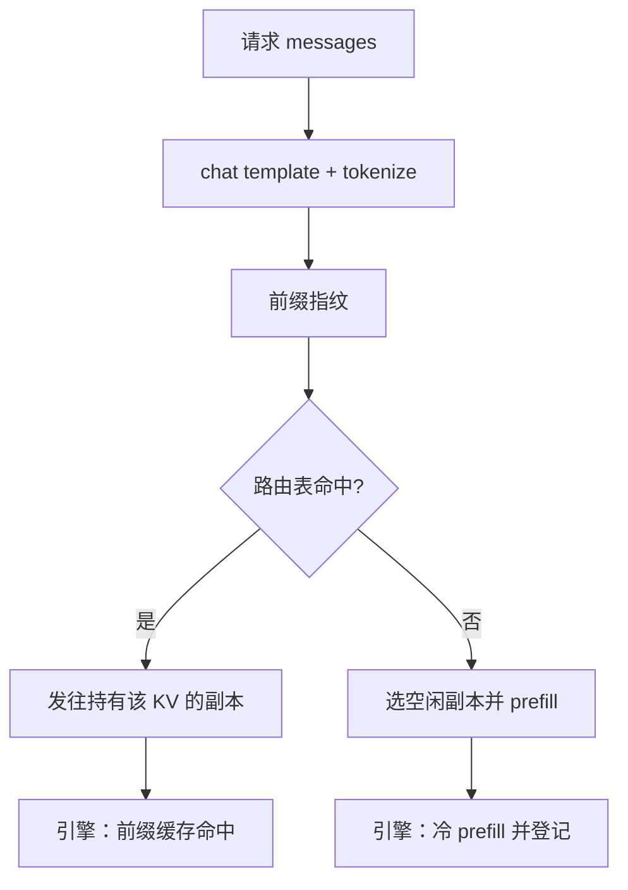

# KV 感知路由

同一前缀反复打到随机副本，等于每次都把已经付过钱的 KV 丢掉重算。路由键应是上下文，而不是轮询计数器。

<footer>—— 对照 vLLM 前缀缓存、TGI 的 cached batch，以及 World Labs 所说的 cache-aware routing 思路</footer>

连续批解决的是「一张卡上同时跑许多序列」。集群一放大，问题变成：新请求该进哪一张卡。默认的轮询、最少连接、随机，对无状态 HTTP 是对的，对自回归 LLM 是错的——因为状态就在 GPU 的 KV 里。系统提示、多轮历史、同一文档的多次提问，都是可复用前缀。路由若看不见这些前缀已经落在哪份副本上，引擎内部的分页缓存再精巧，命中率也会被跨机打成接近零。本篇写 **KV 感知路由**：用前缀（或会话）当路由键，把请求送到已持有对应 KV 的副本，并在失败时回退到冷 prefill。不编造未公开的集群带宽，也不给「KV-aware routing」伪造一篇不存在的经典 arXiv。

## 问题

一次请求的成本明显分成两截。Prefill 读完整提示，算力密集，写出长度为 $n_{\mathrm{prompt}}$ 的 KV；decode 每步读这份 KV 再追加一个 token，带宽密集。若 $n_{\mathrm{prompt}}$ 主要是系统提示加工具说明，而用户句只有几十个 token，那么「每轮换一个副本」会把几乎整段 prefill 重做一遍。副本数 $R$ 越大，随机命中同一副本的概率按 $1/R$ 降，缓存收益被水平扩展吃掉。这是扩缩容与缓存之间的结构冲突，不是某一家引擎的 bug。

PD 分离把 prefill 与 decode 拆到不同池，KV 还要在网上搬一次。搬迁体积随层数、KV 头、精度和长度线性涨。路由在这里有第二层含义：decode 副本应对同一会话保持亲和，避免每轮把同一份前缀 KV 再传一遍。World Labs 在 Atlas 说明里把 cache-aware routing 与 KV-caching、disaggregated serving 并列，当作自回归服务可迁移的思路，而不是某一云产品的开关名，见 [沿用 LLM 的 KV cache](/llm/atlas-llm-serving-tricks)。

### 会话粘滞不够用

只按 `user_id` 或 cookie 粘滞，会把同一用户的两个无关会话绑在同一副本上，造成热点；也会把共享系统提示的大量用户打散。KV 感知的键应当来自**可复用的 token 前缀**：系统提示哈希、检索文档 id、对话树的公共祖先。SGLang 一类引擎在进程内用前缀树做 radix 匹配；集群路由要做的，是把「树在哪张卡上」暴露给负载均衡，而不是在进程外再猜。

粘滞与感知的差别：粘滞是「这个人还来我这儿」；感知是「这份 KV 还在我这儿」。人可以换设备，前缀哈希不变。用用户 ID 当唯一路由键，是把产品账号模型误当成缓存模型。

## 方法

路由表维护的不是连接数，而是「前缀指纹 → 副本集合」。指纹可以是 tokenizer 之后的 token id 前缀的哈希，长度取系统提示或最近一次可缓存边界（例如上一轮完整 assistant 结束）。请求到达网关时，先算指纹，查表：命中则发往对应副本（可在多个持有者之间再按负载挑）；未命中则按容量挑选冷副本，并在 prefill 完成后把指纹登记上去。副本淘汰 KV 时必须回调网关删表项，否则会出现「路由以为热、引擎冷启动」的假命中，尾延迟比纯随机更差。

与引擎内部缓存的分工：引擎负责块分配、分页、本机 LRU（TGI 的 block allocator、LMDeploy 的 KV 槽、vLLM 的 prefix cache）；网关负责跨进程的位置。两者用同一套指纹算法，否则会出现引擎能命中、网关却把请求送到空副本。指纹必须在 [chat template](/llm/chat-template) 之后计算——模板不同，token 不同，KV 不能复用。

### 与取消、扩缩容的耦合

[流式取消](/llm/sse-cancel) 会释放 KV。若取消的是一轮中间状态，会话前缀可能仍在；若用户点「新对话」，应主动使指纹失效。扩容出的空副本不要承接热指纹，直到自己完成一次 prefill。缩容前要把该副本上的热前缀迁走或接受一次性的命中率下跌——滚动升级等于定期制造冷启动。MindIE MS 一类平台做故障重调度时，同样要让路由表与实例生命周期同事务，见 [MindIE](/llm/mindie)。

多 LoRA 时指纹还要叠适配器 id：同一提示、不同 LoRA，KV 一般不能混用，因为残差流已经走过不同的 $BA$，见 [多 LoRA 服务](/llm/multi-lora-serving)。只哈希文本、不哈希 `lora_name`，会造成静默串台。

## 机制

收益来自少做的 FLOPs。记系统提示长度为 $s$，用户增量为 $u$，通常 $s\gg u$。热路由把每轮 prefill 从 $O(s+u)$ 降到 $O(u)$（增量部分），decode 不变。副本数增加时，若路由完美，命中率由「唯一热前缀数是否装得进各卡 KV 预算」决定，而不是由 $1/R$ 决定。预算公式与端侧相同，只是 $B$ 更大，见 [KV 预算](/llm/on-device-kv) 里的字节乘积：层数 × 长度 × KV 头 × 头维 × 2 × 字节。

假命中的成本高于随机：网关多一次查表，引擎发现块不在，再走冷路径，还可能在错误副本上挤掉别人的热块。因此表项要有世代号或 checksum，与引擎的 cache generation 对齐。一致性哈希按指纹把前缀稳定映射到副本，能在网关无状态时近似感知——但副本异构（有的卡 KV 池更小）时，纯哈希会造成小卡被长上下文打满。带容量的感知路由需要心跳：各副本上报剩余 KV 页。

「cache-aware」在文献与产品里被用来指多类事情：引擎内前缀共享、网关亲和、以及 PD 分离后的 KV 传输调度。写设计文档时要写明是哪一层。Atlas 那句 can take advantage 是能力陈述，不是某开源路由器已经官方支持 Atlas。

### 负载与缓存的权衡

永远打热副本，会把爆款系统提示变成单卡热点，TTFT 的 P99 在热卡上爆炸，空卡闲着。需要第二键：在热集合里挑负载最低者，或对超热前缀做有限复制（同一指纹登记多个副本，由第一次冷 prefill 扩散）。复制提高容量，降低单卡命中深度。这与 CDN 的热点对象多副本是同一逻辑，只是对象是 KV 页而不是图片。

## 边界与工程取舍

KV 感知不是跨租户安全边界。指纹碰撞、日志里打印 token 前缀、把会话 id 当 URL，都会泄漏内容。路由表应存哈希，不存原文。合规上，会话亲和可能与「请求可被任意可用区处理」的容灾目标冲突：要明确降级策略——灾备区接受冷启动，而不是把 KV 同步当成事务存储。

不要把一致性哈希当成已经感知了 KV：它只稳定映射，不知道块是否还活着。不要在无共享的 decode 池上假设前缀还在 prefill 池里。不要为了路由发明未测量的「跨机 NVLink」。集群规模上，跨节点仍是 [Scale-Out](/llm/scale-up-vs-scale-out) 网络；感知路由减少的是重复计算，不是把以太网变成 NVLink。

可引用：TGI / LMDeploy / vLLM 的本机 KV 管理说明；DistServe 对 prefill/decode 拆分的公开论述；World Labs 对 cache-aware routing 的表述。没有一篇必须伪造编号的「KV-aware routing」奠基论文。

## 小结

- 水平扩展会把本机前缀缓存的命中率按副本数稀释，除非路由按 KV 位置寻址。
- 路由键是模板化之后的前缀指纹（可加 LoRA id），不是用户 ID。
- 表项必须与引擎淘汰、取消、缩容同生命周期，假命中比随机更差。
- 热点前缀要有限复制，避免单卡被系统提示打满。
- 感知路由省的是重复 prefill，不改变跨节点互连的物理带宽。
- 出处：开源引擎的前缀缓存文档；TGI cached batch；Atlas / DistServe 对 cache-aware 与分离式服务的公开表述。
