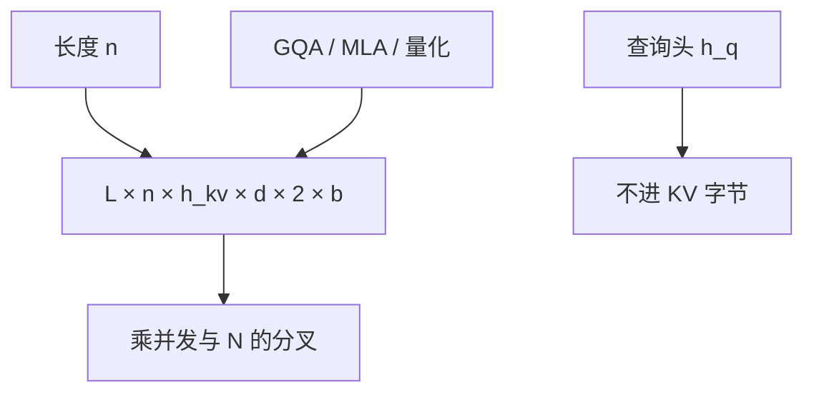

# KV cache 大小计算

解码服务里随请求胀缩的那一块内存，几乎总是键值缓存：把它写成层数、头数、长度和元素宽度的乘积，再谈并发。

<footer>—— Pope et al., Efficiently Scaling Transformer Inference, 2022；头数因子见 Ainslie et al., GQA, 2023</footer>

[上一课](/llm/multi-sample-aggregation)把多样本投票写成测试时计算：$N$ 条 decode 的 KV 近线性涨。本课打开「推理系统进阶」：先算清楚一份缓存有多大，再谈屋顶线与美元。公式在 [Decode 显存墙](/llm/decode-memory-wall) 已出现过一回，这里把它收成可代入的会计，不重推注意力。后课用算术强度解释为什么同样的字节在 decode 上是墙；本课只问「放得下多少」。布局是 [BSHD / HND](/llm/kv-layout)，不改变字节计数，只改变能不能合并加载。

## 问题

投票、长上下文、连续批，都会把「再加一条序列」说成产品决策。若不先写出字节，决策是在拍脑袋。缺口是一份 *每层、每序列* 的 KV 体积，以及它如何随 $h_{kv}$、量化、MLA 变。权重是常数，KV 是变量；服务容量墙几乎总被变量击中。

令 $L$ 为层数，$n$ 为该序列当前长度（提示+已生成），$h_{kv}$ 为 KV 头数，$d$ 为头维，$b$ 为每元素字节（FP16=2，FP8=1），键与值各一份。则

$$
\mathrm{KV}(n)=L\cdot n\cdot h_{kv}\cdot d\cdot 2\cdot b.
$$

查询头 $h_q$ 不进公式。把 MHA 的 $h_q$ 代进去，会把 70B 级 GQA 模型的缓存高估数倍，规划出来的并发是假的。

分页不改变上式的「正在使用的 token」项，只消灭预留碎片。容量规划仍用 $n$ 的分位数，而不是最大值乘槽位数再假装能跑满。

## 方法

先算单请求峰值：取 $n=n_{\mathrm{prompt}}+n_{\mathrm{gen}}$ 的 SLA 上限。再乘并发 $B$。总 KV $\approx B\cdot\mathrm{KV}(n)$，加上权重、激活碎片、CUDA 上下文。GQA 把 $h_{kv}$ 换成组数；[MLA](/llm/mla) 把 $h_{kv}\cdot d\cdot 2$ 换成潜变量宽（外加解耦 RoPE 键），不能沿用 MHA 公式。KV INT8/FP8 只改 $b$，见[量化缓存](/llm/kv-int8-fp8)。

多样本：$N$ 条共享提示页时，提示段 $\mathrm{KV}(n_{\mathrm{prompt}})$ 一份，生成段 $\approx N\cdot\mathrm{KV}(n_{\mathrm{gen}})$。规划「思考模式 $N=8$」时漏掉生成段，会在吐词中途 OOM。

## 机制

上式是容量。带宽账单是每步读 $\mathrm{KV}(n)$ 加读权重，下一课才写强度。这里只需记住：容量满了请求进不去；容量没满但每步读不完，TPOT 仍然炸。两者都随 $n$ 线性，但产品表现不同——一个是 429/OOM，一个是「还能聊但一个字 200ms」。Pope 等人把推理扩展写成阶段与并行度；会计的第一张表就是这份线性式。

[FlashAttention](/llm/flashattention) 不存 $n\times n$ 的 $A$，不改变 KV 缓存大小：缓存的是 $K,V$（或潜向量），不是注意力矩阵。混淆「FA 省显存」与「KV 变小」会把训练激活与推理缓存加错账。

## 边界与工程取舍

不要用训练时的激活检查点数字估推理 KV。不要把「最大上下文 128K」写成每条请求都按 128K 预留——那是分页要消灭的做法；但峰值并发仍要按分位数留余量。MoE 不改变注意力 KV 公式（专家在 FFN）；别把专家参数算进 KV。后课把同一份字节放进屋顶线。

出处：Pope et al., 2022；GQA：Ainslie et al., 2023；MLA：DeepSeek-V2。不发明 arXiv。

## 小结

- $\mathrm{KV}=L n h_{kv} d \cdot 2 b$；查询头不进式。
- GQA / MLA / 元素宽度改的是因子，不是「再乘一个经验系数」。
- 分页减碎片，不减正在用的 token 字节。
- 多样本：提示可共享，生成段按 $N$ 涨。
- FA 省的是 $A$，不是 KV。
- 下一课：这些字节在 decode 上的算术强度。
- 出处：Pope et al., 2022；Ainslie et al., 2023。
