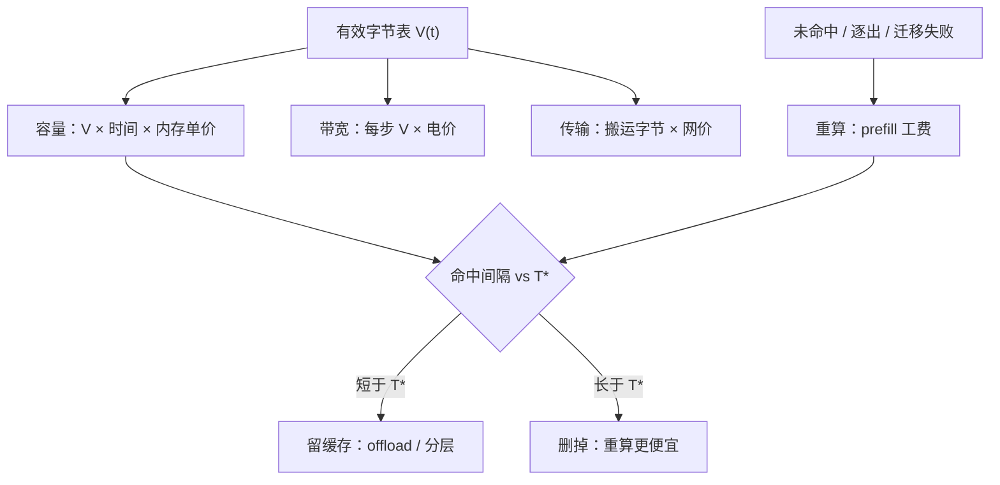
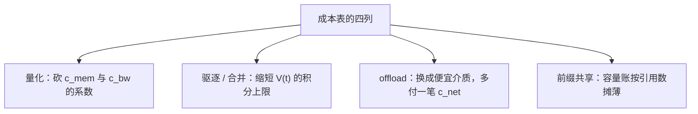

# KV 成本模型

每一份 KV 都在付四笔账：占地的租金、每步扫描的电费、搬运的网费、丢了重算的工费；成本模型就是把它们乘出来。

<footer>—— 据 Pope et al., 2022 的成本会计口径与开放 API 缓存折扣定价实践整理</footer>

[上一课](/llm/kv-measurement-pitfalls)让数字可信，本课让数字可钱。前面每一课的决策——精度、配额、驱逐、合并、offload、迁移——最终都要回答「值不值」，而值不值的分子分母就是这四笔账。字节表在[预算课](/llm/kv-longcontext-budget)已经编好，本课把字节乘上单价与时间，得到服务一份上下文的真实成本，并推出整个课程最划算的一条决策规则：存还是重算。

## 问题

KV 成本有四条腿。**容量**：HBM 是稀缺资本，一份常驻 KV 按字节 × 时间交租金，长会话把页 pin 越久账越厚。**带宽与能耗**：decode 每步扫全部可见 KV，TPOT 与能耗都近似正比于每步字节——这份账随长度线性，在 128K 处从零头变主项。**传输**：[PD 分离](/llm/pd-kv-transfer)的交接、[迁移](/llm/kv-distributed-migration)的搬移、跨域拉取，都按 GB 计网费。**重算**：缓存未命中、被逐出的历史在多轮里杀回、迁移失败兜底，都要重付一次 prefill 的算力费。四条腿的价目不同质——一个按字节·秒，一个按字节·步，一个按字节·次，一个按 token·次——混在一个「GPU 成本」里就无从优化。

## 方法

把成本写成请求生命周期的积分。单请求成本

$$
C = c_{\rm w} + \int_0^T \big( c_{\rm mem} \cdot V(t) \big)\,dt + c_{\rm bw} \sum_{s} \big( V(t_s) \big) + c_{\rm net} \cdot M + c_{\rm prefill} \cdot R,
$$

其中 $V(t)$ 是[有效字节表](/llm/kv-longcontext-budget)给出的 $t$ 时刻 KV 体积（已乘量化、驱逐、合并的折扣），$M$ 是搬运字节量，$R$ 是重算次数。前缀[共享](/llm/kv-prefix-cache)把 $V$ 的提示段按引用数摊薄。这个式子的用途不是精确到分，而是回答三个决策：这份 KV 值得留多久、哪一刀压缩最划算、迁移是否回本。

核心规则是**存与重算的盈亏平衡**。一份 KV 持有的租金随时间线性涨，重算一次的工费按次付，于是有临界时长

$$
T^{*} = \frac{c_{\rm prefill}(n)}{c_{\rm mem}\cdot V}\,,
$$

命中间隔短于 $T^*$ 的会话，缓存省钱；长于 $T^*$ 的，删掉重算更便宜。[分层存储](/llm/kv-tiered-storage)「冷到哪一层」就是这条除法的工程版：介质越慢租金越低，$T^*$ 越长。

数字实例：设一份前缀 KV 每小时的容量租金折合 0.1 元（$c_{\rm mem} V$），重算一次要 2 元（$c_{\rm prefill}$），则 $T^* = 2 / 0.1 = 20$ 小时——会话 20 小时内还会回来就值得存着，超过就删掉、下次重算更便宜。

## 机制

为什么长上下文的成本被 KV 主导：权重的账按请求秒摊是常数，KV 的账按字节×时间积分随长度与驻留时长线性涨——上下文一长，常数被积分吞掉。这也解释了[开放 API 的定价结构](/llm/prompt-cache-billing)：缓存命中的输入给出大幅折扣、另收小额存储费——供应商侧重算一份长前缀的电费比替你存着更贵，折扣就是把节省让渡给把前缀写得可缓存的调用方。压缩四刀在成本模型里各占一格：量化直接砍 $c_{\rm mem}$ 与 $c_{\rm bw}$ 的系数，驱逐与合并缩短 $V(t)$ 的积分上限，offload 把 $c_{\rm mem}$ 换成便宜的介质加一笔 $c_{\rm net}$——同一张表上的不同列，优化顺序按边际收益排。

直觉类比：四笔账像养一辆车——容量是停车费（按面积乘时长），带宽是每公里油费，传输是按次的过路费，重算是把扔掉的路书重新画一遍的人工费。只盯着油费省，停车费可能在车场里默默滚成大头。

代入量级：8B 模型一条 128K 请求的 KV 是 16 GiB（预算课口径）。同一份前缀若有 10 条请求共享，容量账除以 10，而重算账要付 10 次——共享倍数越高，「存」相对「算」的优势越大，前缀工程本质上是在买断重算。

## 边界

成本模型不优化质量：把驱逐配额压到 $T^*$ 之内的「省钱」可能换来任务掉点与返工，质量损失要折价入表才有意义。折扣定价是商业口径，与自建集群的单价不同质，跨口径比较要换算成同一单位（每百万 token 或每小时）。多租户下共享前缀的租金要按引用摊，账记在发起者头上会低估共享价值。合规域的驻留有额外成本项，模型里是一个加法项，治理上是红线。最后，$T^*$ 随硬件代际漂移：内存降价、算力涨价都会移动临界点，成本模型的参数要随报价重估。

常见误区：把「缓存命中打一折」理解成存储近乎免费。折扣价其实是供应商把「省下的重算电费」让给你——他们的前提是重算比存贵。自建集群时这笔账要自己列：内存单价、电价、命中率都是你的数，API 的折扣倍数不能照搬。

## 小结

- 四笔账不同质：容量按字节·秒、带宽按字节·步、传输按字节·次、重算按 token·次；混报就无法优化。
- 单请求成本 = 权重摊销 + 容量积分 + 带宽和 + 传输 + 重算，输入是预算课的有效字节表。
- 存与重算的临界时长 $T^* = c_{\rm prefill} / (c_{\rm mem} V)$；分层存储是它的工程版。
- 前缀共享摊薄容量账而不摊薄重算账——共享倍数放大「存」的优势。
- 成本模型必须配质量折价与代际重估，否则会优化出便宜但不可用的系统。
- 出处：Pope et al., 2022；定价结构口径据本仓库提示缓存计费课；不发明文献。
