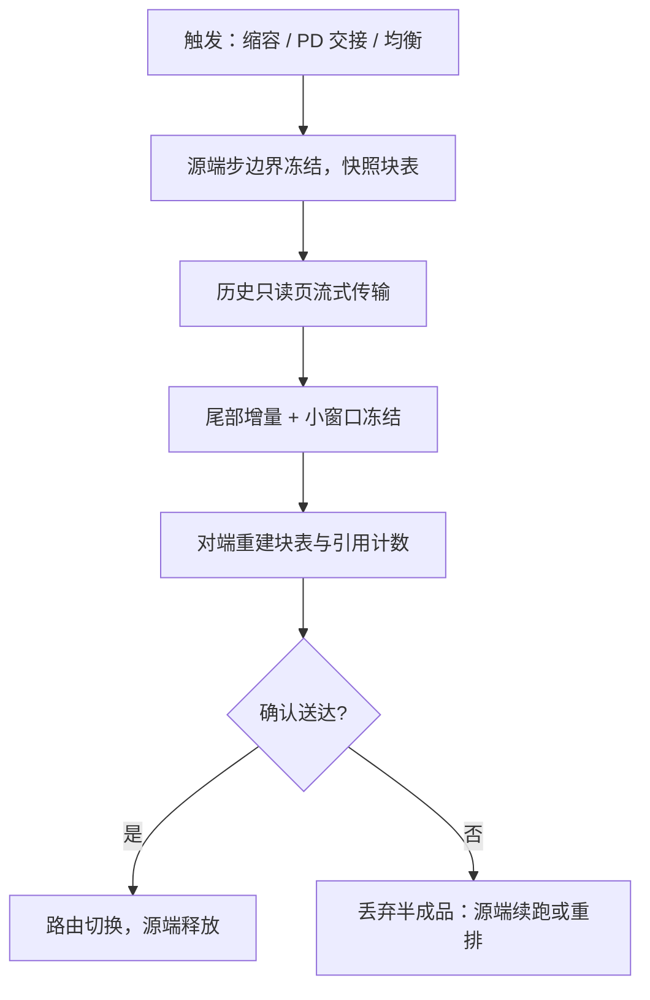

# 分布式 KV 与迁移

迁移的幸运在于 KV 只追加不改写：已写的历史天生是只读快照，要协调的只有正在生长的尾部。

<footer>—— 据 Zhong et al., DistServe, 2024 与 Patel et al., Splitwise, 2023 的分离式服务实践整理</footer>

[上一课](/llm/kv-speculative-interaction)管住了一台副本内的写入与回滚。集群把问题放大一个维度：[PD 分离](/llm/pd-disaggregation)要求预填实例把 KV 交给解码实例；[缩容](/llm/scale-down-kv)要求正在生成的请求换地方；[前缀缓存](/llm/kv-prefix-cache)想被路由送到对的副本。传输与带宽的账已各自写过，本课写迁移的一致性：迁移期间谁在写、块表怎么重定向、失败算谁的。

## 问题

迁移撕开了第一课的所有权：一页两个候选主人。三件事会出错。**双写**：源端继续 decode 追加，目标端也开始写，同一逻辑位置的键出现两个版本。**丢失**：源端在确认送达前释放了页，传输失败后这条请求既不能续算也无处重算。**分裂**：引用计数两半——前缀页在源端被别的请求共享着，迁移请求的那份引用挂到对端后，谁负责这页的生死？叠加的约束是时间：迁移期间请求的 decode 要不要停？停，是用户可见的停顿；不停，就要回答双写。

## 方法

**冻结–拷贝–切换**。最简单的正确协议：源端在步边界冻结该请求（停止追加），快照块表，传页，对端按清单重建块表与引用计数，路由切走，源端释放。正确性来自「写权移交是原子的」：任何时刻最多一个写者，世代号（块表版本）保证旧路由的迟到更新被拒。代价是停顿等于传输时间。

**增量迁移**。利用 KV 的追加-only 性质砍停顿：历史页只读，可以先流式传；源端继续 decode，只把新追加的尾部增量传过去，最后在尾部做一次小窗口冻结切换。[PD 分离](/llm/pd-kv-transfer)是它的极限情形：预填结束时 KV 定型，源端再无追加，一次传完即切换。增量窗口越小，最后的切换停顿越接近毫秒级。

**失败语义**。切换确认前，源端仍是负责人；超时未确认，就丢弃对端半成品、源端续跑或整体重排（丢 KV 重 prefill）。这条兜底要提前定价：重算成本 = 该请求的 prefill 报价，传输失败的期望损失 = 传输失败率 × 重算成本——值不值得迁移，先过这道算术。路由侧从源头减少迁移：[缓存感知路由](/llm/kv-aware-routing)把请求送到已有前缀的副本，[RDMA 拉取](/llm/kv-rdma-fetch)把跨机读取做成对端主动取，而不是源端推。

## 机制

一致性归根到底还是所有权：迁移协议本质上是把「写权 + 引用」这对状态从源端原子搬到对端，块表世代号是搬运的载体。KV 的追加-only 是这份工作比一般有状态服务友好的根源——历史不可变，传输天然是流式的，需要协商的只有尾部一小段。这也解释了为什么[分层存储](/llm/kv-tiered-storage)与迁移能共用一套块接口：换介质、换副本、换机，动的都是「页的住所与主人」，不是页的内容。

量级感受：8B 模型 FP16 的 KV 是 128 KiB/token，1K token 历史约 128 MiB，100 Gbps 网线约 10 ms；一条 32K 请求全量约 4 GiB，约三分之一秒。增量迁移把切换停顿压到尾部那一小段——全量传输的账只付给带宽，不付给停顿。

## 边界

同构假设很脆：两端 TP 度、精度、块大小不同，就要重切片与重量化，成本从「拷贝」涨成「重算一级」，多数工程选择不迁、改用重排。[引用计数](/llm/kv-lifecycle-ownership)跨引擎不可移植，清单在对端重建时要连带前缀共享的间接引用，漏一条就是提前释放。缩容一次性触发大量迁移会形成迁移风暴，挤占与正常 decode 同一张网；分级排水比一步到位稳。最后，KV 是用户数据：跨信任域传输与驻留要走与提示正文同级的隔离与合规，别因为是缓存就绕过。

## 小结

- 迁移协调的是「写权 + 引用」的原子移交；追加-only 让历史传输天然流式。
- 冻结–拷贝–切换最简单正确；增量迁移把停顿压到尾部小窗口。
- 失败兜底定价：重算成本 × 失败率是迁移可行性的第一道算术。
- 路由与拉取从源头减少迁移；同构（TP/精度/块大小）是便宜迁移的前提。
- KV 是用户数据，跨域驻留按提示正文的合规级别处理。
- 出处：Zhong et al., DistServe, 2024；Patel et al., Splitwise, 2023；存储层次据本仓库分层 KV、PD 传输课。
