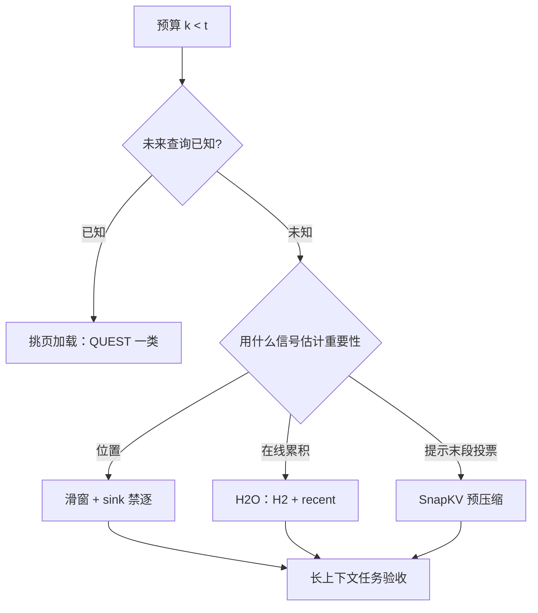

# 驱逐策略与启发式

每条驱逐启发式都是同一个三段式：给历史打重要性分，给新来者留保护期，然后把分数最低者不可逆地扔掉。

<footer>—— 据 Zhang et al., H2O, NeurIPS 2023；Xiao et al., StreamingLLM, ICLR 2024 的策略结构整理</footer>

[上一课](/llm/kv-layerwise-sensitivity)把预算按层按头重排，隐含的前提是预算必须先存在：长度受控、每 token 字节受控之后还不够，就要丢历史。本课写丢的规则。各配方的机制已分别写过——[窗口与 sink](/llm/kv-eviction)、[H2O](/llm/h2o-kv)、[SnapKV](/llm/snapkv)、[QUEST](/llm/quest-kv)——本课收拢成一张谱系表：启发式之间怎么比、按什么选、错在哪。

## 问题

预算 $k$ 小于当前长度 $t$ 时，必须选一个可见子集 $S_t$，此后 softmax 只在 $S_t$ 上归一化。选错的代价不可逆：被丢的键不再参与任何点积，将来即使变成关键也找不回来。所有启发式因此都在回答同一道题——**用现在的信息估计「未来的注意力会打给谁」**。估计是免不了的：未来查询还没出现。差别只在估计器用什么信号、给谁上保险。

还有一套容易混淆的「驱逐」：页池压力下逐出无引用的[前缀缓存](/llm/kv-prefix-cache)页，按 LRU 走。那改变的是「哪些字节住在 HBM」，不改任何请求的可见集，与本课的可见集驱逐分属两本账，混写会让「命中率」与「任务质量」互相背锅。

## 方法

按估计信号排成谱系。

- **位置即分数**：滑动窗口加 sink 禁逐。零统计成本、最稳，代价是中间历史整段丢失。适合「只要当前句稳定、缓存常数」的流式场景（配方见 [StreamingLLM 策略](/llm/streaming-kv)）。
- **累积注意力当分数**：[H2O](/llm/h2o-kv) 在线累积每个位置的注意力质量，驱逐非窗口内分数最低者。能保住中部的实体锚点，但分数偏向活得久的位置，新出现的专名要靠 recent 保护期救。
- **提前投票**：[SnapKV](/llm/snapkv) 用提示末段的观察窗预选前缀簇，在生成开始前完成压缩。适合「提示长、生成短」的问答负载；代价是选完即锁，长生成中途需要的新证据进不来。
- **不删，挑着读**：[QUEST](/llm/quest-kv) 保留全部 KV，按当前查询挑页加载。没有失忆，失败模式是召回不足；前提是查询在 decode 前已知。

选型判据三条：未来查询是否已知（已知走 query-aware，未知只能预测性驱逐）；提示与生成的长度比（长提示短生成偏好 SnapKV，长生成偏好 H2O 式在线）；允许多大的任务质量损失。

## 机制

三段式结构的每一环都有独立的失败模式。**分数**是对未来注意力的预测：累积分数偏向早期位置，投票偏向提示末段的局部模式，分布漂移时估计误差直接兑现成误杀。**保护期**是对估计置信度的承认：recent 窗保住「还没来得及积累分数」的位置，sink 禁逐保住配分函数。**不可逆**是与挑页方法的本质分界：删改的是模型看见的集合，挑改的只是 IO——前者是近似生成，后者是近似访存，两者不该用同一个「压缩率」评价。

驱逐还改变缓存的账本形状：被压缩后的页不再随 $t$ 线性增长，容量与带宽的预算（后课）要按压缩后的长度重算；同时压缩页与全量页[指纹不同](/llm/kv-prefix-cache)，不能进同一条前缀共享链。

同一预算下启发式之间的差距不是几个点：H2O 论文的消融里，只留最近窗口的版本在多种任务上明显掉队，而「H2 + recent」接近全缓存。选型必须在真实长生成上跑，短补全的困惑度会把滑窗排到第一。

## 边界

时间错位的负载对预测性驱逐最危险：「先闲聊、最后才问文档第 3 节」的查询，重要性在对话开始时不可见。多轮对话是被驱逐历史最常杀回马枪的地方——被删的键在下一轮又被引用，兜底路径是对丢失段重算 prefill，这笔账要提前算进成本。与量化叠加时误差同向累积：4-bit 噪声稀释针的 logit 优势，驱逐又可能把针直接删掉，两刀要联评。最后，评测只看任务质量与驱逐后的长度分布，吞吐提升不构成采用理由。

## 小结

- 可见集驱逐与页池逐出是两本账：前者改模型看见什么，后者只改字节住哪。
- 谱系按信号分：位置（窗口+sink）、在线累积（H2O）、提前投票（SnapKV）、查询感知挑页（QUEST）。
- 三段式：分数 + 保护期 + 不可逆；每环有独立失败模式。
- 选型判据：查询是否已知、提示与生成长度比、可接受的质量损失。
- 压缩后的页进不了全量前缀链；与量化联评，验收只看长上下文任务。
- 出处：Zhang et al., H2O, NeurIPS 2023；Xiao et al., StreamingLLM, ICLR 2024；Li et al., SnapKV, NeurIPS 2024；Tang et al., QUEST, ICML 2024。
