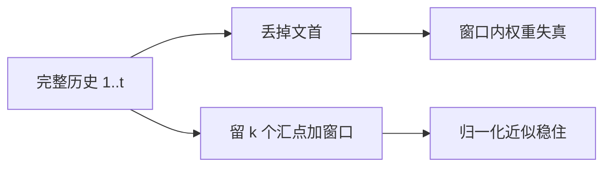

# 窗口淘汰与 sink

    
滚动窗口若把最初几个键一起丢掉，softmax 的分母会塌；把汇点留在缓存里，再只保留最近一段，流式生成才能在常数槽位上稳住。

    <footer>—— Xiao 等，StreamingLLM，2023</footer>

KV 预算不够时，要么压缩每条键，要么少留几条。少留的最简单办法是滑动窗口：只保留最近 $w$ 个 token 的 KV，更早的直接删。对从全注意力训出来的模型，这样删会在某个时刻突然胡言——不是因为当前句子已经滑出窗口，而是文首那些被 softmax 当成「汇点」的位置被覆盖了。Xiao、Tian、Chen、Han、Lewis 的 StreamingLLM 把汇点留住，再拼上最近窗口。本篇把「淘汰」写成可见集策略，并和分页 LRU、卸载区分开。现象细节见 [Attention Sink](/llm/attention-sink)，配方见 [StreamingLLM](/llm/streaming-llm)。

## 问题

解码每步的注意力在因果掩码下看见 $1,\ldots,t$。缓存按 $t$ 线性涨。滑动窗口把可见集改成 $\{t-w+1,\ldots,t\}$，空间 $O(w)$。这在训练即滑窗、且窗口总含起始标记的模型上大致成立。对 Llama 一类全注意力预训练、推理才改窗的模型，Xiao 等人观察到：一旦 $t>w$ 把开头几个位置挤掉，困惑度陡升。可视化显示许多层把大量质量分给最初几个 token，即使它们语义空洞。这些位置像水槽，接着归一化所需的质量；切掉之后，窗口内权重被放大，分布离开训练流形。

淘汰还有别的规则：按累积注意力分数丢「不重要」的中间 token（H2O 一类重击中）、按提示末观察窗压缩前缀。它们改的也是可见集，失败模式却不同。窗口淘汰是时间上的硬切；汇点是对这种硬切的最小补丁。本篇聚焦窗口加汇点，不把所有驱逐算法摊开。

淘汰与卸载不同。淘汰之后注意力不再读这些键，模型等于失忆。卸载之后若仍在可见集里，只是读得更慢。分页 LRU 丢掉的是物理页，若块表还指向它们，必须重算或换入；若连逻辑槽都删了，才是淘汰。

## 方法

### 可见集写成 sink ∪ window

令汇点长度 $k$（论文常用 $4$ 量级），窗口 $w$。时刻 $t$ 的缓存为

$$
\mathcal{C}_t=\{1,\ldots,k\}\cup\{t-w+1,\ldots,t\}
$$

（$t\le k+w$ 时退化为全前缀。）softmax 只在 $\mathcal{C}_t$ 上归一化。空间与逐步注意力都是 $O(k+w)$，与 $t$ 无关。$k$ 的职责是锚定配分函数，不是存章节开头的事实，因此不必加到几百。窗口承担局部句法与最近实体。中间历史主动放弃。

### 位置跟逻辑下标，不跟槽位

每个留下的 KV 带着它被写入时的逻辑位置 $p$。RoPE 用 $p$，不用环形缓冲里的物理下标。汇点永远是 $p=0,1,\ldots,k-1$，窗口是最近 $w$ 个真实 $p$。滚动时覆盖最老的窗口槽，不动汇点。若把缓存重排成 $0,\ldots,k+w-1$ 再旋转，相位全错，等于在切汇点之外又做了一次分布偏移。

### 和分页 LRU 同时存在时

服务引擎的块 LRU 不知道哪些槽是汇点。内存压力下它可能先回收「最久未用」的文首块——而文首块恰恰是所有后续步都还要读的汇点，只是没有「最近写入」。必须把前 $k$ 个逻辑位置标成不可驱逐，或单独钉在一块 pinned 区。前缀缓存的系统提示往往与汇点重叠：钉系统提示可以顺便保住汇点，但系统提示很长时，只钉前 $k$ 个 token 就够稳态，其余仍按前缀共享策略管理。

## 机制

设训练时汇点质量为 $p_{\mathrm{sink}}$。丢掉之后，窗口内权重近似乘 $1/(1-p_{\mathrm{sink}})$。$p_{\mathrm{sink}}$ 到 $0.3$–$0.5$ 时放大很猛，各头还不一致。留下汇点，等于让分母里继续有一项稳定的大贡献，窗口内相对比值更接近训练时。Xiao 等人据此在不微调的前提下，让 Llama-2、MPT、Falcon、Pythia 等在滑动窗口语言建模上把长度推到数百万 token 量级仍保持平坦的困惑度；相对「滑窗不够就重算更长上下文」的基线，流式场景最高约 $22.2$ 倍加速。平坦的是局部语言建模，不是对窗口外事实的检索。

$k$ 很小就够，是因为要的是锚而不是记忆。把 $k$ 加大去「多记一点开头」，既挤占窗口槽，又读不完整段系统提示——长提示应走前缀缓存或检索，不应冒充汇点预算。

随机、无语义的占位 token 也能当汇点，说明它更像基准电位。预训练时专门加一个占位汇点，是 Xiao 等人指出的进一步改进，不是推理配方的必要条件。

## 边界与工程取舍

窗口淘汰解决的是常数 KV 上的稳定生成，不是 128K 针测。用户问三小时前的数字，窗口里没有，汇点里也没有。产品应暴露窗口长度，或在窗外接检索。与 [前缀缓存](/llm/prefix-caching) 组合时：系统提示若希望被精确读到，它必须整个落在可见集里，而不能只靠 $k=4$ 的汇点。常见拆法是「系统提示常驻（前缀缓存）+ 对话历史滑窗 + 文首汇点」，三笔预算分开写。

已用滑窗训练且掩码总含 BOS 的模型，再叠一套 StreamingLLM 可能重复。应先画注意力图。H2O 一类按分数驱逐会动中间 token，可能误删当前句里暂时分数不高、稍后需要的实体；它与汇点可以叠加（先保证文首，再在窗口内做重击中），但超参变多，失败更难归因。位置外推是另一件事：单次提示本身超过训练长度时，汇点救不了相位出界。

调试对照应当干净：同样 $w$，一组丢文首，一组强制留前 $k$ 个。第二组立刻恢复，就是汇点问题，加长 $w$ 是错药。若两组一样坏，才是窗口真的太短，看不见当前任务需要的局部上下文。

调度日志里的「evict」要标明驱逐的是物理页还是逻辑可见性。两种 evict 混用同一个词，事故会以偶发胡言出现，且与负载相关，极难复现。

## 小结

- 窗口淘汰把 KV 钉在最近 $w$ 个；对全注意力预训练模型，必须额外保留 $k$ 个文首汇点，否则 softmax 失真。
- 位置用逻辑下标；汇点不可被分页 LRU 当冷页回收。
- 稳定来自配分函数被锚住，不提供窗口外记忆。
- $k$ 取很小即可；长系统提示用前缀缓存，不要用汇点预算去存。
- 与卸载、块 LRU、分数驱逐是不同轴，日志与配置应分开。
- 不微调即可接入；训练即滑窗的模型可能不需要再叠一套。
- 出处：Xiao 等，*Efficient Streaming Language Models with Attention Sinks*，2023（后为 ICLR 2024）。现象专文见 Attention Sink，完整流式配方见 StreamingLLM。
