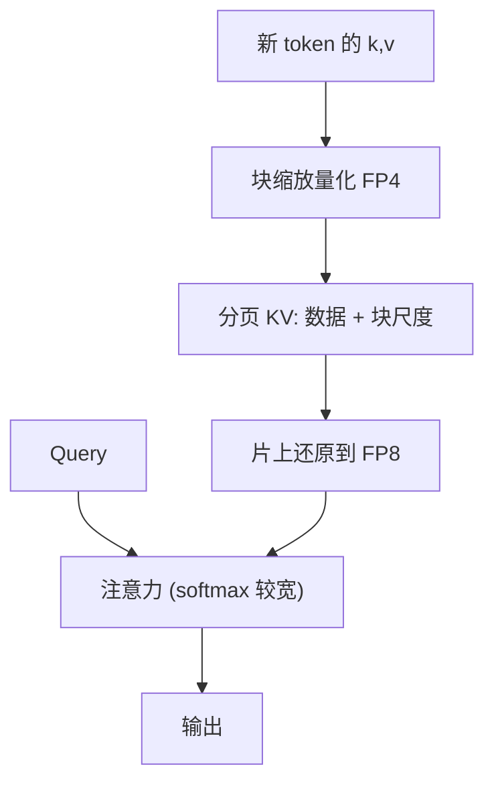

# KV FP4 量化

    
缓存从 FP8 再砍一半，换来的是更长的上下文或更大的 batch；误差沿解码步累积，所以 4-bit KV 必须带块尺度，并且核要在片上还原，而不是在 HBM 里解回 FP16。

    <footer>—— NVIDIA TensorRT-LLM / Model Optimizer 的 NVFP4 KV；对照 KVQuant、KIVI 对亚 4-bit 轴的分析</footer>

KV 体积随序列长度线性涨，decode 每步还要再扫一遍，见 [Decode 的显存墙](/llm/decode-memory-wall)。把缓存从 16-bit 打到 [INT8 / FP8](/llm/kv-int8-fp8) 已能接近翻倍预算；再往 4-bit，同样预算下长度或并发再近一倍，但键的通道异常值会立刻绑死尺度。算法侧，Hooper 等人的 KVQuant（约 3-bit）与 Liu 等人的 [KIVI](/llm/kivi)（2-bit 非对称）证明：轴要比比特数先选对。硬件侧，Blackwell 把 NVFP4 做成带块缩放的原生 4-bit 浮点，TensorRT-LLM 提供 NVFP4 KV cache，NVIDIA 技术博客写相对 FP8 缓存约减半占用、精度损失可控制在约 1% 量级（其评测设定下）。本篇写 **FP4 KV 这条生产路径**，以及它和 INT4/INT2 研究核的差别。不要把权重 NVFP4 与 KV NVFP4 当成同一个开关。

## 问题

注意力公式不变，变的是 $K,V$ 在 HBM 里的编码。8-bit 时逐 token 或逐块尺度常常够用，因为格子还宽。4-bit 元素（E2M1 一类）正规值大约到 $\pm 6$，没有块尺度就会退化成「一层一个 amax」的灾难。键沿通道有稳定的大幅度维（与激活异常值文献同构），值更像按 token 变化的混合系数——KIVI 在 2-bit 上把这件事写成不对称量化：键逐通道，值逐 token。FP4 生产栈若忽略轴，只把 dtype 改成 `fp4`，会在长上下文检索、多轮指令上先坏，困惑度还可能「看起来还行」。

第二条约束是核。若写入时压到 4-bit、注意力前在全局内存解回 FP16，显存占用下降，**带宽几乎不降**，decode 加速为零。真正吃到 4-bit 红利，需要量化感知的注意力：至少在 SRAM 里反量化，或走硬件的 FP4→FP8 数据通路。NVIDIA 博客明确：NVFP4 KV 在注意力与 context 矩阵乘之前解到 FP8，而不是解到 FP16 再走老核。

### NVFP4 KV 与 MXFP4 KV

NVFP4：公开说明常见 16 元素一块、块尺度 FP8（E4M3），另可有张量级尺度；与 OCP MXFP4（32 元素、E8M0）不同，见 [MXFP4 微缩放](/llm/mxfp4-microscale)。TensorRT-LLM 量化表把 NVFP4 KV 标在 Blackwell（sm100/103）上，Hopper 行是 FP8 KV 而非 NVFP4 KV。当前文档还写：启用 NVFP4 KV 时权重/激活量化需走 FP8（`--quant fp8 --kv_cache_quant nvfp4`），不能默认假设 W4A4 与 KV4 任意组合。MXFP4 KV 若出现在引擎里，是另一条块大小与尺度格式；NVIDIA 研究侧有「NVFP4 KV 相对 MXFP4 KV 约 5%」一类对比，绑定其评测，不作定律。

TRT-LLM 允许对未在检查点里打开 FP8 KV 的模型手动开 FP8 缓存；NVFP4 KV 则要求 Model Optimizer 离线量化。两种「打开」的校准深度不同。把一份只量化了权重的 FP8 检查点当成已经校准过 KV4，会在长序列上静默掉点。

## 方法

生产路径（NVIDIA）：用 TensorRT Model Optimizer 的 `quantize` API，配置在 FP8 权重/激活之上再开 NVFP4 KV；也可把权重也打成 NVFP4 以吃 4-bit MMA，那是另一配方。推理时新 token 的 $k,v$ 量化写入分页缓存，页内布局需让数据与尺度在最后一维连续（vLLM 侧实验布局有 `[k_data, k_scale, v_data, v_scale]` 一类）。注意力核读入块，按块尺度还原到 FP8，再与 $q$ 做点积；softmax 仍应在较高精度。QAT 与 PTQ 共用同一套配置入口，QAT 把量化噪声编进训练，长上下文更稳，成本高。

研究路径：KVQuant 用逐通道键、RoPE 前量化键、非均匀码本、逐向量稠密+稀疏分离异常值，在 3-bit 上对 LLaMA 族 WikiText 困惑度劣化 $\lt 0.1$，并讨论百万到千万 token 级上下文的显存可行性。KIVI 用免调 2-bit 非对称轴加短全精度残差窗口，换峰值显存与吞吐。它们的码是整数格子，没有 Blackwell 的 FP4 数据通路，反量化在软件。FP4 KV 买的是**与权重/激活相同的块浮点硬件**；KIVI 买的是更极端的容量。

### 误差沿解码累积

权重 PTQ 的误差每层一次；KV 的误差每个生成步都进入后续注意力。长上下文里，早期 token 的量化噪声会被后面所有 query 反复读到。这就是为何 4-bit KV 比 4-bit 权重更需要块尺度与轴对齐，也是为何只看短上下文 PPL 会低估伤害。检索、针测试、多轮改写比 WikiText 更敏感。NVIDIA 博客把收益写在长上下文与大 batch、以及多 agent / MoE 部署上：KV 不再占满 HBM 时，才能把专家并行与并发叠上去。

## 机制

块尺度让局部动态范围分开：异常通道所在的 16 元块用更大的 FP8 尺度，邻近正常块保留更细网格。相对逐 token INT4，浮点元素自带指数，块内再跨 binade 也不必立刻饱和。相对 MXFP4 的 E8M0，NVFP4 的 E4M3 块尺度有尾数，增益更平滑，这是厂商主张更细块（16 vs 32）之外的另一处差别。

若核在 HBM 侧反量化，4-bit 只是压缩存储，decode 仍按 FP16/FP8 带宽付费。Blackwell 的卖点是 FP4→FP8 在寄存器/Tensor Core 路径上，加载字节按 4-bit 计。软件 INT4 KV 没有这条通路，加速来自减少的加载再加 CUDA 反量化开销，净收益随核质量变。

GQA / MQA 已经从「头数」上减 KV；FP4 是在剩余的字节上再砍。两者相乘。MLA 一类把 KV 压进低秩潜空间，是第三轴。规划显存时不要把三轴的乘数连乘后当成一定能实现——每轴都有精度地板。

## 边界与工程取舍

### 精度轴、硬件轴、引擎版本要分开验收

Hopper / Ada 上的生产 KV 低精度主流仍是 FP8；不要在 H100 上开 NVFP4 KV 期待第五代 MMA。vLLM 的 NVFP4 缓存路径曾按注意力后端分阶段接入（reshape_and_cache 与 FlashInfer 核不同步），版本矩阵要实测。TRT-LLM 的支持矩阵随模型而变，BERT 与 Decoder 不是同一列。

不要用 KIVI 的 2-bit 数字去广告 NVFP4 KV「已经 2-bit」。也不要把 KVQuant 的 10M 上下文可行性写成某云厂商 SLA——那是 A100-80GB 上的算法外推。权重 4-bit 与 KV 4-bit 同时开时，两套尺度、两套核，排障要分开看 PPL 与带宽计数。

何时开 FP4 KV：Blackwell、长上下文或大并发、已有 FP8 基线、愿意跑 ModelOpt 校准或 QAT。何时停在 FP8 KV：Hopper、短上下文、质量敏感的针测试未过。何时上 KIVI/KVQuant：显存比硬件格式更紧，且能接受定制注意力核。

出处：NVIDIA Developer Blog, *Optimizing Inference for Long Context and Large Batch Sizes with NVFP4 KV Cache*；TensorRT-LLM Quantization 文档（FP8 KV、NVFP4 KV、支持矩阵）；Hooper et al., KVQuant, arXiv:2401.18079；Liu et al., KIVI, ICML 2024, arXiv:2402.02750。格式对照 OCP MX 与 NVIDIA NVFP4 材料。

## 小结

- FP4 KV 把缓存再相对 FP8 减半，但必须块缩放，且反量化要在片上/硬件通路完成才有带宽意义。
- 生产主路径目前是 Blackwell 上的 NVFP4 KV，常与 FP8 权重/激活搭配；与 MXFP4 块参数不同。
- 键的通道异常值使轴比比特更先决；KIVI/KVQuant 是更低比特的算法参照，不是同一 dtype。
- 误差沿解码累积，短 PPL 不能代替长上下文与检索评测。
- Hopper 默认停在 FP8 KV；不要混用权重量化开关与 KV 量化开关。
- 出处：NVIDIA TRT-LLM / ModelOpt 文档与 NVFP4 KV 博客；KVQuant 与 KIVI 论文。
