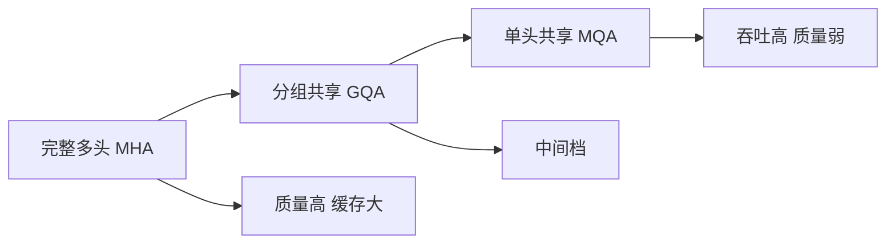

# KV 头数、质量与吞吐的权衡

解码时真正卡住的往往不是算力，而是反复读写那份随序列变长的键值缓存；少写几个头，吞吐就会明显松绑。

<footer>—— Noam Shazeer, Fast Transformer Decoding, 2019</footer>

自回归解码的每一步都要带着历史键值一起读。头数一旦与查询头对齐成完整多头，缓存体积就按头数线性膨胀，带宽先于 FLOPs 成为上限。Shazeer 在 2019 年把键值压到单头，Ainslie 等人 2023 年的 GQA 再把档位拉开，DeepSeek-V2 的 MLA 则换成潜向量压缩。本篇不展开投影公式，只沿「KV 头数」这一根轴，把质量、显存与吞吐放在同一张权衡图上；实现细节分别见相邻叶子 [MQA](/llm/mqa)、[GQA](/llm/gqa)、[MLA](/llm/mla)，训练侧的梯度耦合见 [共享 KV 下的训练稳定性](/llm/shared-kv-training)。

## 问题

解码阶段，注意力的矩阵乘看起来像计算，实际是一次带宽极高的查表。对长度 $n$、层数 $L$、KV 头数 $h_{\mathrm{kv}}$、头维 $d_h$ 的缓存，体积近似

$$
\mathrm{KV} \approx 2\, L\, h_{\mathrm{kv}}\, d_h\, n \cdot b
$$

其中 $b$ 是每个元素的字节数。查询头数 $h_q$ 只出现在当步的 $Q$ 投影里，不进入缓存；真正随 $n$ 涨的是 $K$ 和 $V$。Decode 几乎总是显存带宽墙：每生成一个 token，都要把截至当前的 KV 全部扫一遍。头数减半，扫过的字节就减半，算术强度上升，吞吐往往跟着上来。完整多头令 $h_{\mathrm{kv}}=h_q$，质量最好，缓存也最肥。服务场景里批次一大、上下文一长，这份额外的头就会把卡填满，被迫降并发。

质量一侧的故事对称。每个 KV 头提供一套独立的键值子空间，查询头可以在不同子空间里对齐不同模式。把头并到一起，等于强迫许多查询共享同一套键值，表达能力下降。经验上这不是断崖：GQA 表明，从完整多头降到每组若干共享头，下游往往只掉一点点；再降到单头 MQA，掉点才变得肉眼可见。权衡因此是连续的，不是「要么全要、要么全不要」。

## 方法

### 头数如何进入 KV 体积

把查询头按组划分，每组共用一套 $K,V$，就得到头数轴上的三档。MHA 是 $h_{\mathrm{kv}}=h_q$；MQA 是 $h_{\mathrm{kv}}=1$；GQA 取中间整数 $h_{\mathrm{kv}}=h_q/g$。缓存公式只认 $h_{\mathrm{kv}}$，所以从 32 头降到 8 头，KV 体积直接变成四分之一，与 $h_q$ 是否仍为 32 无关。推理内核仍按查询头并行算 softmax，只是若干查询读同一块 $K,V$。

MLA 不在这根轴上滑动。它把键值打进低秩潜向量，推理时把投影吸收进 $W_{KV}$，缓存的是压缩后的 $c_{KV}$，不是「更少的头」。头数权衡回答的是「同样的头维，留几套独立 KV」；潜向量回答的是「一套 KV 要不要先降维」。两件事可以叠加，但比较时必须分开，否则会把 MLA 的缓存收益误记成「头更少」。

### 质量曲线不是线性的

Ainslie 等人把 T5 一类编码器–解码器从多头检查点升训到 GQA，观察到一个重复出现的形状：从 $h_{\mathrm{kv}}=h_q$ 降到 $8$ 附近，翻译与问答的损失很平；再往 $4$、$2$、$1$ 走，曲线才变陡。直觉是：查询头已经很多，键值子空间有冗余；先并掉冗余的头，信息损失小于并掉最后几套真正不同的键值。Llama 2 把 32 个查询头配 8 个 KV 头，等于每 4 个查询共享一套键值，成为后来开源稠密模型的默认档。

这条曲线依赖任务。复制、检索、精确指代更吃独立键值；语言建模的平均交叉熵往往更宽容。评测若只看困惑度，会低估「头太少」在长上下文针测上的伤害。吞吐一侧同样非线性：当 KV 已小到不再是带宽瓶颈，再减头只能省一点显存，延迟几乎不动，质量却继续掉。最优档因此是「刚好让 decode 仍卡在算力或调度、而不是卡在扫 KV」的那一格，而不是理论上最小的 $h_{\mathrm{kv}}=1$。

### 和 MLA 不是同一根轴

把 GQA 的 $h_{\mathrm{kv}}$ 再减，最终会碰到 MQA。再往下没有头可减，只能改表示。MLA 让每个查询头仍有自己的查询，但键值来自共享的低秩代码；缓存按潜维计，不按头计。于是出现一种看起来矛盾的配置：查询头可以很多，KV 缓存却很小。这不是否定头数权衡，而是提醒：头数是第一根旋钮，秩与量化是另外两根。工程上应先选定 $h_{\mathrm{kv}}$ 使质量可接受，再决定要不要上 MLA 或 KV 量化；三根旋钮一起拧，归因会乱。

## 机制

注意力输出仍是

$$
o=\sum_{i=1}^{h_q}\mathrm{softmax}\!\left(\frac{q_i k_{\pi(i)}^\top}{\sqrt{d_h}}\right)v_{\pi(i)}
$$

其中 $\pi(i)$ 把查询头映射到它所在组的 KV 头。$h_{\mathrm{kv}}$ 变小，$\pi$ 的原像变大，更多 $q_i$ 读同一对 $(k,v)$。softmax 的竞争发生在序列维，不发生在头维：共享并不自动让不同查询头算出相同的权重，只是它们必须在同一套键上去竞争。若这套键区分不了两种模式，两个查询头再怎么转 $W_Q$ 也拆不开。

吞吐机制更硬。FlashDecoding 一类内核按 KV 分块流式归约，时间大致正比于 $h_{\mathrm{kv}}\cdot n$。批次 $B$ 上来以后，总带宽是 $B\cdot h_{\mathrm{kv}}\cdot n$。减 $h_{\mathrm{kv}}$ 与减 $B$ 在带宽账本上等价，但减头不减并发，这正是服务端愿意付一点质量的原因。同一显存预算下，KV 头减半往往可以接近翻倍并发。用户侧延迟未必按比例下降，因为单请求仍要扫自己的那条缓存；受益更明显的是吞吐和排队。量化把 $b$ 从 2 字节打到 1 字节，效果与减头同类，可叠加，也各自有误差源。

## 边界与工程取舍

头数不是免费的旋钮。训练若从头用 MQA，容量不足会在中后期表现为验证损失掉队，再在推理侧减头补不回来。从 MHA 检查点升训可以走捷径，但升训步数不够时，共享头尚未学会「一套键值伺候多套查询」，质量会停在半山腰。长上下文把 $n$ 放大，KV 体积的系数变大，原先「8 头够用」的结论可能被针测推翻，需要在目标上下文长度上重新画曲线，而不是沿用短上下文的 GQA 档位。

另一条边界是内核与并行。张量并行按头切， $h_{\mathrm{kv}}$ 太小会让每卡分到的 KV 头不足，通信次数不变、计算变少，效率反而差。MLA 把缓存换成潜向量后，并行切分对象变了，不能套用 GQA 的切头经验。端侧与云侧的最优点也不同：端侧在乎绝对显存，MQA 或激进量化更常见；云侧在乎批次效率，GQA-8 这类中间档更稳。

取舍可以写成三条可执行的规则。第一，先在目标硬件上量 decode 的屋顶线，确认瓶颈是 KV 带宽再动头数。第二，质量用针测与长依赖任务守门，不要只看平均损失。第三，头数、潜向量、量化分开做消融，避免把 MLA 的收益记到 GQA 头上。「少头一定更快」只在带宽墙内成立。一旦 KV 已装进片上或序列很短，减头省下的字节换不来延迟，只会丢掉子空间。

## 小结

- Decode 的 KV 体积正比于 $h_{\mathrm{kv}}$，与查询头数无关；减头是减带宽，不是减注意力头的计算图宽度。
- MHA → GQA → MQA 是同一根轴上的离散档，质量曲线前段平、后段陡，8 头附近常是甜点。
- MLA 压缩的是秩，不是头数，不能画进同一条「头越少越快」的曲线。
- 最优档由目标上下文、批次和屋顶线共同决定，短上下文上的 GQA 结论不可直接外推到针测。
- 张量并行、端云差异会把「理论上最小头数」推离可部署点。
- 训练能否跟上共享 KV，决定推理侧减头是否可逆，详见共享 KV 训练稳定性。
- 出处：Shazeer, *Fast Transformer Decoding: One Write-Head is All You Need*, 2019；Ainslie et al., *GQA*, 2023；DeepSeek-V2（MLA）, 2024。
