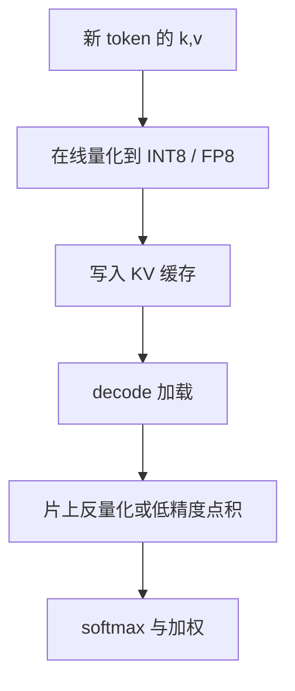

# KV INT8 / FP8

    
解码每步都要把历史键值从显存扫进片上；把每个元素从两字节打到一字节，等于在带宽墙上立刻让出一倍的序列或批次。

    <footer>—— 对照服务栈里的 KV 低精度实践，以及 KIVI 对更低比特非对称量化的分析</footer>

KV 体积是 $2\,L\,h_{\mathrm{kv}}\,d\,n\,b$。$b$ 在 FP16/BF16 下是 $2$ 字节。改成 INT8 或 FP8，$b$ 变成 $1$，同样预算下长度或并发可接近翻倍。这不改注意力公式，只改缓存里存的数字以及读出来之后如何还原。权重量化省的是静态体积；KV 量化省的是随 $n$ 涨的那一截，而且每生成一个 token 都要再扫一遍，所以它对 decode 带宽的意义往往大于它对显存占用的意义。更极端的 2-bit 非对称方案见 [KIVI](/llm/kivi)；本篇停在 8-bit 这一档，写尺度、轴与工程边界。

## 问题

Decode 近似显存带宽墙：每步加载截至当前的 $K,V$，计算是一次瘦的点积加加权。加载字节减半，时间就有机会减半，前提是核真的按 8-bit 读、而不是先在全局内存里拆成 FP16 再当 16-bit 扫。许多「支持 INT8 KV」的实现只在存放时压缩，注意力前又解回 FP16，显存占用下降，带宽几乎不降。真正吃到带宽红利，需要量化感知的注意力核，或至少在片上完成反量化。

数值上，键和值不是权重。权重离线、可校准、分布相对稳；KV 是在线、逐 token 追加、带激活异常值。键沿通道常有固定的大幅度通道（与激活异常值文献一致），值更像按 token 变化的混合系数。把两者套同一套逐张量 INT8，容易在异常通道上饱和，或在平坦区域量化阶梯过粗。8-bit 相对 4-bit、2-bit 宽松得多，逐 token 或逐张量在很多模型上已经够用，但这不是因为 8-bit「没有轴的问题」，而是误差被更多比特盖住了。

FP8 与 INT8 都是一字节，语义不同。INT8 要零点与尺度；FP8（E4M3 / E5M2）自带指数，对动态范围更宽的通道更省事，累加与核支持取决于硬件代数。Hopper 一类对 FP8 GEMM 友好，并不自动等于 FP8 KV 加载也免费。

## 方法

### 存 8-bit，算高精度

常见路径：写入缓存前把新 token 的 $k,v$ 量化成 INT8 或 FP8，附上尺度（逐 token、逐组或逐通道）；注意力时把块读入片上，反量化到 FP16/BF16 再与 $q$ 做点积。若核支持 INT8/FP8 的点积，可以在低精度乘、高精度累加，少一次显式反量化。尺度必须与 [布局](/llm/kv-layout) 一起存：HND 下逐 token 尺度是沿 $S$ 的一条向量；逐通道尺度是沿 $D$ 的一条向量，和分组方式绑定。

INT8 常用非对称仿射：

$$
\hat{x}=\mathrm{round}\big((x-z)/s\big),\quad x \approx s\cdot\hat{x}+z
$$

$s,z$ 按选定的轴统计 min/max 或百分位。FP8 则选格式：E4M3 精度较好、易饱和；E5M2 范围更宽、尾数更糙。KV 的异常值让 E4M3 可能溢出，需要缩放；许多实现先除一个块级 scale 再写入 E4M3。

### 校准与在线统计

离线校准适合权重，不适合 KV：未来 token 还没出现。在线做法是对刚写出的一组 token 统计 $s$，或沿用该通道上的指数滑动。逐 token INT8 对追加最省事——新行自带 $s$，不必改写旧缓存。逐通道则要等一组 token 凑齐，和 KIVI 的 residual 窗口是同一类结构，8-bit 时往往不必做到那么重。实践中 INT8 KV 大量采用逐 token 或按块（$32$–$128$ token）分组，作为带宽与误差的折中。

### 和头数、卸载叠乘

$b$ 减半与 $h_{\mathrm{kv}}$ 减半在字节上同类，失败模式不同：减头是结构共享，量化是噪声。经验顺序常是先 GQA 再 8-bit KV，而不是先把满头 MHA 打到低比特。卸载到 CPU 时，8-bit 直接减少 PCIe 字节，见 [KV 卸载](/llm/kv-offload)。前缀缓存必须把精度纳入缓存键：FP16 块和 INT8 块不能当同一指纹。

## 机制

8-bit 的误差是加性噪声，进入点积后变成分数上的扰动。softmax 对大 logit 敏感：若误差系统性地抬高某几个位置，注意力会偏；若误差近似各向同性且幅度远小于 logit 间距，权重变化很小。这解释了为何 8-bit 在短上下文几乎无感，在长上下文针测上开始露馅——针的 logit 优势被噪声稀释。值的误差直接加进输出残差，层数一深会累积。把最近 $R$ 个 token 留在 FP16（KIVI 也用这一招）是因为当前句的键值对下一步最重要，噪声预算应花在远历史上。

带宽机制更硬。元素减半，同样 $n$ 的扫描时间趋近减半，算术强度上升，decode 吞吐上升。若反量化在 HBM 侧完成，写出一份 FP16 临时缓冲，带宽反而可能增加。所以「开了 INT8」必须看 profiler：实际事务大小是 8 还是 16。

不要用权重量化的校准集去给 KV 签字。权重误差出现在 GEMM 的稳定矩阵上；KV 误差出现在每步都变的表上。签字应看长对话后半段的针测与重复率，而不是 C4 上的一轮困惑度。

## 边界与工程取舍

8-bit 不是免费的一倍。核没有 8-bit 路径时，收益只在容量，不在延迟。异常值极重的层可能需要对该层保持 FP16，形成混合精度缓存，块表变复杂。FP8 的硬件支持分裂：有的卡对 FP8 GEMM 很快，对不规则的 KV 加载并无特惠；有的 NPU 只认对称 INT8。移植时把格式当成核契约。

与 2-bit 的分工：INT8/FP8 是默认、几乎免调的一档；再往下必须处理键的通道异常值和值的 token 轴，那是 KIVI 的领地。不要在 8-bit 已经让带宽离开屋顶线之后，还为了再省一点显存去上 2-bit，把针测搞坏。反过来，端侧 $B_{\mathrm{kv}}$ 极紧时，8-bit 可能仍不够，需要量化与窗口淘汰一起上，见 [窗口淘汰](/llm/kv-eviction) 与端侧预算一文。

前缀共享、多轮命中在量化后仍然成立，但尺度张量要一起共享。只共享整数格子、尺度对不上，等于静默损坏。块大小变化会改变分组量化的组边界，配置要冻结。

报告「INT8 无损」时写明上下文长度。2K 上无损、32K 针测掉点，是常见组合，不是互相打脸，而是误差被长度放大。

## 小结

- KV INT8/FP8 把 $b$ 从 2 打到 1，目标首先是 decode 带宽，其次才是容量。
- 真正降延迟需要低精度加载或片上反量化；解回 FP16 再扫，只省占用。
- 键有通道异常值，值更随 token 变；8-bit 较宽容，但仍应避免最粗的全局一张量尺度去打所有层。
- 最近 token 可留高精度；精度必须进入前缀缓存的键。
- 与 GQA、卸载、淘汰叠乘时分开归因。
- 更低比特的非对称方案交给 KIVI，不要把 2-bit 的故事写进 8-bit 的配置。
- 出处：8-bit KV 是服务实现中的工程档位；轴与异常值的系统分析见 Liu 等 KIVI（ICML 2024）。FlexGen 等系统亦曾采用低比特 KV 以减小传输。
