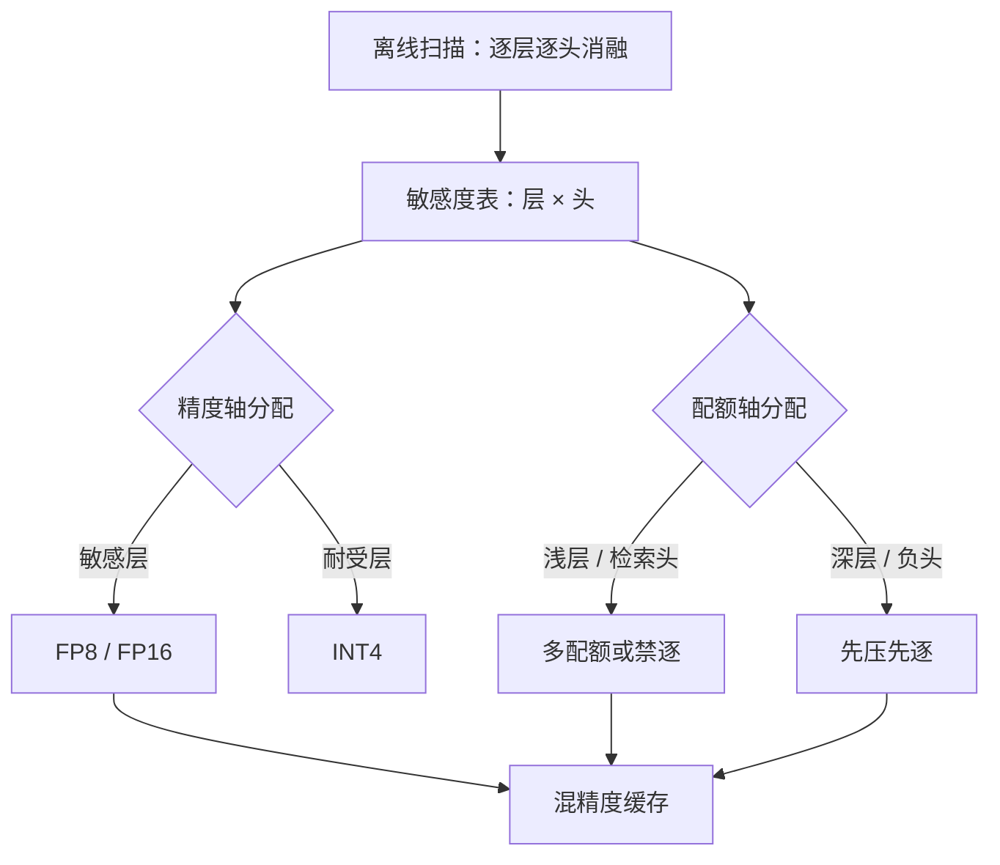

# 逐层与逐头的敏感度

误差预算在网络深度上不是均匀货币：同样一比特花在第一层和第三十层，买到的质量不一样。

<footer>—— 据 Liu et al., KIVI, ICML 2024 的逐层量化敏感性观察；配额视角见 Cai et al., PyramidKV, 2024</footer>

[上一课](/llm/kv-quant-int8-int4)把所有层、所有头一视同仁地压到同一档。缺口是：误差预算在深度与头之间的分布不均匀——同样的 4-bit，有的层几乎无感，有的层掉点；同样的驱逐配额，有的头是检索主干，有的头全程陪跑。统一策略把预算花在无感处，把刀落在要害处。本课写敏感度怎么量出来、预算怎么按层按头重排。量化轴与头数的结构权衡各有先课，不重写。

## 问题

统一策略隐含「各层各头同质」。两条证据反对它。量化侧：KIVI 在流行模型上观察到第一层对低比特最敏感，同样操作在中间层几乎免费。驱逐侧：注意力角色沿深度分化——浅层的注意力弥散在整个上下文上，深层则集中到少数锚点，信息像通过漏斗收窄；[头角色](/llm/attention-head-roles)也早已分化，归纳头与检索头承载长程复制，负头的分布近乎均匀。对浅层驱逐、对检索头量化，都是在最不耐受的位置下刀。

敏感度还随负载变：检索型任务把要害押在少数长程头上，闲聊负载几乎测不出差别。所以敏感度不是模型的一个常数，而是「模型 × 任务」的性质，测量必须带着目标负载做。

## 方法

**量出来**。对每层每头做受控消融：单独把该层量化到目标比特、或单独纳入驱逐集，在针检索与长文档任务上量 delta，困惑度只做粗筛。廉价的代理是注意力的集中度（分数熵）：弥散的层/头对扰动耐受，尖峰的对扰动敏感，可先按熵排序再做精确消融。扫描离线做一次，部署时查表。

**用出来**。两条再分配的轴。精度轴：敏感层保 FP8/FP16，其余打 INT4，平均比特不变、掉点显著收窄。配额轴：驱逐预算按层重排——浅层多留、深层少留，与漏斗形状一致；同一层内，检索头与汇点位置禁逐，负头先逐。[H2O](/llm/h2o-kv) 的累积分数可以当逐头的驱逐判据，但它不分层；把分数与层位联用，才接近「预算花在刀刃上」。

## 机制

层间不均的机制在信息流：早期层处理局部的词序与句法，需要「看得宽」，注意力熵高、可删的少；深层做语义聚合，只对少量锚点打分，砍掉无人看的位置损失很小。金字塔式的配额（浅层厚、深层薄）就是这个形状的直接翻译。量化敏感度同构：第一层的键承担了「定位自己在哪」的基础功能，通道异常最深，压它等于动摇配分函数。

头维的机制在角色分工：归纳头负责把当前 token 链接到早前出现的位置，是上下文学习载体的那批头，丢了它们的键，少样本能力先崩；负头只做均匀背景，是天然的压缩对象。GQA 之后头维只剩 $h_{kv}$ 个独立键值组，一切按头策略必须以 KV 头为单位执行，粒度先被结构钉死——这是 [KV 头数权衡](/llm/kv-head-tradeoff) 给出的约束，不是实现选择。

敏感度表要在「模型 × 负载」两维上建档：同一次扫描给出的排序，搬到检索型负载上可能整体重排。换了主力任务不改表，等于拿着旧地图开车。

## 边界

混精度把缓存切成多种粒度，核必须支持逐块不同比特，前缀缓存的[指纹](/llm/kv-prefix-cache)要把「哪层哪头什么精度」一并编进键，否则跨请求共享会命中到不一致的页。逐层驱逐与滑窗、sink 配方叠加时，禁逐区要取并集，别让两条策略互相拆台。离线扫描有分布漂移：模型升级、提示模板大改之后敏感度排序会变，表要随版本重扫。最后，别把「深层不敏感」推到极端——最深几层直接接输出分布，残差里的值误差会放大，压缩方案通常给首末层单独留档。

## 小结

- 敏感度是「模型 × 任务」性质：用受控消融加注意力熵代理量出来，离线扫描、部署查表。
- 精度轴与配额轴都可以按层按头重排；金字塔分配与信息漏斗形状一致。
- 浅层最怕量化与驱逐；检索头、归纳头与汇点位置禁逐，负头先压。
- GQA 把头策略的粒度钉在 KV 头上；混精度进缓存指纹。
- 首末层单独留档；表随模型与负载版本重扫。
- 出处：Liu et al., KIVI, ICML 2024（逐层敏感性）；Cai et al., PyramidKV, 2024（按层配额）；头角色口径据本仓库既有课程。
