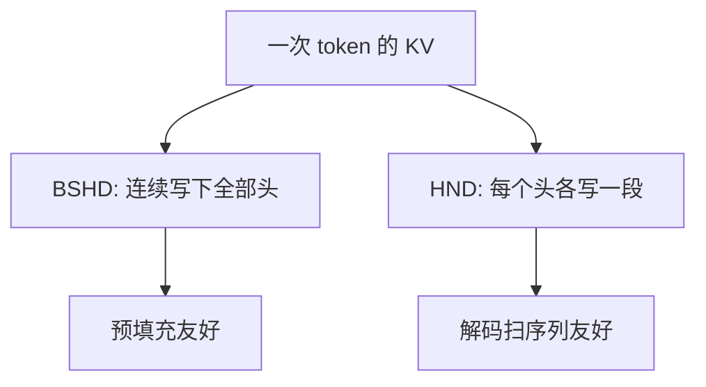

# KV Cache 布局：BSHD / HND

    
同样的键值，头在外还是序列在外，决定的是一次解码能合并多少次加载，而不是公式里多了哪一项。

    <footer>—— 对照 FlashAttention 的稠密约定与 FlashInfer / TensorRT-LLM 的缓存约定</footer>

注意力公式不规定张量在内存里怎么排。训练脚本里 $K$ 常常是 `(batch, seq, heads, dim)`，服务框架的分页缓存却经常把头维提到前面，再按块切开。名字不统一：有人写 BSHD，有人写 NHD；有人写 HND，有人写 BHSD。本篇把这两类排法定下来，说明它们各自对预填充、解码、向量化加载和分页块的影响。公式仍是缩放点积；变的是一次 `load` 能带走多少有用字节。相邻的块大小见 [分页 KV](/llm/paged-kv-block-size)，虚拟连续的另一条路见 [vAttention](/llm/vattention)。

## 问题

令一条请求在某一层的键为四维对象：批次 $B$（或槽位）、序列 $S$、KV 头 $H$、头维 $D$。行主序下，最右维变化最快。把 $S$ 放在 $H$ 左边还是右边，得到两种常见布局：

$$
\mathrm{BSHD}:\ [B,S,H,D], \qquad \mathrm{HND}:\ [H,S,D]
$$

（HND 常再加块号或批次，写成 `[num_blocks, H, block_size, D]` 或 `[B,H,S,D]`。）FlashAttention 一类训练/预填充核默认吃 BSHD（或把 $B$ 与 $S$ 融合成 token 维的 NHD）。TensorRT-LLM、FlashInfer 的缓存侧大量使用 HND。vLLM 早期的键缓存还在 $D$ 上拆出打包因子 $x$，形状接近 `[num_blocks, H, D/x, block_size, x]`，为的是让最内维对齐 $16$ 字节事务。

排错了，不会立刻算错数——转置一下就能对齐——但会在解码热路径上多一次大块 permute，或让核带着跨步加载跑。服务栈里 KV 常驻、每步只追加一个 token，转置的摊销成本很高，所以布局一旦选定，会从分配器一直传到核参数。

BSHD 里的 B 经常是「逻辑批次」，分页之后变成块号；HND 里的 S 经常被截成 `block_size`。比较两种布局时，先对齐「哪一维是连续的」，再谈名字。

## 方法

### BSHD：按 token 追加更顺

BSHD 的最内两维是 $H,D$。一个 token 的全部 KV 头排成一段连续内存，长度为 $H\cdot D$（键或值再乘元素字节）。预填充时按序列写下整段提示，写指针一路向前，和激活的 `(S, hidden)` 很像。解码追加也简单：在该请求的序列末尾接上 $H\cdot D$ 个元素。多头之间不必打散到相距 $S\cdot D$ 的地址。

对预填充注意力，查询也是 BSHD 时，$QK^\top$ 沿 $D$ 做点积、沿 $S$ 做归约，和 FlashAttention 的块循环一致。训练与推理预填充因此能共用一条核路径。代价在解码：每个头要沿序列扫 $K$，而 BSHD 下同一头的相邻 token 被 $H\cdot D$ 的步长隔开，合并加载变差。头数多、序列长时，解码会变成大量跨步读。

### HND：按头扫序列更顺

HND 把 $H$ 放到序列前面。固定一头，其 $S\times D$ 是一块连续（或按块连续）的矩形。解码核按头并行，每头对当前 $q$ 扫过这段矩形，加载是合并的。FlashDecoding、FlashInfer 的 decode 核偏爱这种排法。分页时，一块往往是某头的 `block_size` 个 token，块内连续，块间靠块表跳转——这比「一块里交错排着所有头」更容易给核写。

追加的代价反过来：写一个新 token 要在 $H$ 个头上各写 $D$ 个元素，地址相距一个序列跨步（或一个块跨步）。解码每步只写一次，这点跨步通常可接受；预填充若也按 HND 写，就要么先按 BSHD 算再转置进缓存，要么让预填充核直接以 HND 输出。很多引擎选择「预填充用 BSHD 计算，写入缓存时排成 HND」，把转置藏进预填充，解码不再付。

### 打包维 $x$ 与元素大小

半精度下 $D=128$ 时，有人把 $D$ 拆成 $D/x$ 与 $x$（$x=8$ 使最内维 $16$ 字节），好让 LDG 指令走满事务、并贴近 tensor core 的片段形状。这不是第三种逻辑布局，而是 HND 或 BSHD 在最内维上的对齐约束。元素从 FP16 换成 FP8、INT8，最内维的「好宽度」跟着变，$x$ 或 `head_dim` padding 必须重选，否则量化后的 KV 会在带宽上把省下的字节吐回去。见 [KV INT8 / FP8](/llm/kv-int8-fp8)。

## 机制

合并访存要求同一 warp 的线程读相邻地址。解码时典型映射是：线程对应 $D$ 的分量或 $S$ 的片段，头是外层循环。若内存是 HND，外层切头、内层扫 $S$，地址连续。若内存是 BSHD，相邻 token 的同一通道隔了 $H\cdot D$，cache line 里夹着别的头的数据，有效带宽下降。预填充则相反：同一 token 的多头查询要一起做，BSHD 让「一个 token 的全体头」成为自然的向量。

GQA 不改变这套几何，只是 $H$ 变成 $h_{\mathrm{kv}}$ 而不是 $h_q$。头更少时，BSHD 的跨步 $H\cdot D$ 变小，解码对 BSHD 的惩罚变轻；HND 的优势也变薄。因此「必须 HND」不是定理，而是在 $h_{\mathrm{kv}}$ 仍较大、解码占总时延为主时的工程默认。MLA 一类潜向量缓存把 $H,D$ 收成更窄的 $d_c$，布局问题还在，只是矩形更瘦。

不要用 PyTorch 的 `contiguous()` 在每步解码上「临时转成核想要的布局」。那是在用一次全缓存读写换省事，带宽账单通常高于核本身。

## 边界与工程取舍

布局是接口，不是超参。一旦分页块按 HND 分配，FlashAttention 的稠密预填充核就不能直接把输出指针指到缓存上，必须经过转换核或选择原生支持该布局的实现（FlashInfer、厂商插件）。混用两种布局而不写清楚，会出现「数值对、速度差一截」或「某一层没转置、精度 silently 错位」。

跨设备也不统一。有的 NPU 要求 $D$ 对齐 $32$、序列维在最外；有的 CUDA 核要求块内 HND。移植时先画一张「写入方 → 存储 → 读取方」的布局图，再谈融合。前缀共享时，共享的是物理块：两请求必须对同一块使用同一布局，不能一边按 BSHD 解释、一边按 HND 解释。

调试建议：用一个 token、两个头的最小张量打印线性地址，确认 `K[b,s,h,d]` 与 `K[h,s,d]` 谁在 `d+1` 的旁边。文档和代码注释里写全称 $B,S,H,D$，少用「标准布局」这种词——标准在各仓库里并不相同。

若预填充占比很高（长提示、短生成），强行全链路 HND 可能为解码省下的那一点，不够补偿预填充转置。反过来，对话解码为主的服务，值得在写入缓存时就排成 HND。

## 小结

- BSHD（及融合后的 NHD）让单 token 的全体头连续，利于追加与预填充；HND 让单头的序列连续，利于解码扫 KV。
- 分页块通常按 HND 切；稠密训练核通常按 BSHD 写。中间若有一次转置，应摊销在预填充，而不是每步解码。
- 打包维 $x$ 是对齐约束，随元素宽度改变。
- GQA 减小 $H$ 会削弱布局差异；不能把某一模型上的结论当成定律。
- 前缀共享与多核并存时，布局必须是块的一部分契约，不能只存在于调用方脑子里。
- 用最小张量核对跨步，比看变量名可靠。
- 出处：布局约定来自 FlashAttention 系列的稠密张量接口，以及 FlashInfer、TensorRT-LLM、vLLM 等服务栈的 KV 缓存实现；不是单独一篇数学论文。
