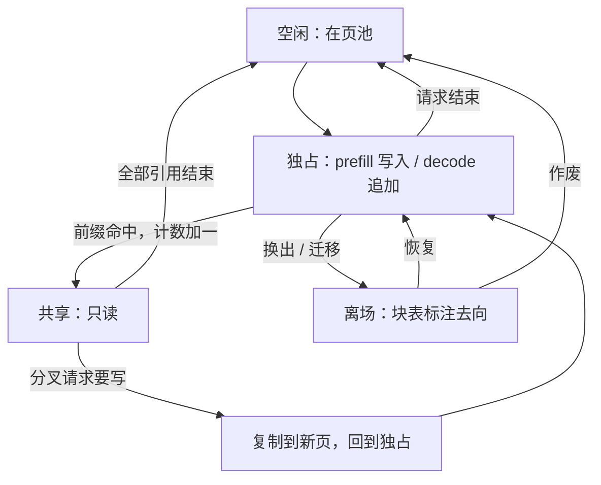

# KV 的生命周期与所有权

页表回答「放在哪」，生命周期回答「归谁、活多久」；所有权不定，共享和释放迟早写坏别人的字节。

<footer>—— 据 Kwon et al., PagedAttention, SOSP 2023 的块表与引用计数整理</footer>

[上一课](/llm/ak-map)把内核工程收进五条坐标与一条交付链：tile 怎么切、变体差在头与地址、快来自字节不过 HBM，且接口比内核活得久——页表与变长都写进了接口合同。本课程顺着「地址」这条坐标往下走：KV 在请求之间被写入、追加、共享、搬移、释放，谁有权写哪一页、页何时归还——所有权错了，再快的核也在算被污染的缓存。本课立起地基：生命周期与所有权。寻址与 gather 不重讲；后课的分页、共享、压缩默认这套状态机已经成立。

## 问题

把 KV 当成「随张量来的私有缓冲」，生命周期就散落在代码各处：预填充写入一次，解码每步追加，束搜索与并行采样复制，请求结束释放。所有权含糊出两类错。写冲突：并行采样共享同一前缀页，却有实现路径就地更新——另一个请求的注意力会读到被改写的键，错误延迟数百步才浮现，极难归因。悬空引用：请求结束把页还池，异步的投机校验、续跑中的请求、或跨机传输的接收端还握着旧块表，读到的页已被下一请求覆写。两类错的共同根源是没有回答：这一页此刻归谁、处于什么状态。

大小本身是[算得清的](/llm/kv-cache-size-math)：$\mathrm{KV}=2Ln h_{kv} d b$ 随长度与并发线性涨，[分页](/llm/paged-attention)把这段字节切成池里的页。本课的问题不在公式，而在簿记：页从池里出来的那一刻起，发生了什么。

## 方法

把每条 KV 页钉成状态机，所有权跟着状态走。

- **空闲**：在池里，不属于任何人。
- **独占**：被恰好一个请求的块表引用，预填充写入、解码追加都发生在这里；唯一的可写状态。
- **共享**：前缀命中后引用计数大于 1，全员只读；分叉要写，先写时复制到新页。
- **离场**：被换出（[卸载](/llm/kv-offload)）或在传输路上；块表标注去向，回来或作废都走显式路径。

规则三条。写权只属于唯一引用者：引用计数大于 1 时任何写入先复制。释放由最后一个引用消失触发，无论请求结束、会话过期还是缓存逐出。块表是唯一真相源：投机回滚、抢占恢复、迁移失败，都要先改块表再动内存，顺序反了就是悬空引用。生成开始前定新增 KV 的归属：并行采样各分叉拿各的新页，祖先页只读——[vLLM](/llm/vllm-paged) 的 copy-on-write 契约。

## 机制

所有权先行，是因为引用计数是后面所有课的共同底座。[前缀共享](/llm/prefix-caching)用它表达「一份物理页、多个逻辑用户」；驱逐用它区分「缓存页」与「活跃页」——缓存页无活跃请求也不回收，活跃页连缓存逐出都不许；[迁移](/llm/pd-kv-transfer)用它保证传输期间源端不写。三个场景共用一台状态机；各写一套私有标记，一定在边角对不上。

边界事件最常漏。抢占把独占页换成「被换出」，恢复时块表没跟着走，换出页就成了无人认领的垃圾；取消与超时要连共享引用一起减，否则前缀缓存里挂着已死会话的页。本课程后课的碎片率、命中率、成本分摊，全部定义在这台状态机上——状态含糊，数字就对不上。

Llama-3-8B（32 层、8 个 KV 头、头维 128、FP16）每 token 的 KV 是 128 KiB，一个 4K token 的会话占 512 MiB。若这段前缀被 3 个请求共享，物理 in-use 是 512 MiB，逻辑占用是 1.5 GiB——所有权簿记不同，两种说法都对，也都能骗人。

## 边界

状态机不等于线程安全：同一页内的并发追加还要锁或原子操作，所有权只保证「没有两个写者」。它也不管页内字节怎么排——那是 [布局](/llm/kv-layout) 的事。引擎的持有粒度不同：按请求、按块、或按前缀树节点记引用；跨引擎迁移时引用计数不可移植，只能传页清单，在对端重建。把生命周期写成请求对象的生命周期是常见偷懒：请求被抢占、迁移、续跑时它就失效了，所有权必须挂在块上。

## 小结

- 生命周期：空闲 → 独占（唯一可写）→ 共享（只读）→ 离场 → 空闲，所有权随状态走。
- 三条规则：写权只属唯一引用者、共享写前复制、释放由最后一个引用触发。
- 块表是唯一真相源；异步路径先改表再动内存。
- 引用计数是共享、驱逐、迁移、测量的公共底座，不是子系统私有细节。
- 所有权挂在块上而非请求对象上；抢占与取消连共享引用一起结账。
- 出处：Kwon et al., PagedAttention, SOSP 2023（块表、引用计数与 copy-on-write）；大小口径见 Pope et al., 2022。据本仓库既有课程整理，不发明新文献。
