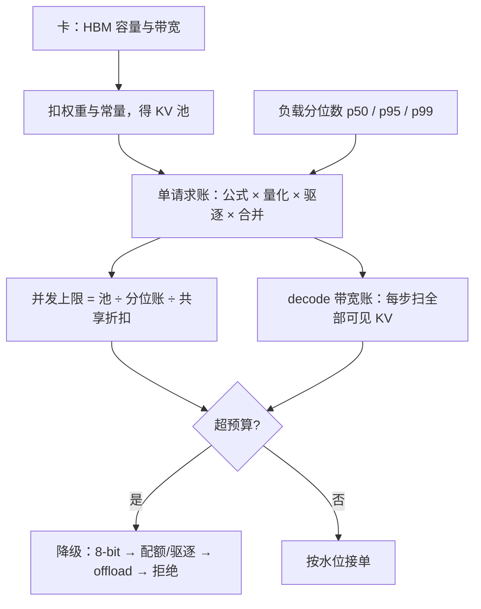

# 长上下文的 KV 预算

「支持 128K」是能力声明，不是容量声明；预算表不编出来，长上下文就在第六十个并发请求上替你做决定。

<footer>—— 据 Pope et al., 2022 的推理扩展会计口径整理</footer>

压缩单元把刀凑齐了：[量化](/llm/kv-quant-int8-int4)、[逐层配额](/llm/kv-layerwise-sensitivity)、[驱逐](/llm/kv-eviction-heuristics)、[合并](/llm/kv-merge-distill)。系统交互单元先问分配：一张卡的 HBM 里，权重、页池、上下文、余量怎么切？一条 128K 的请求值得多少份额？本课把生命周期、分页、共享与压缩四刀装进同一张预算表。字节的公式[早已写出](/llm/kv-cache-size-math)，本课不重推，只做代入与决策。

## 问题

长上下文先撞墙的地方是容量：KV 随长度线性涨，权重是常数，变量先击穿池子。预算缺位的表现是两头挨打：接单时不知道能不能装下，凭「支持 128K」承诺满并发；跑到一半 OOM，靠抢占和重算还账。另一张墙是带宽：decode 每步要把全部可见 KV 从 HBM 扫一遍，128K 的满长请求哪怕只生成一个字，也要先付一遍全量扫描。两张墙都随 $n$ 线性，产品表现完全不同——前者是 429 与 OOM，后者是「还能聊，但一个字两百毫秒」。预算必须两张都编。

## 方法

预算编制五步。

**一、固定项**。权重、CUDA 上下文、激活与专家池先扣掉，剩下的才是 KV 池；页池水位再留一截给抢占与增长（口径见[分页课](/llm/kv-paging-fragmentation)）。

**二、单请求账**。代入 $\mathrm{KV}=2Ln h_{kv} d b$，再乘本系统各刀的实际压缩：精度因子（量化后有效 $b$）、驱逐后的长度、合并率。产出一张「每 token 有效字节」表，按位置分层列——统一价目做不了精细预算。

**三、负载画像**。长度分布用分位数：p50 编吞吐、p95 编容量、p99 编逃生路径。页池没有「平均请求」，按均值编预算等于给 p99 请求预埋 OOM。

**四、并发上限**。池子除以分位请求账，得同时服务的满长请求数；再乘前缀[共享](/llm/kv-prefix-cache)的分叉折扣——共享提示只付一份，生成段各付各的。

**五、逃生顺序**。超出预算时按「无损 → 近似 → 搬家 → 不服务」降级：先 8-bit，再逐层配额与驱逐，再 [offload](/llm/kv-offload) 与[分层存储](/llm/kv-tiered-storage)，最后拒绝。顺序的理由是误差性质：量化的噪声远小于误杀，搬家的代价是带宽不是正确性。

## 机制

两张账分开记的理由在产品语义。容量账错了一格是拒绝率，带宽账错了一格是 TPOT；前者可以靠降级和排队救，后者直接写进每一轮的用户体感。带宽账的机制在[算术强度](/llm/arithmetic-intensity-decode)：decode 是瘦计算、胖加载，每步时间近似等于读完全部 KV 加权重的时间，所以「每 token 有效字节」表同时是容量表和时间表——压一半字节，池子翻倍、TPOT 减半，一张表两处兑现。长上下文把这层关系放大到不可忽略：满长请求的 KV 扫描可以从「零头」涨到「每步的主要项」，[decode 显存墙](/llm/decode-memory-wall) 的那一课在 128K 处从背景变成了主旋律。

代入感受量级：Llama-3-8B（32 层、8 KV 头、FP16）每 token 128 KiB，128K 上下文一条就是 16 GiB——80 GiB 的卡扣掉 16 GiB 权重后，满长并发只剩两三条。先量化到 8-bit 再谈并发，不是优化，是及格线。

## 边界

预算随模型、精度、页大小、压缩策略版本化，升级模型必须重编，旧表不能沿用。投机解码会放大长度方差（接受长度不确定），预算要留回滚余量，这是下一课的主题。共享的折扣只在同副本上兑现，路由把同前缀打散时折扣作废。on-device 场景的预算更紧，口径相同而常数不同（见[端侧 KV 预算](/llm/on-device-kv)）。最后，「最大上下文」是窗口声明，绝不能当成常驻预留——那是[分页](/llm/paged-attention)之前的老错误，别在预算表里复发。

## 小结

- 预算两张表：容量（并发上限、拒绝率）与带宽（每步扫描时间），都随长度线性、语义不同。
- 编制五步：扣常量、单请求账、负载分位数、并发上限、逃生顺序。
- 单请求账 = 公式 × 量化 × 驱逐 × 合并；统一价目做不了精细预算。
- 分位数会计：p50 编吞吐、p95 编容量、p99 编逃生；均值会埋雷。
- 降级顺序按误差性质：8-bit → 配额/驱逐 → offload → 拒绝。
- 出处：Pope et al., 2022；公式与墙的口径据本仓库 KV 大小计算、算术强度课。
