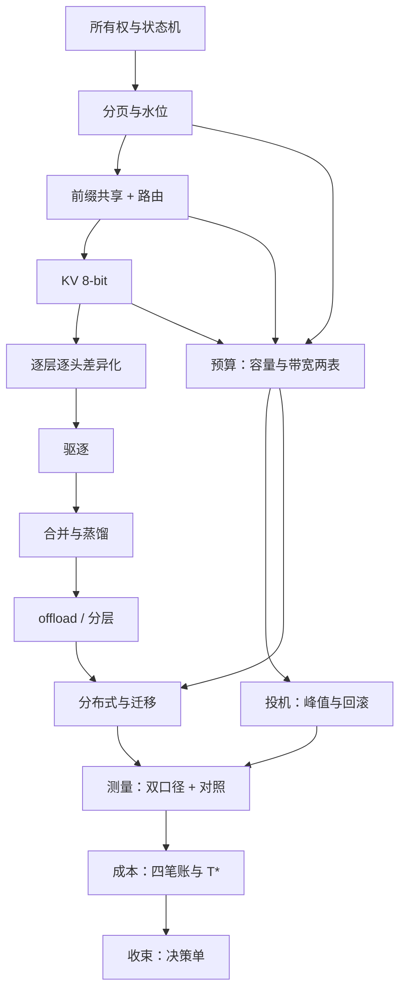

# KV 管理收束

收束不是把十三课再讲一遍，而是把它们压成一张能贴在工位上的决策单：先做什么、后做什么、什么永远不碰。

<footer>—— 据 Kwon et al., SOSP 2023 与 Pope et al., 2022 的系统口径，按本课程整理</footer>

[上一课](/llm/kv-cost-model)把字节换成了钱：四笔账摆上桌，「值不值」有了统一的算法。至此这门课的零件齐了——所有权、分页、共享、量化、敏感度、驱逐、合并、预算、投机、分布式、测量、成本——本课收束：把它们装配成一张地图和一张决策单。上游是[注意力内核工程](/llm/ak-map)回答的「核怎么读缓存」，下游是调度回答「谁先用池子」，本课程回答中间这一层：缓存本身怎么管。**本课程到此收束。**

## 问题

十三个决策点分布在系统各层，各自局部最优会互相拆台：量化改[指纹](/llm/kv-prefix-cache)使共享失效，驱逐改变[长度分布](/llm/kv-longcontext-budget)使预算失真，迁移挤占 decode 的网，压缩收益被[错误的口径](/llm/kv-measurement-pitfalls)掩埋。没有全局顺序，团队会在错误的位置先动刀——最常见的两条弯路是：跳过分页直接上 2-bit 量化（先做有损的，后做无损的），以及不上前缀共享先调参数（把可买断的重算当成性能问题调）。收束要给的就是这张先后表。

## 方法

**决策单**，按「误差性质递增、边际成本递增」排序：

1. **分页与水位**：无损，拿回预留与碎片的容量，是一切的前提。
2. **前缀共享与缓存感知路由**：无损，省重算与容量期望；命中靠放置，不靠运气。
3. **KV 8-bit**：近似但稳，容量与带宽的系数同时砍半；核兑现事务宽度。
4. **逐层逐头差异化**：把 3 的残余误差按[敏感度表](/llm/kv-layerwise-sensitivity)重排，平均比特不变。
5. **驱逐**：可见集换预算，误杀不可逆；滑窗+sink 是保底，分数法看负载。
6. **合并与蒸馏**：高冗余处优于驱逐；可训练则走向 MLA/Beacon 一类架构化压缩。
7. **offload 与分层**：把容量账换成介质账，按 $T^*$ 定冷热。
8. **分布式与迁移**：单机拿不出来才上集群；先路由后搬运，重算兜底定价。

每一步都拿上一步吐不出的余量；任何一步的收益要在[测量](/llm/kv-measurement-pitfalls)与[成本](/llm/kv-cost-model)口径下联评后才算数。永不碰的三件事：共享页就地写（所有权）、跨口径比较利用率（测量）、只报吞吐不报任务质量（验收）。

## 机制

顺序背后的机制是不变式与参数的分层：所有权与口径是不变式，破了它们，任何参数调优都在错误的账本上计算；分页到迁移是参数，按误差性质排序——无损操作永远先于有损操作，因为后者的收益评估依赖前者的账已经干净。另一个机制是**互补而非替代**：MLA、GQA 把压缩买进权重，是训练期的另一条路线，与本课程的推理期管理不冲突——架构给的每一档压缩，推理期的刀照样在余量上继续生效，只是基数变了。

一张自检表：如果只能做三件事——先开分页与水位，再配前缀共享加缓存感知路由，然后把 KV 打到 8-bit 并核对 profiler 的事务宽度。多数服务在第三步之前就已拿到大半收益，后面的每一刀都要求先证明前面拿不出来了。

## 边界

这张地图有时效。架构侧：潜变量注意力一类设计把压缩买进权重，推理期管理的基数变小，但四刀的相对顺序不变。硬件侧：HBM 容量与单价的代际变化会移动 $T^*$ 与预算表的每一个常数。负载侧：长文档、多轮 agent、MoE 专家缓存各有自己的瓶颈位，决策单的顺序要在真实负载上重验。收束也不是终点：缓存管好之后，瓶颈移向调度与多租户，移向长上下文系统工程的另一头——本课程交付的是中间这一层的地图，地图之外的路，由相邻课程接棒。

## 小结

- 决策单按误差性质排序：分页 → 共享 → 8-bit → 逐层差异化 → 驱逐 → 合并 → offload → 分布式。
- 所有权与测量口径是不变式，破了它们一切调优都算错账。
- 每一步拿上一步吐不出的余量；收益在测量与成本口径下联评。
- 训练期压缩（GQA/MLA）与推理期管理互补：基数变了，刀的顺序不变。
- 三件永不碰：共享页就地写、跨口径比利用率、只报吞吐不报质量。
- 出处：本课程十三课的综合口径；底层文献锚点为 Kwon et al., SOSP 2023 与 Pope et al., 2022。
