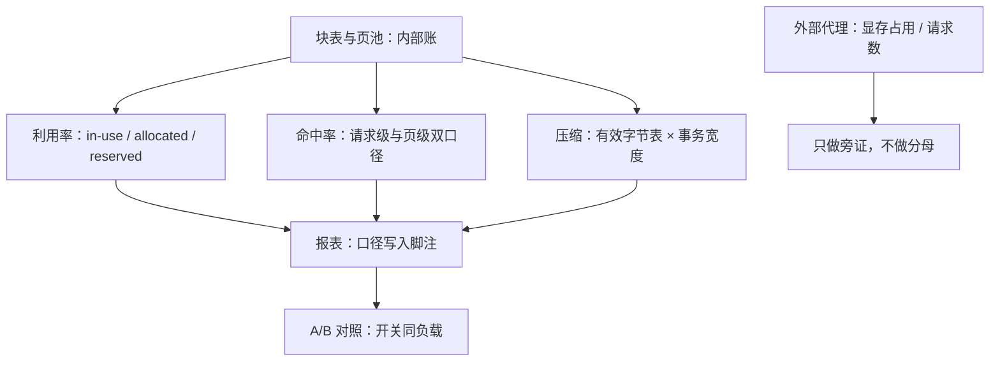

# KV 测量的坑

利用率、命中率、压缩率，每一个数字都对——只要你不问分母是谁；KV 报表的第一义务是写清口径。

<footer>—— 据 Kwon et al., SOSP 2023 的测量口径与各推理引擎的指标实践整理</footer>

前九课定义了一堆量：三种利用率口径、前缀命中率、碎片率、接受长度分布、压缩率、每 token 有效字节。本课写它们怎么在报表里被算错。坑的共同结构只有一个：**用外部代理反推内部状态**。显存占用、请求计数、理论压缩率都是代理；唯一可信的源头是第一课那台状态机——块表与页池的内部账。

## 问题

四类高频错报。**利用率**：reserved、allocated、in-use 三口径混用，「利用率 95%」可以指页都发出去了（allocated/reserved），也可以指页内几乎无空槽（in-use/allocated），两者之间可以差一整个内部碎片。显存占用更糟：nvidia-smi 的数字里混着权重、激活、CUDA 上下文与分配器预留，从中「反推」KV 用量等于把四个变量当一个读。**命中率**：一份共享页被 $N$ 条请求引用，按请求计数分子就是 $N$，物理省的是 1——分母选错，命中率高估 $N$ 倍；分母还必须是「可命中请求」，随机对话站点天生低命中，不代表实现坏。**压缩收益**：「存 8-bit」不等于「带宽减半」，若核读出后先解回 FP16，容量降了而每步时间几乎不动——[profiler 里的实际事务宽度](/llm/kv-int8-fp8)才是证据。**归因**：TTFT 降了，是前缀命中、分块预填还是新驱动？没有对照开关的归因都是编故事。

## 方法

仪表从状态机导出，不从代理反推。

- **容量页**：in-use、allocated、reserved 三条曲线并列画，碎片率 $1-{\rm in\text{-}use}/{\rm allocated}$ 单独一条；峰值按分位记，不按均值。
- **共享页**：两个口径并行——请求级「token 节省」（分子按引用次数）与页级「物理节省」（分子按物理页数），中间的差就是共享倍数本身。
- **时间页**：TTFT/TPOT 用[分位数口径](/llm/ttft-percentiles)，TPOT 长尾单独归因：投机解码的接受长度方差（上一课的监控项）是头号嫌疑人。
- **对照纪律**：每个收益数字必须配一个「关掉该开关」的同负载对照；[基准条件](/llm/serving-metrics)——并发、长度分布、是否共享系统提示、页大小、精度——写不进图就要写进脚注，否则数字不可复现。

## 机制

为什么内部账是唯一源：利用率的三个口径、命中的两个口径，每一个都是状态机的一个合法投影——三口径在课二的定义里就同时成立，坑不在数字错，在投影被当成了全貌。投影必须成对出现：报 in-use 就要带 allocated，报请求级命中就要带页级命中，单独发布任何一个投影都是在替读者选择结论。压缩收益的机制同理：字节表是静态账，[事务宽度](/llm/arithmetic-intensity-decode)是动态账，收益取两者交集，只报静态表的「4 倍压缩」在核不支持时就是虚数。

命中率 90% 而 TTFT 只降 10% 是常见的「假警报」：命中的多是短系统提示，TTFT 的大头在长文档前缀。收益要按 token 加权再按长度分桶看，按请求计数的命中率解释不了延迟变化。

## 边界

有些量本质上测不准：碎片率在动态负载下是瞬时值，采样间隔决定了你看见的是峰还是谷；跨实例聚合的命中率会被[路由](/llm/kv-aware-routing)的放置策略塑造，改路由等于改分子。驱逐与合并的评测有自己的坑：短补全的困惑度对误杀几乎无感（[驱逐课](/llm/kv-eviction-heuristics)已立规），长上下文任务的掉点要单独预算，吞吐提升可能只是把损失搬到了没人测的任务上。最后，报表的读者是容量规划与排障两个角色，前者要分位数与口径，后者要时间线与归因——一张不分读者的总表，通常两个角色都用不上。

## 小结

- 一切口径错报的共同结构：用外部代理反推内部状态；唯一源是块表与页池的账。
- 利用率三口径并列画；碎片率的分母是 allocated，不是 reserved。
- 命中率分请求级与页级双口径，分母是可命中请求；共享倍数就是两口径之差。
- 压缩收益 = 静态字节表 × 动态事务宽度；「存了低精度」不是「省了带宽」。
- 每个收益配对照开关，基准条件进脚注；TPOT 长尾先查接受长度方差。
- 出处：Kwon et al., SOSP 2023（测量与碎片口径）；指标定义据本仓库服务指标、TTFT 分位课。
