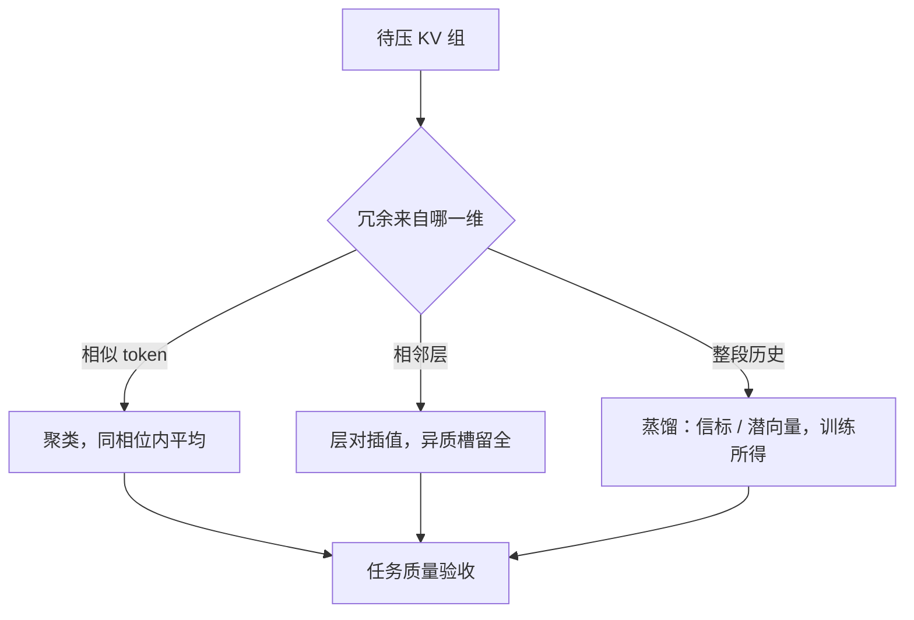

# KV 合并与蒸馏

驱逐问「扔掉谁」，合并问「谁能代表一组」；当冗余足够高，一条平均过的键比十条各留一半的键更便宜也更准。

<footer>—— 据 Liu et al., MiniCache, 2024 的跨层融合与 Snell et al., 2022 的上下文蒸馏思路整理</footer>

[上一课](/llm/kv-eviction-heuristics)的刀口是「扔掉谁」，估计器再好也救不了不可逆的误杀。本课换刀口：把多条压成一条。合并把冗余条目平均掉，蒸馏把压缩本身学进参数。两条路共同的赌注是：历史里存在可替代的自由度——驱逐假设低分条目没人看，合并假设一组条目能被它们的代表替换，蒸馏假设「压缩态 → 完整行为」这个映射可以被学会。

## 问题

历史往往冗余：重复的指令段、同义的相邻 token、逐层累加后高度相似的相邻层 KV。对这样的组，逐条驱逐反而危险——每一条都有小概率被注意到，删谁都是伤；而平均之后，组内方差才是误差，冗余越高误差越小。合并的直接障碍在键上：键带位置相位，注意力算的是 $q^\top R_t k$，两条不同位置的键不能直接平均，相位混叠会破坏点积结构；值活在残差流语义下，可加可权，平均宽容得多。合并因此是一个「在哪个空间平均」的问题，而不是「平均会不会坏」的问题。

## 方法

**跨 token 合并**。相似 token 聚类（按键的余弦或按注意力行为），值加权平均；键必须限制在相对相位接近的窗口内合并，或先对键去相位、平均后再挂回代表位置的相位。适合指令重复、引用同一段落的长提示。

**跨层合并**。残差流逐层累加，相邻层的 KV 相似度可以逼近 1，于是相邻层对可插值成一条，仅保留少量异质槽（汇点位置、高熵位置）的完整 KV——MiniCache 的结构就是这个形状：大部分层对融合，个别槽留全。要分清它与训练期共享的界限：[CLA](/llm/cross-layer-kv-sharing) 与 [YOCO](/llm/yoco) 把共享学进结构与权重，[推理期合并](/llm/kv-as-long-context)是事后补偿，上限低于学出来的共享，但不要求重训。

**蒸馏**。把压缩写进参数。[Activation Beacon](/llm/activation-beacon) 插入信标 token，用它们的激活压缩前文，训练后把有效上下文从 4k 拉到 400k 量级；上下文蒸馏让学生模型在压缩状态下对齐完整上下文的行为分布。[MLA](/llm/mla) 是同一思想的架构化终态：潜向量就是学出来的「合并」，满宽键值只是上投影的临时展开。

## 机制

合并的误差模型是组内方差：$m$ 条等权合并，误差与方差成正比，与冗余度互补。这解释了它与驱逐的分工——驱逐在分数低处下刀，合并在高冗余处下刀，最好的对象恰恰是「每条都被看过、但看的内容几乎一样」的组。跨层的可合并性来自残差流的累加结构：每层只写入一个小增量，邻近层的总量自然接近；假设在汇点与高熵槽失效，所以异质槽必须留全。蒸馏的机制是把推理期成本搬进训练期：一旦「压缩态」成为训练分布的一部分，模型学会从中恢复行为，服务时只付一次压缩写入的前向，不付逐 token 的账。

三刀的次序也由机制决定：先合并掉冗余（方差小、无感），再量化（噪声加在更少的条目上），最后驱逐（分数在更干净的缓存上统计）——反着做，驱逐会把本可合并的条目误杀。

合并与蒸馏都改变 KV 的「形状」：合并后的页 token 数与全量页不同，无法进同一条[前缀共享链](/llm/kv-prefix-cache)；蒸馏产出的信标态则要求整条推理栈（模板、位置编码、缓存键）按新形状重写。

## 边界

推理期合并不可逆，与驱逐共享「时间错位」的失败模式；聚类与相位对齐的开销落在 prefill，长提示可摊、短请求不划算。跨层合并对「层增量异常大」的模型（深层仍在大幅改写表征）收益骤减。蒸馏需要训练数据与算力，分布漂移要重训，且压缩率是学出来的超参不是运行时旋钮。评估口径与驱逐相同：长上下文任务质量，不是困惑度；并把「合并组数、保留槽位、蒸馏压缩率」写进报告，否则数字无法复现。

## 小结

- 驱逐删自由度，合并以代表替换冗余组，蒸馏把压缩学进参数；误差模型分别是误杀、组内方差、分布漂移。
- 键合并不自由：RoPE 相位限制合并窗口或要求去相位；值可加，宽容得多。
- 相邻层 KV 高度相似是跨层融合的燃料，异质槽必须留全；上限是 CLA/YOCO 那类学出来的共享。
- MLA、Beacon、上下文蒸馏同属「学出来的压缩」，训练成本换推理成本。
- 三刀次序：先合并、再量化、后驱逐；验收看长上下文任务。
- 出处：Liu et al., MiniCache, 2024；Snell et al., Learning by Distilling Context, 2022；架构口径据本仓库 MLA、CLA、Beacon 课。
