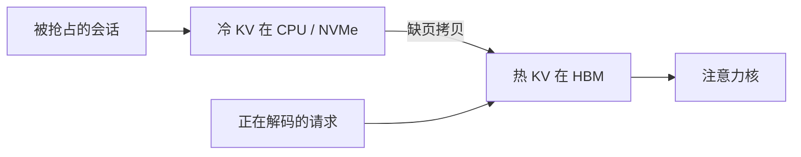

# KV 卸载到 CPU / 远端

    
HBM 装不下的不是权重就是过去的键值；把冷的那截搬到主机或更远的地方，换的是带宽，不是公式里的项消失。

    <footer>—— 对照 Sheng 等 FlexGen 把权重、激活与 KV 放进 CPU/磁盘层级，以及服务栈里按块换出的实践</footer>

KV 随序列与批次线性涨，先于权重把 GPU 显存顶满。减头、量化、滑窗都是在缩小「必须常驻 HBM 的那一份」。还有一条不改模型的路：把暂时用不到的 KV 搬到 CPU 内存、NVMe，甚至远端节点，等解码重新碰到再搬回来。Sheng 等人 2023 年的 FlexGen 把权重、激活和 KV 一起放进多层存储，为目标是单卡高吞吐离线生成；在线服务则更多按分页块做细粒度换出。本篇写卸载的带宽账、重叠与失败模式，不把某云厂商的专有交换格式当成论文。

## 问题

一次解码要读当前层全部驻留 KV。若它们都在 HBM，瓶颈是显存带宽；若一部分在 CPU，瓶颈变成 PCIe（或 CXL）。后者比前者慢一个数量级以上：HBM 以 TB/s 计，PCIe 4.0 ×16 大约数十 GB/s。把整层 KV 每步从 CPU 拉上来，生成一个 token 的时间会被传输钉死，算力闲着。所以卸载能成立，必须满足至少一条：不是每步都用到被卸的那部分（例如已抢占的请求、还未轮到的层、滑窗外本就不会读的块）；或者传输能与别的计算重叠，且传输量小于重叠窗口的算力。

在线与离线的目标不同。FlexGen 一类系统接受高延迟，用精心安排的调度把 GPU 算满，换单卡吞吐；聊天服务不能让用户等一次磁盘往返才出下一个字。于是同样叫「offload」，产品形态是两种：吞吐导向的多层流水，与延迟导向的「只换出被抢占或空闲会话的块」。

卸载不增加模型记得的内容。它只是把已有 KV 的住所改了。窗口外已经丢掉的键，卸到 CPU 也找不回来——那是淘汰，不是卸载。

## 方法

### 按层、按请求、按块

三种切法。按层：算第 $\ell$ 层时，只保证该层 KV 在 HBM，前后层放主机，算完换下一批。这与训练时的激活检查点类似，预填充长序列时有用，解码每步都要过所有层，层间换入换出会变成每步全模型走一遍 PCIe。按请求：把暂停、低优先级或长尾会话的整份 KV 赶出 GPU，恢复时再拉回。这是连续批处理里抢占的自然延伸。按块：与 [分页 KV](/llm/paged-kv-block-size) 同一套块表，物理槽的后端可以是 HBM 或 CPU 页，注意力核或调度器在缺页时触发拷贝。粒度最细，也最能与 [前缀缓存](/llm/prefix-caching) 共用同一块 ID。

FlexGen 的贡献是把权重、激活、KV 的存放一起规划，并用交错调度让 PCIe 与计算重叠，而不是「显存不够就整模型 offload」的朴素实现。它证明：在单卡、大模型、追求吞吐时，CPU 甚至磁盘上的 KV 可以被喂饱 GPU。它不证明：同一套调度能满足多租户低延迟。

### 带宽不等式

令一步解码要读的 KV 字节为 $M$，链路带宽为 $B_{\mathrm{io}}$，重叠窗口里 GPU 还能做的其他计算时间为 $t_{\mathrm{comp}}$。若 $M / B_{\mathrm{io}} > t_{\mathrm{comp}}$ 且这些字节都在远端，则 TPOT 的下界就是传输时间。减 $M$ 的手段：GQA、量化、只拉本步可见窗口、层间流水只拉下一层。增 $t_{\mathrm{comp}}$ 的手段：更大的批次（别的请求还在 HBM 上算）、把卸载请求从交互池里拿开。远端若是另一台机器，还要加序列化、RDMA 与尾延迟，不等式更紧。

## 机制

### 只读换出与预取

换出的正确性依赖块内容不变。KV 一旦写完（该 token 的键值已追加），直到被淘汰前都是只读的，所以搬到 CPU 不必写回脏页——这一点比训练激活卸载更简单。写路径只发生在追加新 token 时，新块应在 HBM 分配；冷的是旧块。前缀共享时，热请求与冷请求可能指向同一物理块：引用计数必须跨存储层，不能把仍被 GPU 请求指着的块卸走。

预取是唯一能把延迟藏起来的机制。调度器若知道下一层、下一个时间步、下一个即将 resume 的请求，就可以在当前 GEMM 时把下一包 KV DMA 进来。预取错误（猜错下一请求）会挤占 HBM，比不预取更糟。因此交互式服务往往只对「即将 resume 的那一条」做预取，而不是盲目把 CPU 上所有块往卡上灌。

量化后再卸载，传输的字节变少，PCIe 税下降。先 INT8 再卸，通常比先卸 FP16 更划算。精度故事见 [KV INT8 / FP8](/llm/kv-int8-fp8)，不要在卸的路上再随手改变量化轴。

## 边界与工程取舍

不要把「支持 CPU offload」写进低延迟 SLA。它适合：单卡跑过大模型的离线批处理；在线服务里被抢占的会话；端侧把长对话的远历史放到 DRAM。不适合：每条交互请求的默认路径。测量必须看 TPOT 的分位数，平均值会被仍在 HBM 上的请求粉饰。

远端节点上的 KV 还有一致性与安全问题。多副本不要各卸各的再各算各的，除非接受前缀缓存失效。租户隔离在主机内存同样适用，不能因为「已经离开 GPU」就放松。NVMe 上的 KV 会把尾延迟打到十毫秒以上，只适合完全离线。

与窗口淘汰的分工：淘汰改变模型可见集，卸载不改变。先决定模型还能否读这些键，再决定它们住在哪一层存储。把本应淘汰的块卸到 CPU「以备将来」，是在用主机内存假装长记忆，注意力核若已经看不见它们，这份拷贝只是垃圾。

FlexGen 的数字不能直接抄到在线网关。它的目标函数是吞吐，调度可以重排整个离线批次。网关的目标函数是排队与 TPOT，重排空间小得多。

## 小结

- KV 卸载把冷键值放到 CPU / 磁盘 / 远端，不改变注意力可见集，只改变住所。
- 每步都要从远端拉全量 KV 时，PCIe 会成为 TPOT 下界；必须靠抢占粒度、层流水或与计算重叠。
- FlexGen 展示了单卡、吞吐导向的多层规划；在线服务更常见的是按分页块换出被抢占会话。
- 已写完的 KV 只读，换出无需写回；新 token 仍在 HBM 追加。
- 共享块的引用计数要跨存储层；量化可以降低传输字节。
- 低延迟交互不要把 offload 当默认路径；与淘汰分开记账。
- 出处：Sheng 等，*FlexGen: High-Throughput Generative Inference of Large Language Models with a Single GPU*，ICML 2023；块级换出建立在 Kwon 等 PagedAttention 的块表之上。
